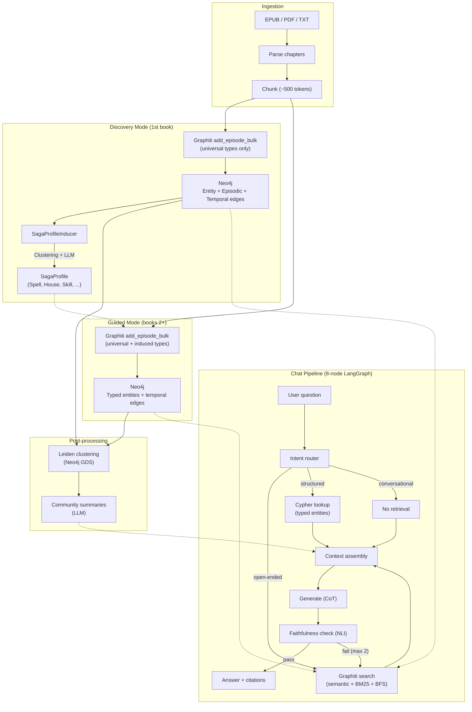
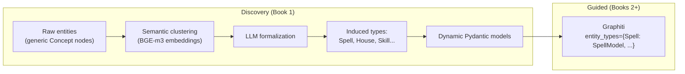
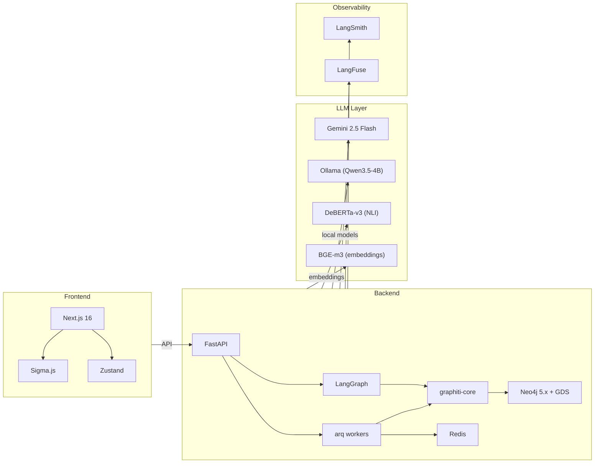
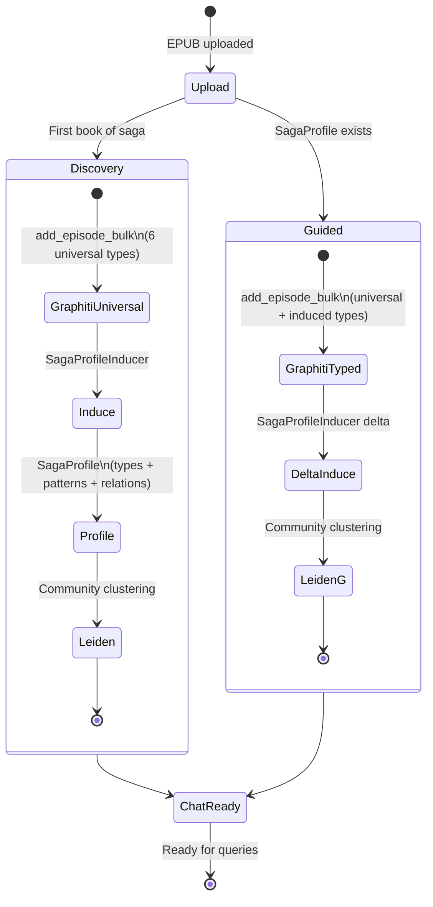
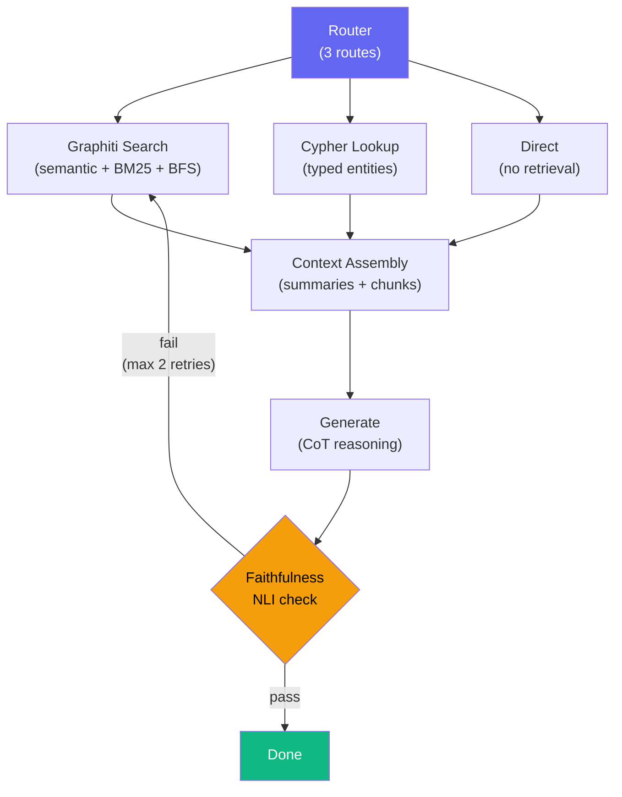
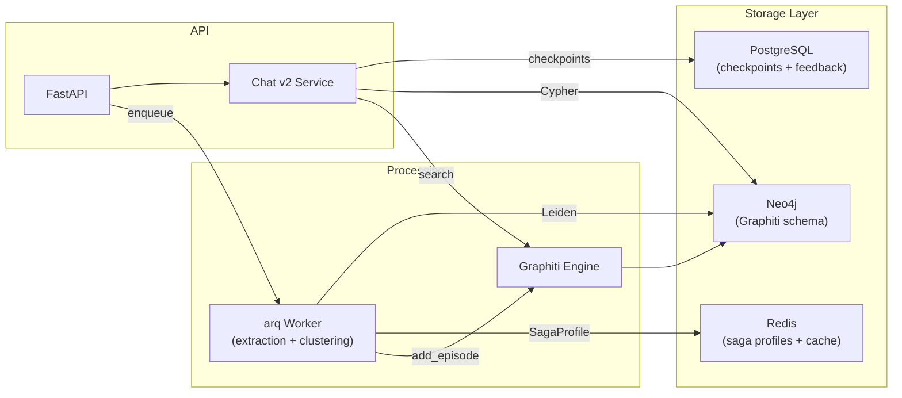

<p align="center">
  
  
  
  
  
  
  
</p>

# WorldRAG

**Automatic Knowledge Graph construction + RAG chat for fiction novel universes.**

WorldRAG ingests novels (LitRPG, fantasy, sci-fi), automatically discovers the ontology of each fictional universe, builds a temporal Knowledge Graph in Neo4j, and exposes a chat interface for querying the graph with hybrid retrieval.

The core innovation is the **SagaProfileInducer** -- a module that analyzes the first book of a saga and induces the ontology automatically (character classes, magic systems, factions, progression systems...), then uses it to guide extraction of subsequent books.

> Research project -- LIFAT, Universite de Tours.

---

## How It Works



---

## Key Concepts

### SagaProfileInducer

The original contribution. When you ingest the first book of a saga, WorldRAG:

1. Extracts entities with **universal types** only (Character, Location, Object, Organization, Event, Concept)
2. Clusters semantically similar entities (e.g., "Expelliarmus", "Patronus", "Lumos" form a cluster)
3. An LLM formalizes each cluster into an **induced type** (Spell, House, MagicalCreature...)
4. Detects **textual patterns** (`[Skill Acquired: X]`, `[Level N -> M]`)
5. Produces a **SagaProfile** -- a Pydantic model that is injected into Graphiti for all subsequent books



**Examples of induced profiles:**

| Saga | Induced Types | Patterns |
|------|---------------|----------|
| Harry Potter | Spell, House, MagicalCreature | -- (prose only) |
| Primal Hunter | Skill, Class, Bloodline | `[Skill Acquired: X]`, `[Level N -> M]` |
| L'Assassin Royal | MagicSystem (2 instances) | -- (low-magic) |

### Temporal Model

Graphiti maintains a **bi-temporal** graph -- every fact has validity timestamps. WorldRAG maps narrative time (book, chapter, scene) to datetime via `NarrativeTemporalMapper`:

```
(book=1, chapter=5) -> datetime(2000-01-06)
(book=2, chapter=1) -> datetime(2027-05-19)
```

This enables queries like "What skills did Jake have at chapter 30?" with native temporal filtering.

### Dual Retrieval

The chat pipeline uses two complementary retrieval strategies:

| Strategy | When | How |
|----------|------|-----|
| **Graphiti search** | Open-ended questions | Semantic + BM25 + BFS graph traversal |
| **Cypher lookup** | Structured questions | Typed queries on induced labels |

Both hit the same Neo4j database -- Graphiti nodes are augmented with saga-specific labels.

---

## Tech Stack



| Component | Technology | Purpose |
|-----------|-----------|---------|
| **API** | FastAPI (async) | REST API, SSE streaming, file upload |
| **KG Engine** | Graphiti (graphiti-core) | Extraction, entity resolution, temporal storage, hybrid retrieval |
| **Graph DB** | Neo4j 5.x + GDS + APOC | Storage, Cypher queries, Leiden clustering |
| **Orchestration** | LangGraph 0.3+ | 8-node chat pipeline, async workers |
| **Extraction LLM** | Gemini 2.5 Flash | Entity/relation extraction via Graphiti |
| **Chat LLM** | Gemini 2.5 Flash | Answer generation with CoT |
| **Local LLM** | Qwen3.5-4B (Ollama) | Conversation memory summarization |
| **NLI** | DeBERTa-v3-large (local) | Faithfulness checking |
| **Embeddings** | BGE-m3 (local) | Semantic search via Graphiti |
| **Task Queue** | arq + Redis | Async book ingestion + clustering |
| **Checkpointing** | PostgreSQL | LangGraph conversation state |
| **Monitoring** | LangSmith + LangFuse | Traces, costs, KG pipeline vs RAG pipeline |
| **Frontend** | Next.js 16 / React 19 | Chat UI, graph explorer |
| **State** | Zustand | Frontend state management |
| **Clustering** | Leiden (Neo4j GDS) | Community detection + LLM summaries |

---

## Quick Start

### Prerequisites

- **Python 3.12+**
- **Node.js 20+**
- **Docker** + Docker Compose
- **uv**: `pip install uv`
- **Ollama** (optional, for local models): [ollama.ai](https://ollama.ai)

### 1. Clone and install

```bash
git clone https://github.com/xairon/WorldRAG.git
cd WorldRAG

uv sync --all-extras           # Python deps
cd frontend && npm install     # Frontend deps
```

### 2. Configure environment

```bash
cp .env.example .env
# Edit .env:
#   GEMINI_API_KEY=...          (required - extraction + chat)
#   GRAPHITI_ENABLED=true       (activate KG v2 pipeline)
```

### 3. Start infrastructure

```bash
docker compose up -d
# Starts: Neo4j + GDS, Redis, PostgreSQL, LangFuse
```

### 4. Start services

```bash
# Terminal 1: API
uv run uvicorn backend.app.main:app --reload --port 8000

# Terminal 2: Workers
uv run arq app.workers.settings.WorkerSettings

# Terminal 3: Frontend
cd frontend && npm run dev
```

### 5. Ingest a book

```bash
# Upload
curl -X POST http://localhost:8000/api/books \
  -F "file=@primal_hunter_book1.epub" \
  -F "title=The Primal Hunter" \
  -F "genre=litrpg"

# Trigger Graphiti extraction (Discovery Mode)
curl -X POST http://localhost:8000/api/books/{book_id}/extract-graphiti \
  -H "Content-Type: application/json" \
  -d '{"saga_id": "primal-hunter", "saga_name": "The Primal Hunter", "book_num": 1}'

# Check induced profile
curl http://localhost:8000/api/saga-profiles/primal-hunter
```

---

## API Reference

### Books

| Method | Endpoint | Description |
|--------|----------|-------------|
| `POST` | `/api/books` | Upload book (ePub/PDF/TXT) |
| `GET` | `/api/books` | List all books |
| `GET` | `/api/books/{id}` | Book details + chapters |
| `POST` | `/api/books/{id}/extract-graphiti` | Trigger Graphiti extraction (Discovery/Guided) |
| `DELETE` | `/api/books/{id}` | Delete book + data |

### Chat

| Method | Endpoint | Description |
|--------|----------|-------------|
| `POST` | `/api/chat/query` | Send question, get answer (sync) |
| `GET` | `/api/chat/stream` | SSE streaming (tokens + sources) |
| `POST` | `/api/chat/feedback` | Submit thumbs up/down |
| `GET` | `/api/chat/feedback/{thread_id}` | Get feedback for thread |

### Saga Profiles

| Method | Endpoint | Description |
|--------|----------|-------------|
| `GET` | `/api/saga-profiles` | List all induced profiles |
| `GET` | `/api/saga-profiles/{id}` | Get profile details |
| `PUT` | `/api/saga-profiles/{id}` | Update profile manually |
| `DELETE` | `/api/saga-profiles/{id}` | Delete profile |

### Graph & Admin

| Method | Endpoint | Description |
|--------|----------|-------------|
| `GET` | `/api/graph/{book_id}` | Graph data for Sigma.js |
| `GET` | `/api/graph/{book_id}/search` | Entity search |
| `GET` | `/api/health` | Health check (all services) |
| `GET` | `/api/admin/costs` | Cost tracking |
| `GET` | `/api/admin/dlq` | Dead letter queue |

---

## Architecture

### Pipeline Modes



### Chat Pipeline (8-node LangGraph)



### Data Flow



---

## Project Structure

```
WorldRAG/
├── backend/app/
│   ├── main.py                              # FastAPI + lifespan (Neo4j, Redis, PG, Graphiti)
│   ├── config.py                            # Pydantic Settings (.env)
│   ├── api/routes/
│   │   ├── books.py                         # Upload + extract-graphiti endpoint
│   │   ├── chat.py                          # Query + stream + feedback (v1/v2 switch)
│   │   ├── saga_profiles.py                 # CRUD for induced ontology profiles
│   │   ├── graph.py                         # Graph explorer for Sigma.js
│   │   └── health.py, admin.py, ...
│   ├── core/
│   │   ├── graphiti_client.py               # Graphiti singleton wrapper
│   │   ├── logging.py                       # structlog setup
│   │   ├── resilience.py                    # Circuit breakers + retries
│   │   └── cost_tracker.py, dead_letter.py
│   ├── services/
│   │   ├── saga_profile/
│   │   │   ├── models.py                    # SagaProfile, InducedEntityType, ...
│   │   │   ├── inducer.py                   # SagaProfileInducer (5-step algorithm)
│   │   │   ├── pydantic_generator.py        # SagaProfile -> Graphiti entity_types
│   │   │   └── temporal.py                  # NarrativeTemporalMapper
│   │   ├── ingestion/
│   │   │   └── graphiti_ingest.py           # Discovery / Guided mode orchestrator
│   │   ├── chat_service_v2.py               # ChatServiceV2 (Graphiti retrieval)
│   │   └── community_clustering.py          # Leiden + LLM community summaries
│   ├── agents/chat_v2/
│   │   ├── graph.py                         # 8-node LangGraph builder
│   │   └── state.py                         # ChatV2State TypedDict
│   └── workers/
│       ├── tasks.py                         # process_book_graphiti + legacy tasks
│       └── settings.py                      # arq config + Graphiti init
├── frontend/                                # Next.js 16 / React 19
│   ├── components/chat/                     # Thread sidebar, sources, citations, feedback
│   ├── components/graph/                    # Sigma.js graph explorer
│   └── lib/utils.ts                         # Dynamic entity type colors/icons
├── docker-compose.prod.yml                  # Production (ports 495xx, GPU, GDS)
├── docker-compose.yml                       # Development
└── docs/
    └── superpowers/specs/                   # Design specs + implementation plans
```

---

## Configuration

### Required

| Variable | Description |
|----------|-------------|
| `GEMINI_API_KEY` | Google AI API key (extraction + chat) |
| `GRAPHITI_ENABLED` | `true` to activate KG v2 pipeline |

### Optional

| Variable | Default | Description |
|----------|---------|-------------|
| `NEO4J_URI` | `bolt://localhost:7687` | Neo4j connection |
| `NEO4J_PASSWORD` | `worldrag` | Neo4j password |
| `REDIS_URL` | `redis://localhost:6379` | Redis connection |
| `POSTGRES_URI` | `postgresql://...` | PostgreSQL connection |
| `LLM_CHAT` | `gemini:gemini-2.5-flash` | Chat generation model |
| `LLM_GENERATION` | `gemini:gemini-2.5-flash-lite` | Auxiliary LLM |
| `OLLAMA_BASE_URL` | `http://localhost:11434` | Ollama server |
| `LANGFUSE_HOST` | -- | LangFuse host (self-hosted) |
| `LANGCHAIN_API_KEY` | -- | LangSmith API key |

---

## Testing

```bash
# All new KG v2 tests (121 tests)
uv run python -m pytest backend/tests/test_saga_profile_models.py \
  backend/tests/test_narrative_temporal_mapper.py \
  backend/tests/test_pydantic_generator.py \
  backend/tests/test_graphiti_client.py \
  backend/tests/test_graphiti_ingest.py \
  backend/tests/test_saga_profile_inducer.py \
  backend/tests/test_chat_v2_pipeline.py \
  backend/tests/test_saga_profiles_api.py \
  backend/tests/test_extract_graphiti_endpoint.py \
  backend/tests/test_chat_service_v2.py \
  backend/tests/test_community_clustering.py -v

# Linting
uv run ruff check backend/ --fix
uv run ruff format backend/
```

---

## Research Context

WorldRAG is developed at **LIFAT** (Laboratoire d'Informatique Fondamentale et Appliquee de Tours), Universite de Tours, France.

The project explores automatic Knowledge Graph construction from fiction novels using SOTA tools (Graphiti, Leiden, LangGraph) with a focus on **ontology induction** -- discovering the rules and systems of fictional universes automatically rather than hardcoding them.

### References

- Mo et al. "KGGen: Extracting Knowledge Graphs from Plain Text with Language Models." NeurIPS 2025.
- Rasmussen et al. "Zep: A Temporal Knowledge Graph Architecture for Agent Memory." arXiv:2501.13956.
- Bai et al. "AutoSchemaKG: Automatic Schema-based Knowledge Graph Construction." HKUST, 2025.
- Bian et al. "LLM-empowered Knowledge Graph Construction: A Survey." arXiv:2510.20345.

---

## License

MIT License. See [LICENSE](LICENSE) for details.

---

<p align="center">
  <strong>WorldRAG</strong> -- Turning novels into knowledge, one chapter at a time.
</p>
