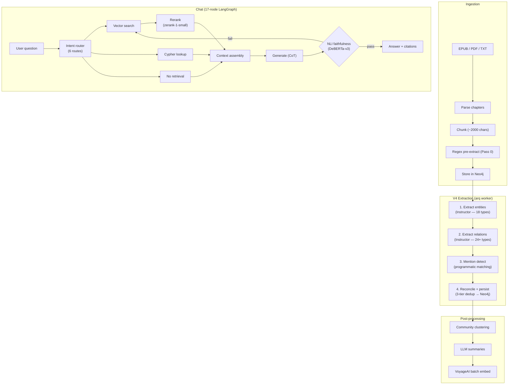

<p align="center">
  
  
  
  
  
  
</p>

# WorldRAG

**Automatic Knowledge Graph construction + RAG chat for fiction novel universes.**

WorldRAG ingests novels (LitRPG, fantasy, sci-fi), extracts entities and relationships using structured LLM output (Instructor), builds a temporal Knowledge Graph in Neo4j, and exposes a chat interface powered by a 17-node LangGraph agent with hybrid retrieval and NLI faithfulness checking.

> Research project -- LIFAT, Universite de Tours.

---

## Pipeline



---

## Tech Stack

| Component | Technology | Purpose |
|-----------|-----------|---------|
| **API** | FastAPI (async) | REST API, SSE streaming, file upload |
| **Extraction** | Instructor (structured output) | Single-pass KGGen-style pipeline (V4) |
| **Orchestration** | LangGraph | 6-node extraction pipeline (GOLEM v1.1), 17-node chat agent |
| **Graph DB** | Neo4j 5.x + GDS + APOC | Entity/relation storage, Cypher queries, community detection |
| **Extraction LLM** | DeepSeek V3.2 (OpenRouter) | Entity + relation extraction via Instructor |
| **Chat LLM** | Gemini 2.5 Flash | Answer generation with chain-of-thought |
| **Local LLM** | Ollama (Qwen3.5-4B) | Auxiliary tasks (summarization) |
| **NLI** | DeBERTa-v3-large (local) | Faithfulness checking in chat pipeline |
| **Embeddings** | VoyageAI (voyage-3.5) | Batch semantic embeddings for retrieval |
| **Reranker** | zerank-1-small (local CrossEncoder) | Reranking in chat retrieval pipeline |
| **Task Queue** | arq + Redis | Async extraction + embedding jobs |
| **Checkpointing** | PostgreSQL | LangGraph conversation state (AsyncPostgresSaver) |
| **Monitoring** | LangFuse (self-hosted) + structlog | Traces, costs, structured logging |
| **Frontend** | Next.js 16 / React 19 | Chat UI, graph explorer, book management |
| **Graph Viz** | Sigma.js + graphology (ForceAtlas2) | Interactive graph exploration |
| **State** | Zustand | Frontend state management |

---

## Quick Start

### Prerequisites

- **Python 3.12+** with [uv](https://github.com/astral-sh/uv)
- **Node.js 20+**
- **Docker** + Docker Compose
- **Ollama** (optional, for local models): [ollama.ai](https://ollama.ai)

### 1. Clone and install

```bash
git clone https://github.com/xairon/WorldRAG.git
cd WorldRAG

uv sync --all-extras           # Python deps
cd frontend && npm install     # Frontend deps
```

### 2. Configure environment

```bash
cp .env.example .env
# Edit .env — at minimum:
#   GEMINI_API_KEY=...              (chat generation)
#   OPENROUTER_API_KEY=...          (extraction — DeepSeek V3.2)
```

### 3. Start infrastructure

```bash
docker compose up -d
# Starts: Neo4j (49520/49521), Redis (49522), PostgreSQL (49523), LangFuse (49517)
```

### 4. Start services

```bash
# Terminal 1: API server
uv run uvicorn backend.app.main:app --reload --port 8000

# Terminal 2: arq worker (extraction + embedding jobs)
uv run arq app.workers.settings.WorkerSettings

# Terminal 3: Frontend
cd frontend && npm run dev
```

### 5. Ingest a book

```bash
# Upload
curl -X POST http://localhost:8000/api/books \
  -F "file=@book.epub" \
  -F "title=The Primal Hunter" \
  -F "genre=litrpg"

# Trigger V4 extraction (async — returns immediately)
curl -X POST http://localhost:8000/api/books/{book_id}/extract/v4

# Monitor progress via book status
curl http://localhost:8000/api/books/{book_id}
```

---

## Project Structure

```
WorldRAG/
├── backend/app/
│   ├── main.py                 # FastAPI + lifespan (Neo4j, Redis, PG, LangFuse)
│   ├── config.py               # Pydantic Settings (.env)
│   ├── api/routes/             # books, chat, graph, admin, health, stream, ...
│   ├── core/                   # Logging, resilience, cost tracking, DLQ, ontology
│   ├── llm/                    # LLM providers, embeddings (VoyageAI), reranker
│   ├── schemas/                # Pydantic models (18 entity types, 24+ relation types)
│   ├── repositories/           # Neo4j data access (book, entity, graph repos)
│   ├── services/               # Extraction pipeline, embedding, ingestion, chat
│   ├── agents/                 # LangGraph graphs (extraction, chat)
│   ├── prompts/                # LLM prompt templates
│   └── workers/                # arq tasks (extraction + embedding)
├── frontend/                   # Next.js 16 / React 19
│   ├── components/chat/        # Thread sidebar, citations, confidence, feedback
│   ├── components/graph/       # Sigma.js graph explorer (ForceAtlas2)
│   └── components/extraction/  # Extraction controls + progress
├── ontology/                   # YAML ontology (core, genre, series layers)
├── scripts/                    # Neo4j init, PostgreSQL migrations
└── docker-compose.yml          # Infrastructure (ports 495xx)
```

---

## Extraction Pipeline

The V4 pipeline uses **Instructor** for structured LLM output in a 6-node LangGraph graph (GOLEM v1.1 ontology), processing one chapter at a time:

1. **Extract entities** -- 18 types (Character, Location, Object, Skill, Class, Event, NarrativeSequence, ...) in a single Instructor call
2. **Extract relations** -- 24+ relation types between extracted entities
3. **Mention detect** -- Programmatic name/alias matching for source grounding
4. **Reconcile + persist** -- 3-tier entity resolution (exact, fuzzy, embedding similarity) then Neo4j upsert

An `EntityRegistry` accumulates context across chapters. After all chapters, book-level post-processing runs clustering, community summaries, and embedding generation.

The legacy V3 pipeline (4-pass LangExtract parallel fan-out) remains available via `use_v3_pipeline=True`.

---

## Testing

```bash
# Run all tests (1100+)
uv run pytest backend/tests/ -x -v

# Linting + formatting
uv run ruff check backend/ --fix
uv run ruff format backend/

# Type checking
uv run pyright backend/
```

---

## Research Context

WorldRAG is developed at **LIFAT** (Laboratoire d'Informatique Fondamentale et Appliquee de Tours), Universite de Tours, France. The project explores automatic Knowledge Graph construction from fiction novels, with a focus on structured extraction, entity resolution, and temporal modeling of narrative worlds.

---

<p align="center">
  <strong>WorldRAG</strong> -- Turning novels into knowledge, one chapter at a time.
</p>
