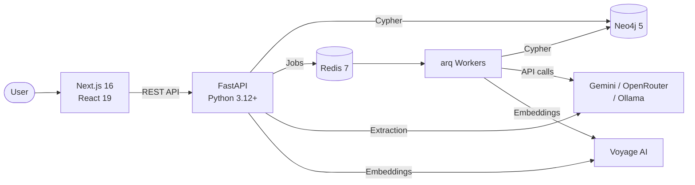

# WorldRAG Documentation

   

## What is WorldRAG?

WorldRAG is a state-of-the-art Knowledge Graph construction system designed for fiction novel universes. It extracts entities, relationships, events, and temporal data from novels (LitRPG, fantasy, sci-fi) and builds a rich, evolving Knowledge Graph in Neo4j.

The system uses a V4 single-pass Instructor extraction pipeline (15 entity types, 16 relation types) via a LangGraph 4-node linear pipeline (extract_entities, extract_relations, mention_detect, reconcile_persist), with regex pre-extraction for structured game-like elements and 3-tier entity deduplication plus vector embedding for semantic search. All heavy processing runs asynchronously via background workers, with built-in cost tracking, circuit breakers, and dead letter queues for production reliability.

**Design principle**: Knowledge Graph construction quality is the top priority. Use cases (reader companion, chat, wiki) are built on top of the KG, not the other way around.

## Key Features

- **V4 single-pass Instructor extraction**: 15 entity types, 16 relation types (LangGraph 4-node linear pipeline)
- **3-tier entity deduplication**: exact match, fuzzy matching (thefuzz), LLM-as-Judge
- **Source grounding**: every extracted entity links back to its source text with exact character offsets
- **Chapter-based temporality**: relationships evolve over chapters (`valid_from_chapter` / `valid_to_chapter`)
- **3-layer ontology**: Core (universal) + Genre (LitRPG) + Series (Primal Hunter) -- extensible to any fiction genre
- **Async background processing**: arq workers for extraction and embedding, with automatic job chaining
- **Cost optimization**: Gemini 2.5 Flash for extraction ($0.15/M), GPT-4o-mini for reconciliation ($0.15/M), Voyage 3.5 for embeddings ($0.06/M)
- **Production resilience**: circuit breakers per LLM provider, rate limiters, tenacity retries, dead letter queue with retry
- **Interactive graph explorer**: Sigma.js + graphology (ForceAtlas2) visualization with entity search, filtering, and character profiles
- **1000+ tests**: golden dataset validation, unit tests, all mocked (no external dependencies)

## Architecture at a Glance


```mermaid
graph LR
    User([User]) --> Frontend[Next.js 16<br/>React 19]
    Frontend -->|REST API| Backend[FastAPI<br/>Python 3.12+]
    Backend -->|Cypher| Neo4j[(Neo4j 5)]
    Backend -->|Jobs| Redis[(Redis 7)]
    Backend -->|Extraction| LLMs[Gemini / OpenRouter<br/>/ Ollama]
    Backend -->|Embeddings| Voyage[Voyage AI]
    Redis --> Workers[arq Workers]
    Workers -->|Cypher| Neo4j
    Workers -->|API calls| LLMs
    Workers -->|Embeddings| Voyage
```

## Documentation Map

| # | Document | Description | Audience |
|---|----------|-------------|----------|
| 1 | [Architecture](./architecture.md) | System design, pipeline flow, 7 Mermaid diagrams | Developers, architects |
| 2 | [Technology Stack](./tech-stack.md) | Every technology choice with rationale ("why X, not Y") | Developers, decision-makers |
| 3 | [Data Model](./data-model.md) | Neo4j schema: 14 node labels, 11+ relationship types, all indexes | Backend developers |
| 4 | [Ontology](./ontology.md) | 3-layer ontology system with academic foundations | Researchers, domain experts |
| 5 | [Extraction Pipeline](./extraction-pipeline.md) | Deep dive: regex, 4 LLM passes, dedup, grounding, embedding | ML engineers, backend devs |
| 6 | [API Reference](./api-reference.md) | All 24 REST endpoints with schemas and examples | Frontend developers, integrators |
| 7 | [Testing](./testing.md) | Test strategy, golden dataset methodology, 1000+ tests | QA, contributors |
| 8 | [Deployment](./deployment.md) | Dev setup, Docker Compose, environment variables, workers | DevOps, new contributors |

**Recommended reading order**: Architecture --> Tech Stack --> Data Model --> Ontology --> Extraction Pipeline --> API Reference --> Testing --> Deployment

## Quick Start

```bash
# 1. Clone the repository
git clone https://github.com/youruser/worldrag.git && cd worldrag

# 2. Configure environment
cp .env.example .env
# Edit .env: add at minimum OPENAI_API_KEY and VOYAGE_API_KEY

# 3. Start infrastructure
docker compose up -d    # Neo4j, Redis, PostgreSQL, LangFuse

# 4. Start backend + worker
uv sync
uv run uvicorn backend.app.main:app --reload --port 8000
# In a separate terminal:
uv run arq app.workers.settings.WorkerSettings

# 5. Start frontend
cd frontend && npm install && npm run dev
```

See [Deployment Guide](./deployment.md) for detailed instructions and production configuration.

## Project Status

### Complete

- V4 extraction pipeline (Instructor, 4-node LangGraph, 15 entity types, 16 relation types)
- V3 legacy extraction pipeline (LangExtract, 4-pass parallel fan-out)
- Entity persistence to Neo4j (15 entity types, 13 upsert methods)
- Full reconciler (all entity types, integrated as LangGraph node)
- 3-tier deduplication (exact, fuzzy, LLM-as-Judge)
- Alias map normalization (stat_changes, skill/class/title names, all lore entities)
- GROUNDED_IN relationships (label-aware UNWIND per entity type, source chunk offsets)
- Multi-provider support: Gemini, OpenRouter (DeepSeek V3.2 etc.), Ollama (local)
- Instructor structured output with provider routing (`provider:model` spec)
- Cost ceiling enforcement (per-chapter and per-book limits with CostTracker)
- Embedding pipeline (Voyage AI, batch 128, vector write-back)
- Background workers (arq: extraction + embedding with auto-chaining)
- Ontology runtime loader (3-layer YAML loading, enum validation, FastAPI dependency)
- DLQ retry mechanism (single chapter + bulk retry-all, re-enqueue via arq)
- REST API (24 endpoints: books, graph explorer, admin with retry)
- Frontend (book management, Sigma.js graph explorer, chat UI, dashboard)
- Infrastructure (Docker Compose: Neo4j, Redis, PostgreSQL, LangFuse)
- Chat/RAG query pipeline (hybrid retrieval: vector + rerank + LLM generate)
- Chat LangGraph agent (17 nodes, 6 routes, NLI faithfulness)
- Chat frontend (thread sidebar, citations, confidence badge, feedback)
- LangGraph PostgreSQL checkpointing (AsyncPostgresSaver)
- Chat feedback API (PostgreSQL)
- 1000+ tests passing (golden dataset + unit tests)

### Planned

- Reader LangGraph agent (summarization, highlights)
- Frontend polish
- Application Dockerfile for containerized deployment
