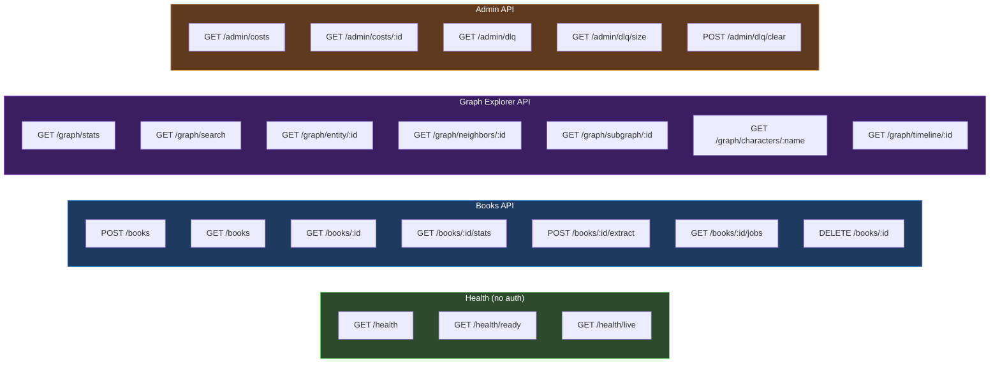

# API Reference

> Complete REST API documentation for WorldRAG's FastAPI backend: all endpoints, request/response schemas, authentication, and usage examples.

**Back to**: [Documentation Hub](./README.md)

---

## Table of Contents

- [Base URL & Authentication](#base-url--authentication)
- [Error Handling](#error-handling)
- [Health Endpoints](#health-endpoints)
- [Books API](#books-api)
- [Graph Explorer API](#graph-explorer-api)
- [Admin API](#admin-api)
- [Endpoint Summary](#endpoint-summary)

---

## Base URL & Authentication

```
Base URL: http://localhost:8000/api/v1
```

### Authentication

All endpoints (except health checks) require a Bearer token:

```http
Authorization: Bearer <API_KEY>
```

Set via environment variable `WORLDRAG_API_KEY`. Admin endpoints require a separate `WORLDRAG_ADMIN_KEY`.

### Rate Limiting

Built-in rate limiter (configurable per-endpoint). Default: 100 requests/minute per client IP.

---

## Error Handling

All errors return consistent JSON:

```json
{
  "detail": "Human-readable error message"
}
```

| Status Code | Meaning | When |
|-------------|---------|------|
| `400` | Validation Error | Invalid input, unsupported format |
| `401` | Unauthorized | Missing or invalid API key |
| `403` | Forbidden | Admin endpoint with non-admin key |
| `404` | Not Found | Book/entity doesn't exist |
| `409` | Conflict | Book not in required status for operation |
| `422` | Unprocessable Entity | Pydantic validation failure |
| `500` | Internal Server Error | Unexpected failure |
| `503` | Service Unavailable | Infrastructure degraded (health check) |

---

## Health Endpoints

### `GET /health`

Comprehensive health check for all infrastructure services.

**Auth**: None required

**Response** `200`:
```json
{
  "status": "healthy",
  "services": {
    "neo4j": "ok",
    "redis": "ok",
    "postgres": "ok",
    "langfuse": "ok"
  }
}
```

**Response** `503` (degraded):
```json
{
  "status": "degraded",
  "services": {
    "neo4j": "ok",
    "redis": "error",
    "postgres": "not configured",
    "langfuse": "ok"
  }
}
```

### `GET /health/ready`

Quick readiness probe for load balancers and orchestrators. Verifies Neo4j connectivity.

**Auth**: None

| Status | Body |
|--------|------|
| `200` | `{"ready": true}` |
| `503` | `{"ready": false}` |

### `GET /health/live`

Lightweight liveness probe. Confirms FastAPI process is alive. No dependency checks.

**Auth**: None

**Response** `200`: `{"alive": true}`

---

## Books API

**Prefix**: `/api/v1/books`
**Auth**: Bearer token required on all endpoints

### `POST /books` — Upload & Ingest

Upload a book file and run the ingestion pipeline (parse → chunk → regex extract → store).

**Content-Type**: `multipart/form-data`

**Parameters**:

| Name | In | Type | Required | Description |
|------|-----|------|----------|-------------|
| `file` | body | file | ✅ | ePub, PDF, or TXT file (max 100 MB) |
| `title` | query | string | ❌ | Book title (defaults to filename) |
| `series_name` | query | string | ❌ | Series name |
| `order_in_series` | query | int | ❌ | Position in series (≥ 1) |
| `author` | query | string | ❌ | Author name |
| `genre` | query | string | ❌ | Genre (default: `"litrpg"`) |

**Supported formats**: `.epub`, `.pdf`, `.txt`

**Response** `200` — `IngestionResult`:
```json
{
  "book_id": "uuid-string",
  "title": "The Primal Hunter - Book 1",
  "chapters_found": 142,
  "chunks_created": 1847,
  "regex_matches_total": 389,
  "status": "completed"
}
```

**Errors**:
- `400`: Unsupported format, no filename, file too large, no chapters found
- `409`: Book with same title already exists
- `500`: Ingestion pipeline failure

### `GET /books` — List All Books

**Response** `200` — `BookInfo[]`:
```json
[
  {
    "id": "uuid-string",
    "title": "The Primal Hunter - Book 1",
    "series_name": "The Primal Hunter",
    "order_in_series": 1,
    "author": "Zogarth",
    "genre": "litrpg",
    "total_chapters": 142,
    "status": "extracted",
    "chapters_processed": 142
  }
]
```

### `GET /books/{book_id}` — Book Detail

Returns full book info with chapter list.

**Response** `200` — `BookDetail`:
```json
{
  "book": { /* BookInfo */ },
  "chapters": [
    {
      "number": 1,
      "title": "Tutorial Begins",
      "word_count": 3456,
      "chunk_count": 5,
      "entity_count": 12,
      "status": "extracted",
      "regex_matches": 3
    }
  ]
}
```

### `GET /books/{book_id}/stats` — Processing Statistics

**Response** `200`:
```json
{
  "total_chapters": 142,
  "chapters_extracted": 142,
  "total_entities": 2847,
  "total_relationships": 1923,
  "total_chunks": 1847,
  "chunks_with_embeddings": 1847
}
```

### `POST /books/{book_id}/extract` — Start LLM Extraction

Enqueues the LLM extraction pipeline as an arq background job. Returns immediately.

**Precondition**: Book status must be `completed`, `extracted`, `partial`, or `embedded`.

**Response** `200` — `JobEnqueuedResult`:
```json
{
  "book_id": "uuid-string",
  "job_id": "extract:uuid-string",
  "status": "enqueued",
  "message": "Extraction job enqueued. Poll GET /books/{book_id}/jobs for status."
}
```

**Errors**:
- `404`: Book not found
- `409`: Book not in correct status (must be ingested first)
- `400`: No chapter text found

### `GET /books/{book_id}/jobs` — Job Status

Check status of background extraction and embedding jobs.

**Response** `200`:
```json
{
  "book_id": "uuid-string",
  "book_status": "extracting",
  "jobs": {
    "extraction": {
      "job_id": "extract:uuid-string",
      "status": "in_progress"
    },
    "embedding": {
      "job_id": "embed:uuid-string",
      "status": "not_found"
    }
  }
}
```

**Job statuses**: `not_found`, `queued`, `in_progress`, `complete`, `deferred`

### `DELETE /books/{book_id}` — Delete Book

Deletes a book and ALL associated data (chapters, chunks, entities, relationships).

**Response** `200`:
```json
{
  "deleted": true,
  "book_id": "uuid-string",
  "chapters_deleted": 142
}
```

---

## Graph Explorer API

**Prefix**: `/api/v1/graph`
**Auth**: Bearer token required on all endpoints

### `GET /graph/stats` — Graph Statistics

Count nodes and relationships by label/type. Optionally scope to a single book.

**Parameters**:

| Name | In | Type | Required | Description |
|------|-----|------|----------|-------------|
| `book_id` | query | string | ❌ | Scope to a specific book |

**Response** `200`:
```json
{
  "nodes": {
    "Character": 87,
    "Skill": 234,
    "Event": 456,
    "Location": 32
  },
  "relationships": {
    "HAS_SKILL": 312,
    "RELATES_TO": 145,
    "PARTICIPATES_IN": 678
  },
  "total_nodes": 1247,
  "total_relationships": 2341
}
```

### `GET /graph/search` — Entity Search

Full-text search across all entity types using the `entity_fulltext` Neo4j index. Falls back to `CONTAINS` scan if the index is unavailable.

**Parameters**:

| Name | In | Type | Required | Description |
|------|-----|------|----------|-------------|
| `q` | query | string | ✅ | Search query (1-200 chars) |
| `label` | query | string | ❌ | Filter by node label (e.g., `Character`, `Skill`) |
| `book_id` | query | string | ❌ | Scope to a specific book |
| `limit` | query | int | ❌ | Max results (1-100, default: 20) |

**Allowed labels**: `Character`, `Skill`, `Class`, `Title`, `Event`, `Location`, `Item`, `Creature`, `Faction`, `Concept`

**Response** `200`:
```json
[
  {
    "id": "4:abc123:0",
    "labels": ["Character"],
    "name": "Jake Thayne",
    "canonical_name": "Jake Thayne",
    "description": "Human, protagonist, Primal Hunter bloodline...",
    "score": 12.5
  }
]
```

### `GET /graph/entity/{entity_id}` — Entity Detail

Get full properties of any entity by its Neo4j element ID.

**Response** `200`:
```json
{
  "id": "4:abc123:0",
  "labels": ["Character"],
  "properties": {
    "canonical_name": "Jake Thayne",
    "name": "Jake Thayne",
    "aliases": ["Jake", "Thayne"],
    "description": "...",
    "role": "protagonist",
    "level": 88,
    "first_appearance_chapter": 1
  }
}
```

### `GET /graph/neighbors/{entity_id}` — Neighborhood

Get the ego graph (neighborhood) of a node within `depth` hops. Uses APOC when available, with automatic fallback.

**Parameters**:

| Name | In | Type | Required | Description |
|------|-----|------|----------|-------------|
| `entity_id` | path | string | ✅ | Neo4j element ID |
| `depth` | query | int | ❌ | Hops (1-3, default: 1) |
| `limit` | query | int | ❌ | Max nodes (1-200, default: 50) |

**Response** `200`:
```json
{
  "nodes": [
    {"id": "...", "labels": ["Character"], "name": "Jake Thayne", "description": "..."},
    {"id": "...", "labels": ["Skill"], "name": "Arcane Powershot", "description": "..."}
  ],
  "edges": [
    {"id": "...", "type": "HAS_SKILL", "source": "...", "target": "..."}
  ]
}
```

### `GET /graph/subgraph/{book_id}` — Book Subgraph

Get the full entity subgraph for a book for D3 force graph visualization.

**Parameters**:

| Name | In | Type | Required | Description |
|------|-----|------|----------|-------------|
| `book_id` | path | string | ✅ | Book UUID |
| `label` | query | string | ❌ | Filter by node label |
| `chapter` | query | int | ❌ | Temporal scope (show state at chapter N) |
| `limit` | query | int | ❌ | Max relationships (1-500, default: 100) |

**Response** `200`: Same `{nodes, edges}` format as `/neighbors`.

### `GET /graph/characters/{name}` — Character Profile

Rich character profile aggregating skills, classes, titles, relationships, and events.

**Parameters**:

| Name | In | Type | Required | Description |
|------|-----|------|----------|-------------|
| `name` | path | string | ✅ | Character name, canonical name, or alias |
| `book_id` | query | string | ❌ | Scope to a specific book |

**Response** `200`:
```json
{
  "id": "4:abc123:0",
  "properties": {
    "canonical_name": "Jake Thayne",
    "role": "protagonist",
    "level": 88
  },
  "skills": [
    {"name": "Arcane Powershot", "rank": "legendary", "type": "active", "since_chapter": 42}
  ],
  "classes": [
    {"name": "Arcane Hunter", "tier": 2, "since_chapter": 42}
  ],
  "titles": [
    {"name": "Hydra Slayer", "acquired_chapter": 42}
  ],
  "relationships": [
    {"name": "Villy", "rel_type": "patron", "since_chapter": 5}
  ],
  "events": [
    {"name": "Hydra Trial", "type": "action", "significance": "major", "chapter": 42}
  ]
}
```

### `GET /graph/timeline/{book_id}` — Event Timeline

Chronological event timeline for a book, filterable by significance.

**Parameters**:

| Name | In | Type | Required | Description |
|------|-----|------|----------|-------------|
| `book_id` | path | string | ✅ | Book UUID |
| `significance` | query | string | ❌ | Min significance: `minor`, `moderate`, `major`, `critical` |
| `limit` | query | int | ❌ | Max events (1-500, default: 100) |

**Response** `200`:
```json
[
  {
    "name": "Hydra Trial",
    "description": "Jake defeats the Scalding Hydra in the arena",
    "type": "action",
    "significance": "major",
    "chapter": 42,
    "participants": ["Jake Thayne"],
    "locations": ["Nevermore Arena"]
  }
]
```

---

## Admin API

**Prefix**: `/api/v1/admin`
**Auth**: Admin API key required (`WORLDRAG_ADMIN_KEY`)

### `GET /admin/costs` — Cost Summary

Aggregated LLM cost report across all providers, models, and operations.

**Response** `200`:
```json
{
  "total_cost_usd": 23.47,
  "by_provider": {
    "google": 18.20,
    "openai": 2.15,
    "voyageai": 3.12
  },
  "by_model": {
    "gemini-2.5-flash": 18.20,
    "gpt-4o-mini": 2.15,
    "voyage-3.5": 3.12
  },
  "entry_count": 1847
}
```

### `GET /admin/costs/{book_id}` — Book Cost Breakdown

Per-chapter cost breakdown for a specific book.

**Response** `200`:
```json
{
  "book_id": "uuid-string",
  "total_cost_usd": 23.47,
  "chapter_count": 142,
  "by_chapter": {
    "1": 0.18,
    "2": 0.22,
    "42": 0.31
  }
}
```

### `GET /admin/dlq` — List Dead Letter Queue

All failed extraction entries.

**Response** `200`:
```json
{
  "count": 3,
  "entries": [
    {
      "book_id": "uuid-string",
      "chapter": 67,
      "error_type": "ExtractionError",
      "error_message": "LLM rate limit exceeded",
      "timestamp": "2025-01-15T10:23:45Z",
      "attempt_count": 3
    }
  ]
}
```

### `GET /admin/dlq/size` — DLQ Size

**Response** `200`: `{"size": 3}`

### `POST /admin/dlq/clear` — Clear DLQ

Purge all DLQ entries.

**Response** `200`: `{"cleared": 3}`

---

## Endpoint Summary



| # | Method | Endpoint | Auth | Description |
|---|--------|----------|------|-------------|
| 1 | `GET` | `/health` | — | Full health check (all services) |
| 2 | `GET` | `/health/ready` | — | Readiness probe (Neo4j) |
| 3 | `GET` | `/health/live` | — | Liveness probe |
| 4 | `POST` | `/books` | Bearer | Upload & ingest book |
| 5 | `GET` | `/books` | Bearer | List all books |
| 6 | `GET` | `/books/{id}` | Bearer | Book detail + chapters |
| 7 | `GET` | `/books/{id}/stats` | Bearer | Processing statistics |
| 8 | `POST` | `/books/{id}/extract` | Bearer | Start LLM extraction |
| 9 | `GET` | `/books/{id}/jobs` | Bearer | Check job status |
| 10 | `DELETE` | `/books/{id}` | Bearer | Delete book + all data |
| 11 | `GET` | `/graph/stats` | Bearer | Node/relationship counts |
| 12 | `GET` | `/graph/search` | Bearer | Full-text entity search |
| 13 | `GET` | `/graph/entity/{id}` | Bearer | Entity detail by ID |
| 14 | `GET` | `/graph/neighbors/{id}` | Bearer | Ego graph (neighborhood) |
| 15 | `GET` | `/graph/subgraph/{id}` | Bearer | Book subgraph for visualization |
| 16 | `GET` | `/graph/characters/{name}` | Bearer | Rich character profile |
| 17 | `GET` | `/graph/timeline/{id}` | Bearer | Event timeline |
| 18 | `GET` | `/admin/costs` | Admin | Cost summary |
| 19 | `GET` | `/admin/costs/{id}` | Admin | Per-book cost breakdown |
| 20 | `GET` | `/admin/dlq` | Admin | DLQ entries |
| 21 | `GET` | `/admin/dlq/size` | Admin | DLQ count |
| 22 | `POST` | `/admin/dlq/clear` | Admin | Purge DLQ |

**Total**: 22 endpoints (3 health + 7 books + 7 graph + 5 admin)

---

**Next**: [Testing](./testing.md) for the test strategy and golden dataset documentation.
