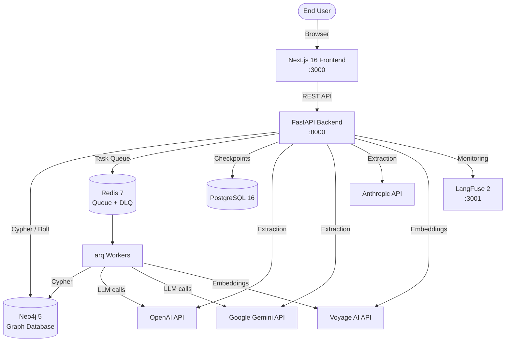
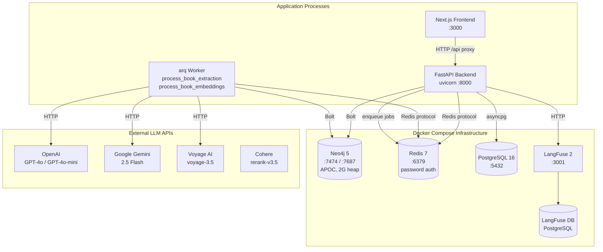
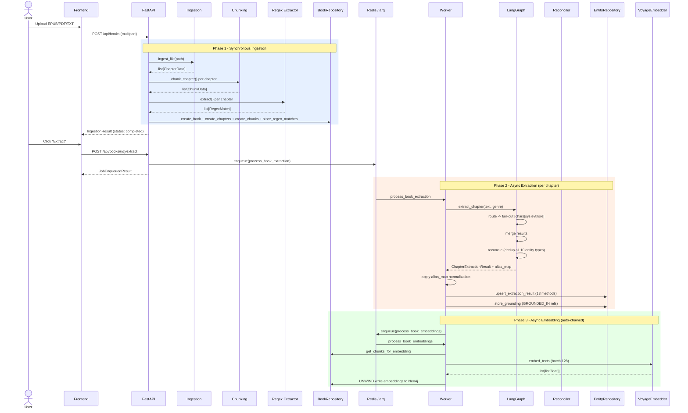
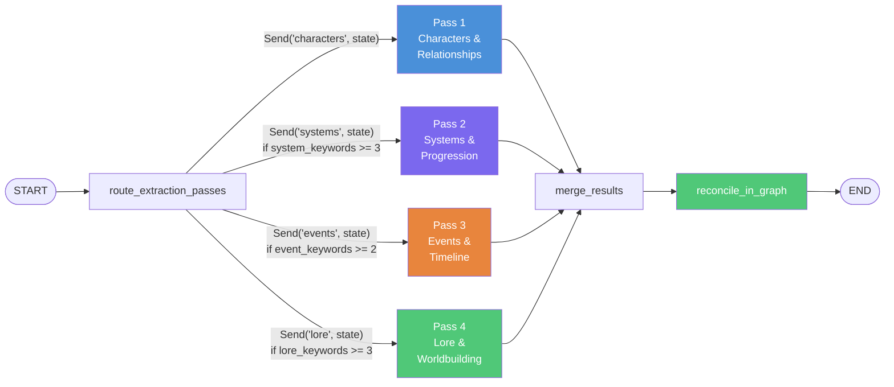
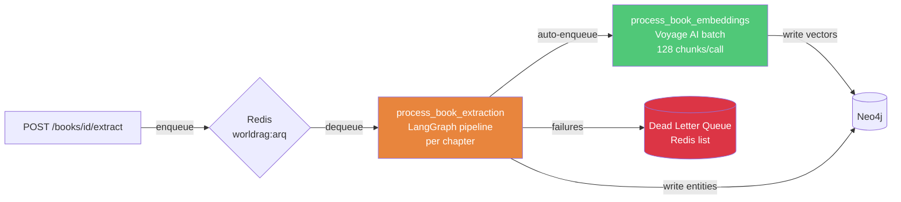
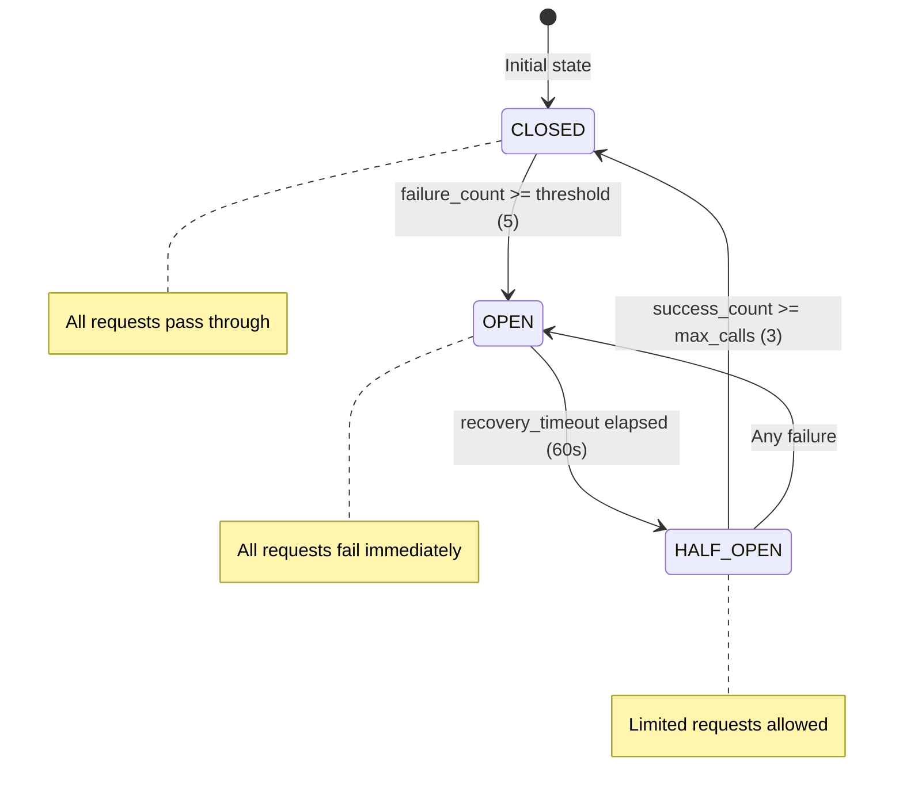

# Architecture

This document describes the complete system architecture of WorldRAG, from high-level system context down to internal component interactions.

## System Context

WorldRAG sits between end users and a constellation of external services. Users interact through a Next.js frontend that communicates with a FastAPI backend. The backend orchestrates LLM providers for entity extraction, a vector embedding service for semantic search, and a graph database for persistent storage.



## Container Diagram

The system is composed of six runtime containers plus external API services. All infrastructure runs in Docker; the application processes (backend, worker, frontend) run on the host during development.



## Full Pipeline Flow

The processing pipeline has three phases: synchronous ingestion (during upload), asynchronous extraction (arq worker), and asynchronous embedding (arq worker, auto-chained).



## LangGraph Extraction Graph

Each chapter is processed through a LangGraph `StateGraph` that parallelizes extraction across four specialized passes. The router analyzes chapter content via keyword detection and dispatches only the relevant passes using LangGraph's `Send()` API for native parallel fan-out.



**State management**: The `ExtractionPipelineState` TypedDict carries 18 fields. Three fields use `operator.add` reducers (`grounded_entities`, `passes_completed`, `errors`) so that parallel branches automatically merge their lists when converging at the `merge` node. The `alias_map` field carries the reconciliation output (entity name deduplication) from the `reconcile` node through to the final result.

**Routing rules**:
- Pass 1 (Characters): **always runs** -- characters appear in every chapter
- Pass 2 (Systems): runs when `system_keywords >= 3`, or genre is LitRPG and `system_keywords >= 1`, or regex matches exist
- Pass 3 (Events): runs when `event_keywords >= 2`
- Pass 4 (Lore): runs when `lore_keywords >= 3`
- Short chapters (< 2000 chars): all passes run unconditionally

## Repository Pattern

All Neo4j access goes through typed repository classes. Services never execute Cypher directly -- they call repository methods that handle session management, parameterization, and error handling.

**`Neo4jRepository`** (base class):
- `execute_read(query, params)` -- read transaction
- `execute_write(query, params)` -- write transaction
- `count(label)`, `exists(label, prop, value)`

**`BookRepository`** (14 methods): CRUD for books, chapters, chunks, regex matches. Manages the bibliographic layer (Series -> Book -> Chapter -> Chunk).

**`EntityRepository`** (13 upsert + 1 orchestrator): Handles all Knowledge Graph entities. The `upsert_extraction_result()` orchestrator executes in three phases:
1. **Sequential**: Characters, then Relationships (relationships reference characters)
2. **Parallel** (`asyncio.gather`): Skills, Classes, Titles, LevelChanges, StatChanges, Events, Locations, Items, Creatures, Factions, Concepts
3. **Sequential**: Grounding data

Every write carries a `batch_id` UUID for rollback capability.

## Worker Architecture

Background processing uses arq (async Redis queue) with two task functions that chain automatically. The worker process maintains its own Neo4j driver, Redis client, cost tracker, and dead letter queue -- independent from the FastAPI process.



**Job lifecycle**:
- Deterministic job IDs: `extract:{book_id}`, `embed:{book_id}` (idempotent enqueue)
- Job status polling via `GET /api/books/{id}/jobs`
- Worker startup initializes Neo4j, Redis, CostTracker, DeadLetterQueue
- Worker shutdown cleanly closes all connections

**Configuration** (from `config.py`):
- `arq_max_jobs`: 5 concurrent jobs
- `arq_job_timeout`: 3600s (1 hour per job)
- `arq_keep_result`: 86400s (24 hours)

## Frontend Architecture

The frontend is a Next.js 16 application using the App Router pattern with Server Components by default. Client-side interactivity is limited to the graph visualization and form interactions.

```mermaid
graph TB
    subgraph "Next.js App Router"
        Layout[RootLayout<br/>Sidebar Navigation]
        Layout --> Home[/ Dashboard<br/>Stats + Health]
        Layout --> Books[/books<br/>Upload + List + Extract]
        Layout --> Graph[/graph<br/>D3 Force Graph Explorer]
        Layout --> Chat[/chat<br/>Placeholder]
    end

    subgraph "Components"
        NavLink[NavLink<br/>Active route detection]
        ForceGraph[ForceGraph<br/>react-force-graph-2d<br/>Color-coded by entity type]
    end

    subgraph "API Client lib/api.ts"
        Fetch[Typed fetch functions<br/>20 endpoint wrappers]
    end

    Graph --> ForceGraph
    Layout --> NavLink
    Books --> Fetch
    Graph --> Fetch
    Home --> Fetch
```

**Graph Explorer features**:
- Book selector and entity type filter
- Full-text entity search
- Subgraph loading per book with chapter filtering
- Node color coding: Character (blue), Skill (green), Class (purple), Event (orange), Location (cyan), etc.
- Click-to-inspect entity details and character profiles

## Resilience Patterns

Every external service call is protected by a layered resilience stack: rate limiting, circuit breaking, and retry with exponential backoff.



**Three layers of protection**:

| Layer | Implementation | Purpose |
|-------|---------------|---------|
| Rate limiter | `ProviderRateLimiter` (aiolimiter + Semaphore) | Prevent hitting API rate limits |
| Circuit breaker | Custom `CircuitBreaker` (asyncio.Lock) | Stop cascading failures |
| Retry | `@retry_llm_call` (tenacity, exponential + jitter) | Handle transient errors |

**Per-provider configuration**:

| Provider | Rate (RPM) | Concurrency | Circuit breaker |
|----------|-----------|-------------|----------------|
| OpenAI | 200 | 20 | `openai_breaker` |
| Gemini | 500 | 20 | `gemini_breaker` |
| Anthropic | 40 | 10 | `anthropic_breaker` |
| Voyage AI | 200 | 15 | `voyage_breaker` |
| Cohere | 80 | 10 | `cohere_breaker` |

**Dead Letter Queue**: Failed chapter extractions are pushed to a Redis-backed DLQ (`DeadLetterQueue`) with metadata (book_id, chapter, error_type, timestamp, attempt_count). Entries can be inspected via `GET /api/admin/dlq`, cleared via `POST /api/admin/dlq/clear`, retried individually via `POST /api/admin/dlq/retry/{book_id}/{chapter}`, or bulk-retried via `POST /api/admin/dlq/retry-all`.

## Cross-Cutting Concerns

### Structured Logging

All logging uses `structlog` with JSON output in production and colored console output in development. Context variables are automatically bound to every log entry:

| Context Variable | Source | Purpose |
|-----------------|--------|---------|
| `request_id` | `RequestContextMiddleware` | Correlate logs for a single HTTP request |
| `book_id` | Set by services | Filter logs per book |
| `chapter` | Set by extraction passes | Filter logs per chapter |
| `pipeline_stage` | Set by graph builder | Track pipeline progress |

### Cost Tracking

The `CostTracker` records every LLM API call with model, provider, token counts, and computed cost. It enforces configurable ceilings per chapter (`$0.50` default) and per book (`$50.00` default) to prevent runaway costs.

Pre-configured pricing for 8 models: GPT-4o, GPT-4o-mini, Gemini 2.5 Flash, Gemini 2.0 Flash, Claude 3.5 Sonnet, Claude 3.5 Haiku, Voyage 3.5, Cohere Rerank v3.5.

### Authentication

Two-tier authentication via Bearer tokens:
- **User endpoints** (`require_auth`): validated against `WORLDRAG_API_KEY`
- **Admin endpoints** (`require_admin`): validated against `WORLDRAG_ADMIN_API_KEY`
- **Dev mode**: when keys are empty, all requests pass through (no auth required)

---

**Next**: [Technology Stack](./tech-stack.md) for the rationale behind every technology choice.
