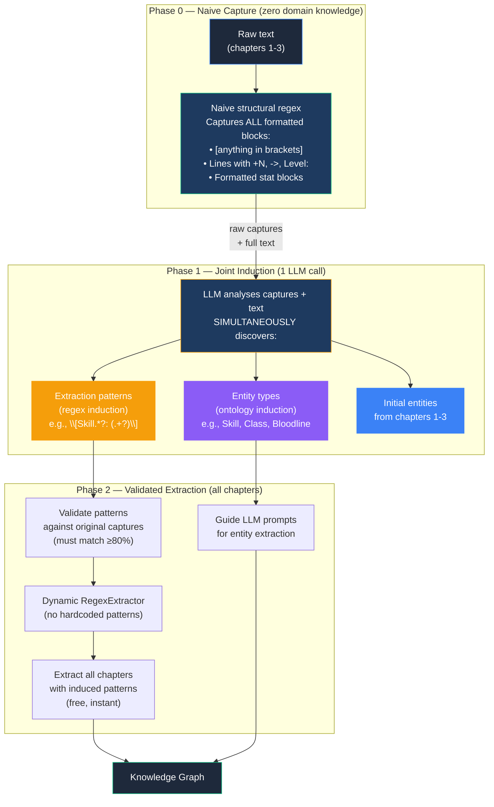
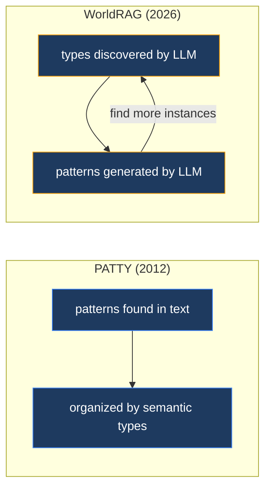
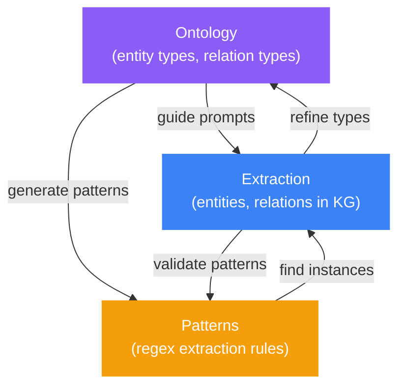

# Co-Evolutionary Extraction: Joint Ontology + Pattern Induction

> **Novelty claim**: This architecture has no direct precedent in the published literature. The closest theoretical argument is Buitelaar et al. (2005) who called for this integration but never built it. WorldRAG is the first implementation of a fully iterative co-construction loop where ontology types, extraction patterns, and entity extraction all evolve together.

## 1. The Problem

Traditional KG extraction systems have a fundamental contradiction:

```
Ontology types   → auto-discovered by LLM  (adaptive)
Extraction rules → hardcoded by developer   (brittle)
```

If the system can discover that "Bloodline" is an entity type, it should also discover that `[Bloodline Awakened: ...]` is the pattern that detects it. Hardcoding the pattern defeats the purpose of automatic ontology induction.

## 2. The Architecture



## 3. The Three Innovations

### 3.1 Regex-as-Seed (no precedent)

Instead of starting with domain knowledge (predefined entity types or seed examples), the system starts with **structural signals**: anything that looks like formatted/structured text in the novel.

```
Naive capture patterns (domain-agnostic):
  • [...]           — bracketed content (5-500 chars)
  • +N Stat         — stat gain lines  
  • N -> N          — level/progression transitions
  • Title: Value    — labeled values
  • Stat Block:     — multi-line stat blocks
```

These patterns require zero knowledge of the genre. They work for LitRPG, xianxia, GameLit, or any fiction with structured progression elements. If the novel has no structured elements, the naive capture returns nothing and the LLM handles everything — no failure mode.

### 3.2 Types → Patterns (reverses PATTY direction)

PATTY (Nakashole et al., EMNLP 2012) organized extraction patterns by semantic types: patterns → types. Our system reverses this: once the LLM discovers "Skill" as a type, it generates the regex `\[Skill (?:Acquired|Learned): (.+?)\]` to detect it.



### 3.3 Triple Co-Evolution (no precedent)

Three components evolve together, each informing the others:



NELL (CMU, 2010) had loose coupling between pattern learning and ontology extension as separate subsystems. Agentic-KGR (Li et al., 2025) has schema + extraction co-evolution via multi-agent RL but no pattern induction. **Nobody has all three in a single loop.**

## 4. Detailed Algorithm

### Step 1: Naive Structural Capture

Run domain-agnostic regex on chapters 1-3. Captures everything that looks structured:

```python
# Domain-agnostic patterns — work for ANY genre
NAIVE_PATTERNS = [
    r'\[([^\[\]]{5,500})\]',           # Bracketed content
    r'^[+\-]\d+\s+.{2,50}$',          # Stat gain/loss lines
    r'\d+\s*(?:->|→|=>)\s*\d+',       # Level/progression transitions
    r'^(?:Level|Class|Title|Rank|Status):\s*.+$',  # Labeled values
]
```

**Output**: List of raw text captures with char offsets.

### Step 2: Joint Induction

One LLM call with Instructor. Input: raw captures + chapter text. Output: structured `InducedPatterns` model.

```python
class InducedRegexPattern(BaseModel):
    name: str              # e.g., "skill_acquired"
    description: str       # "Detects skill acquisition notifications"
    entity_type: str       # "Skill"
    regex: str             # r"\[Skill (?:Acquired|Learned): (.+?)(?:\s*-\s*(.+?))?\]"
    capture_names: list[str]  # ["name", "rank"]
    example_matches: list[str]  # examples from the captures that match

class InducedSchema(BaseModel):
    entity_types: list[InducedEntityType]      # Same as current ontology inducer
    relation_types: list[InducedRelationType]   # Same as current ontology inducer  
    regex_patterns: list[InducedRegexPattern]   # NEW: induced extraction patterns
```

The LLM sees the raw captures AND the text context, so it can:
- Group captures by type ("these 5 are all skill acquisitions")
- Generate regex that captures all variants
- Name the entity type it belongs to
- Provide example matches for validation

### Step 3: Validation

Each induced regex is compiled and validated against its own examples:

```python
for pattern in induced.regex_patterns:
    compiled = re.compile(pattern.regex, re.IGNORECASE)
    hits = sum(1 for ex in pattern.example_matches if compiled.search(ex))
    if hits / len(pattern.example_matches) >= 0.8:
        accept(pattern)  # Valid pattern
    else:
        reject(pattern)  # LLM generated bad regex, skip
```

Rejected patterns mean that entity type falls back to pure LLM extraction (no regex help). This is safe — the LLM can still extract it, just costs more tokens.

### Step 4: Dynamic Extraction

The validated patterns are compiled into a `RegexExtractor` and used for all remaining chapters. No hardcoded patterns, no YAML regex sections.

## 5. What Changes in the Codebase

| Before | After |
|--------|-------|
| `litrpg.yaml` has 21 hardcoded regex patterns | `litrpg.yaml` has zero regex patterns |
| `primal_hunter.yaml` has 5 hardcoded regex patterns | `primal_hunter.yaml` has zero regex patterns |
| `RegexExtractor.default()` has 10 hardcoded patterns | `RegexExtractor.default()` removed |
| `ontology_inducer.py` induces types only | `pattern_inducer.py` induces types + patterns jointly |
| Ontology and patterns are separate systems | Ontology and patterns co-evolve from same LLM call |

## 6. Scientific References

| Paper | Year | Relevance |
|-------|------|-----------|
| Buitelaar et al., "On the Need to Bootstrap Ontology Learning with Extraction Grammar Learning" | 2005 | Theoretical argument for this exact co-construction — never implemented |
| NELL (Mitchell et al., CMU) | 2010-2018 | Loose coupling between pattern learning and ontology extension |
| PATTY (Nakashole et al., EMNLP) | 2012 | Organized patterns by semantic types (our direction is reversed) |
| Snowball (Agichtein & Gravano) | 2000 | Iterative bootstrapping: seeds → patterns → instances → patterns |
| Agentic-KGR (Li et al.) | 2025 | Multi-agent RL with co-evolving schema + extraction (no patterns) |
| AutoSchemaKG (Bai et al., HKUST) | 2025 | Autonomous schema induction (no patterns, no iteration) |
| ODKE+ (Apple) | 2025 | Hybrid patterns + ontology + LLM (but all static, no induction) |
| KGGen (Mo et al., NeurIPS) | 2025 | Iterative entity clustering (no schema or pattern induction) |
| PICK:Regex (Brown PLT) | 2025 | LLM-based regex generation with validation |
| Bartoli et al. (IEEE TKDE) | 2016 | GP-evolved regex from examples (proven human-competitive) |

## 7. Cost Analysis

| Component | Cost per book | Notes |
|-----------|--------------|-------|
| Naive structural capture | $0 | Pure regex, instant |
| Joint induction (LLM) | ~$0.01 | 1 call, ~3K input + ~1K output tokens |
| Pattern validation | $0 | Pure regex compilation + matching |
| Pattern-based extraction (all chapters) | $0 | Pure regex on all remaining chapters |
| **Total overhead vs current** | **~$0.01** | Replaces ~$0 of hardcoded patterns |

The cost is negligible. The benefit is adaptability: the system works on ANY new series without manual pattern writing.
