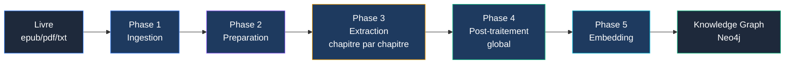
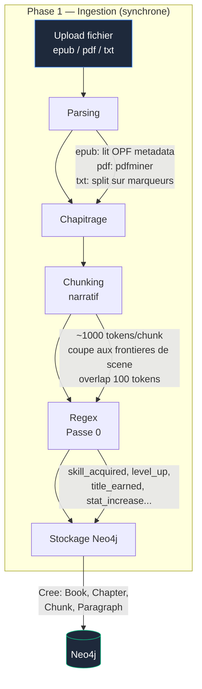
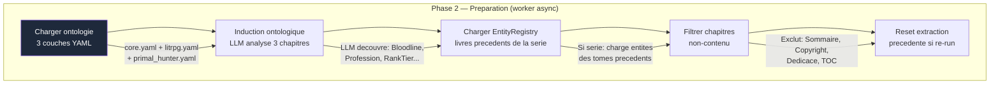
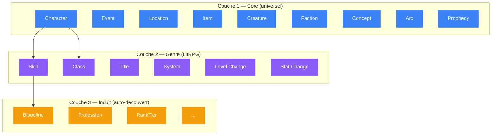
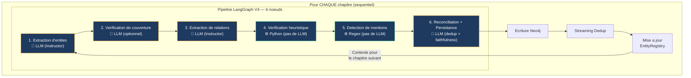
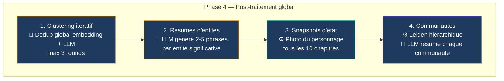
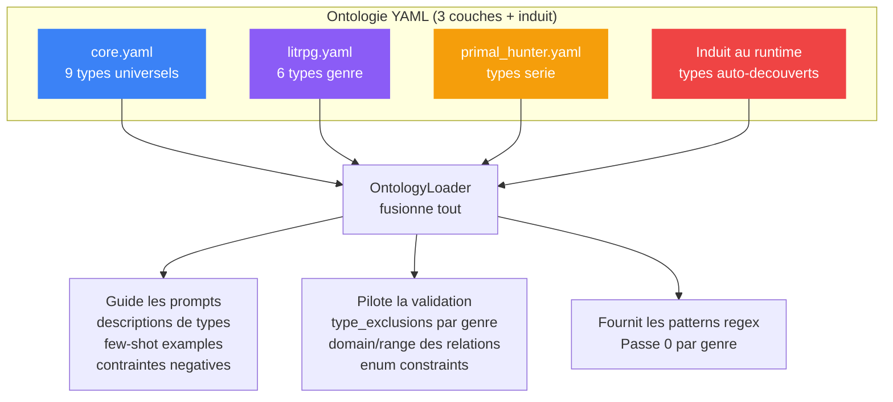
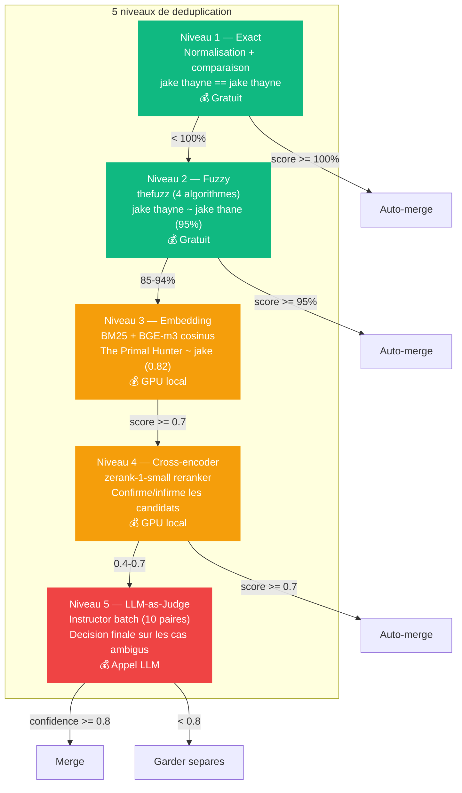
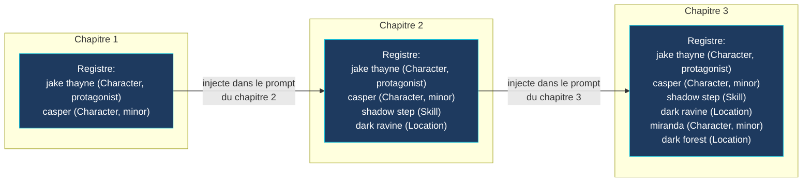

# WorldRAG — Guide complet du pipeline d'extraction

> Ce document explique comment WorldRAG transforme un roman (epub/pdf/txt) en Knowledge Graph Neo4j, du premier octet au dernier noeud.

## Table des matieres

1. [Vue d'ensemble](#1-vue-densemble)
2. [Phase 1 : Ingestion du livre](#2-phase-1--ingestion-du-livre)
3. [Phase 2 : Preparation de l'extraction](#3-phase-2--preparation-de-lextraction)
4. [Phase 3 : Extraction par chapitre](#4-phase-3--extraction-par-chapitre)
5. [Phase 4 : Post-traitement global](#5-phase-4--post-traitement-global)
6. [Phase 5 : Embedding](#6-phase-5--embedding)
7. [Le systeme d'ontologie](#7-le-systeme-dontologie)
8. [Le systeme de deduplication](#8-le-systeme-de-deduplication)
9. [Le registre d'entites](#9-le-registre-dentites)
10. [Controle qualite](#10-controle-qualite)

---

## 1. Vue d'ensemble

Le pipeline transforme un fichier livre en Knowledge Graph en 5 grandes phases :



**Phase 1** (synchrone, instant) : Le livre est parse en chapitres, decoupe en chunks, et les patterns regex sont extraits.

**Phase 2** (worker async) : L'ontologie est chargee, de nouveaux types sont decouverts par le LLM, et le contexte cross-livres est charge.

**Phase 3** (worker async, sequentiel) : Chaque chapitre passe dans un pipeline LangGraph de 6 noeuds qui extrait entites et relations via LLM.

**Phase 4** (worker async) : Deduplication globale, generation de resumes, detection de communautes.

**Phase 5** (worker async) : Les chunks, relations et entites sont vectorises pour la recherche semantique.

---

## 2. Phase 1 : Ingestion du livre

Declenchee par `POST /books` (upload HTTP). Tout se passe dans la meme requete.



### Qu'est-ce que le Chunking narratif ?

Le texte n'est pas decoupe betement tous les 1000 tokens. L'algorithme detecte les **frontieres de scene** :

- Marqueurs explicites : `***`, `---`, lignes vides
- Sauts temporels : "Le lendemain", "Trois jours plus tard"
- Changements de lieu : "Ils arriverent a", "De retour au"
- Changements de point de vue : detection de changement de nom propre dominant

Le chunk coupe en priorite a une frontiere de scene, meme si ca fait un chunk plus court.

### Qu'est-ce que la Passe 0 (Regex) ?

Avant tout LLM, des expressions regulieres detectent les patterns recurrents dans la fiction :

| Pattern | Exemple dans le texte | Ce qui est capture |
|---------|----------------------|-------------------|
| `skill_acquired` | `[Skill Acquired: Shadow Step - Rare]` | nom=Shadow Step, rang=Rare |
| `level_up` | `Level: 42 -> 43` | ancien=42, nouveau=43 |
| `title_earned` | `Title earned: Hydra Slayer` | nom=Hydra Slayer |
| `stat_increase` | `+5 Perception` | stat=Perception, valeur=5 |

Ces resultats sont stockes et reinjectes plus tard comme **indices** dans le prompt d'extraction LLM.

**A la fin de la Phase 1**, le statut du livre passe a `completed`. Le livre est pret pour l'extraction.

---

## 3. Phase 2 : Preparation de l'extraction

Declenchee par `POST /books/{id}/extract/v4`. Un worker arq prend le relais en asynchrone.



### L'ontologie en 3 couches



- **Couche 1 (Core)** : Types universels, valides pour tout genre de fiction. Definis dans `core.yaml`.
- **Couche 2 (Genre)** : Types specifiques au LitRPG (stats, skills, classes). Definis dans `litrpg.yaml`.
- **Couche 3 (Induit)** : Types decouverts automatiquement par le LLM a la lecture des 3 premiers chapitres. Pas dans un YAML — generes au runtime.

L'ontologie sert a 3 choses :
1. **Guider le prompt** : "Voici les types d'entites a extraire"
2. **Valider l'extraction** : "HAS_SKILL doit relier un Character a un Skill"
3. **Fournir des exemples** : positifs et negatifs, par genre et par langue

---

## 4. Phase 3 : Extraction par chapitre

C'est le coeur du systeme. Chaque chapitre traverse un pipeline LangGraph de **6 noeuds** sequentiels.



### Noeud 1 : Extraction d'entites

**Qu'est-ce que ca fait ?** Envoie le texte du chapitre au LLM avec un prompt structure. Le LLM retourne une liste d'entites typees au format JSON.

**Le prompt est compose de :**
- Description de chaque type d'entite (depuis l'ontologie YAML)
- Exemples positifs (few-shot) et negatifs ("NE PAS faire ca")
- Indices regex de la Passe 0 ("on a detecte `[Skill Acquired: Shadow Step]` dans ce texte")
- Contexte du registre ("Jake Thayne est un Character, NE PAS re-extraire comme Event")
- Le texte du chapitre

**Le LLM retourne** (via Instructor/Pydantic) :
```json
{
  "reasoning": "Ce chapitre introduit un nouveau personnage...",
  "entities": [
    {
      "entity_type": "character",
      "type_rationale": "Named individual who takes actions",
      "name": "Jake Thayne",
      "canonical_name": "jake thayne",
      "role": "protagonist",
      "description": "A hunter awakened in the tutorial",
      "extraction_text": "Jake Thayne woke up",
      "char_offset_start": 22,
      "char_offset_end": 41
    },
    {
      "entity_type": "genre_entity",
      "sub_type": "skill",
      "name": "Shadow Step",
      "owner": "jake thayne",
      "rank": "rare"
    }
  ]
}
```

Chaque entite est ensuite **validee au niveau du grounding** : les offsets `char_offset_start/end` sont verifies contre le texte source. Si les offsets sont faux, le systeme cherche le texte ailleurs dans le chapitre (fuzzy recovery).

### Noeud 2 : Verification de couverture

**Qu'est-ce que ca fait ?** Un deuxieme appel LLM leger qui demande : "Y a-t-il des entites nommees que tu as manquees, qui interagissent avec celles deja trouvees ?"

Active seulement si plus de 3 entites ont ete extraites (sinon le chapitre est trop court pour justifier un deuxieme appel). Ajoute les entites manquees a la liste.

### Noeud 3 : Extraction de relations

**Qu'est-ce que ca fait ?** Envoie les entites extraites + le texte au LLM. Le LLM retourne les relations entre entites.

```json
{
  "relations": [
    {
      "source": "jake thayne",
      "target": "Shadow Step",
      "relation_type": "HAS_SKILL",
      "valid_from_chapter": 2,
      "context": "Jake acquired Shadow Step during the wolf hunt"
    }
  ],
  "ended_relations": [
    {
      "source": "jake thayne",
      "target": "Basic Archery",
      "relation_type": "HAS_SKILL",
      "ended_at_chapter": 5,
      "reason": "Replaced by improved archery"
    }
  ]
}
```

Les types de relation sont valides contre l'ontologie. Si le LLM invente un type inconnu, il est remplace par `RELATES_TO`.

### Noeud 4 : Verification heuristique

**Qu'est-ce que ca fait ?** Filtre les entites suspectes sans appeler le LLM. 5 regles :

| Regle | Exemple rejete | Pourquoi |
|-------|---------------|----------|
| Nom absent du texte | "Miranda" (pas dans ce chapitre) | Hallucination LLM |
| Role generique comme Character | "guard", "soldier" | Pas un personnage nomme |
| Event nomme d'apres un Character | "jake levels to 24" | Devrait etre level_change |
| Mecanique de jeu comme Concept | "stamina" comme Concept | Devrait etre stat_change ou genre_entity |
| Character connu comme mauvais type | "jake" comme Event | Deja connu comme Character |

**Important** : les regles 2 et 4 sont **pilotees par l'ontologie** (depuis les fichiers YAML), pas hardcodees dans le code. Quand on change de genre (fantasy au lieu de LitRPG), les regles changent automatiquement.

Extrait aussi des **metadonnees narratives** : ratio de dialogue, personnage POV, nombre de scenes.

### Noeud 5 : Detection de mentions

**Qu'est-ce que ca fait ?** Scan le texte avec des regex mot-frontiere pour trouver toutes les mentions des entites extraites (noms + alias).

Exemple : si on a extrait "Jake Thayne" avec alias ["Jake", "The Primal Hunter"], le scan trouvera chaque occurrence de ces 3 noms dans le texte avec les offsets exacts.

Aucun appel LLM — c'est gratuit et precis.

### Noeud 6 : Reconciliation et persistance

C'est le noeud le plus complexe. Il execute **7 etapes internes** :

```mermaid
graph TD
    subgraph "Noeud 6 — Reconciliation (7 etapes)"
        S0["6.0 Verification NLI<br>🤖 Le LLM verifie que chaque<br>entite est dans le texte"]
        S1["6.1 Dedup cross-type<br>⚙️ Meme nom, types differents<br>→ garder le meilleur type"]
        S2["6.2 Dedup par type<br>🤖 5 niveaux de deduplication<br>exact → fuzzy → embed → CE → LLM"]
        S3["6.3 Application alias<br>⚙️ Normaliser les noms<br>avec la carte d'alias"]
        S4["6.4 Resolution registre<br>⚙️ Matching cross-chapitre<br>fuzzy 90% contre le registre"]
        S5["6.5 Validation ontologie<br>⚙️ Verifier les valeurs enum<br>contre le schema ontologique"]
        S6["6.6 Validation relations<br>⚙️ Verifier source/target types<br>contre les contraintes domain/range"]
        S7["6.7 Mise a jour registre<br>⚙️ Ajouter les nouvelles entites<br>au registre pour le prochain chapitre"]
    end

    S0 --> S1 --> S2 --> S3 --> S4 --> S5 --> S6 --> S7

    style S0 fill:#1e3a5f,stroke:#ef4444,color:#fff
    style S1 fill:#1e3a5f,stroke:#f59e0b,color:#fff
    style S2 fill:#1e3a5f,stroke:#f59e0b,color:#fff
    style S3 fill:#1e3a5f,stroke:#10b981,color:#fff
    style S4 fill:#1e3a5f,stroke:#10b981,color:#fff
    style S5 fill:#1e3a5f,stroke:#8b5cf6,color:#fff
    style S6 fill:#1e3a5f,stroke:#8b5cf6,color:#fff
    style S7 fill:#1e3a5f,stroke:#06b6d4,color:#fff
```



**6.0 — Verification de fidelite (NLI)** : Un appel LLM batch verifie que chaque entite est reellement mentionnee dans le texte source. Les entites hallucinees sont supprimees.

**6.1 — Dedup cross-type** : Si "jake" apparait comme Character ET comme Event dans la meme extraction, on garde le type avec la plus haute priorite (Character > Location > Creature > Skill > ... > Concept).

**6.2 — Dedup par type** : Pour chaque type d'entite, on deduplique en 5 niveaux (voir [Section 8](#8-le-systeme-de-deduplication)).

**6.3 — Application de la carte d'alias** : Les noms sont normalises. "Jake" → "jake thayne", "The Primal Hunter" → "jake thayne".

**6.4 — Resolution cross-chapitre** : Chaque entite est comparee au registre des chapitres precedents. Si un nom est similaire a 90% (fuzzy matching), il est resolu vers le nom canonique du registre.

**6.5 — Validation ontologie** : Les valeurs enum (role, status, event_type) sont validees contre le schema de l'ontologie. Les valeurs invalides sont retirees.

**6.6 — Validation des relations** : Chaque relation est verifiee contre les contraintes domain/range de l'ontologie. Exemple : `HAS_SKILL` doit aller de Character vers Skill. Une relation `HAS_SKILL` de Event vers Concept est supprimee.

**6.7 — Mise a jour du registre** : Les nouvelles entites sont ajoutees au registre pour servir de contexte au chapitre suivant.

### Apres le pipeline : ecriture Neo4j

Les entites et relations validees sont ecrites dans Neo4j avec le pattern **MERGE** :

```cypher
-- Entites : MERGE sur (canonical_name, book_id)
MERGE (ch:Character {canonical_name: "jake thayne", book_id: "abc123"})
ON CREATE SET ch.name = "Jake Thayne", ch.role = "protagonist", ...
ON MATCH SET ch.description = CASE WHEN size($desc) > size(ch.description)
                              THEN $desc ELSE ch.description END

-- Relations : MERGE sur (source, type, target) — PAS de temporal dans la cle
MERGE (a)-[rel:HAS_SKILL]->(b)
ON CREATE SET rel.valid_from_chapter = 2, rel.occurrences = 1
ON MATCH SET rel.last_seen_chapter = 5, rel.occurrences = rel.occurrences + 1
```

Le MERGE sans proprietes temporelles dans la cle d'unicite empeche la duplication des relations entre chapitres.

---

## 5. Phase 4 : Post-traitement global

Apres tous les chapitres, 4 operations s'executent sur l'ensemble du graphe :



**1. Clustering iteratif** : Recupère TOUTES les entites du livre, les embed avec BGE-m3, calcule la similarite cosinus, et demande au LLM de confirmer les merges. Repete jusqu'a convergence (max 3 rounds). Corrige les doublons que le dedup par chapitre a manques.

**2. Resumes d'entites** : Pour chaque entite avec 3+ mentions, le LLM genere un resume de 2-5 phrases a partir des textes ou elle apparait.

**3. Snapshots d'etat** : Pour les 5 personnages principaux, cree un instantane de leur etat (niveau, skills, classes, titres) tous les 10 chapitres. Permet de repondre a "Quel etait le niveau de Jake au chapitre 30 ?"

**4. Detection de communautes** : L'algorithme de Leiden detecte des groupes d'entites fortement connectees a 3 niveaux de granularite. Le LLM genere un resume pour chaque communaute.

---

## 6. Phase 5 : Embedding

Declenchee automatiquement apres l'extraction (chainage arq).

3 phases d'embedding :
1. **Chunks** : Chaque chunk de texte est vectorise (BGE-m3 local ou VoyageAI)
2. **Relations** : Les descriptions de relation sont vectorisees (technique LightRAG)
3. **Entites** : Les descriptions d'entite sont vectorisees

Les vecteurs sont stockes directement sur les noeuds Neo4j pour la recherche semantique (utilisee par le chat RAG).

---

## 7. Le systeme d'ontologie

L'ontologie est le **cerveau** du pipeline. Elle controle 3 aspects :



### Validation pilotee par l'ontologie

Les regles de validation sont definies **dans le YAML**, pas dans le code Python. Quand on change de genre, les regles changent automatiquement.

Exemple dans `litrpg.yaml` :
```yaml
validation_rules:
  type_exclusions:
    concept:
      excluded_terms: [stamina, mana, hp, xp, free points, ...]
      reason: "Game stats — use stat_change or genre_entity"
  domain_range:
    HAS_SKILL:
      from: [Character]
      to: [Skill, GenreEntity]
```

Si on extrait un roman de fantasy pure (pas de systeme de jeu), `fantasy.yaml` ne contiendrait PAS l'exclusion de "stamina" comme concept — ce serait un concept narratif legitime.

---

## 8. Le systeme de deduplication

Le probleme central : le LLM peut nommer la meme entite differemment d'un chapitre a l'autre. "Jake", "Jake Thayne", "The Primal Hunter", "Thayne" — c'est la meme personne.

5 niveaux de deduplication, du plus rapide au plus intelligent :



La dedup se produit a **3 moments** :
1. **Intra-chapitre** (noeud 6.2) : apres l'extraction de chaque chapitre
2. **Streaming** (apres persistence) : compare les nouvelles entites aux existantes dans Neo4j
3. **Global** (post-traitement) : clustering iteratif sur tout le graphe

---

## 9. Le registre d'entites

Le registre est la **memoire** du pipeline entre les chapitres. C'est un dictionnaire qui grandit a chaque chapitre.



Le registre sert a :
- **Consistance des noms** : le LLM voit les noms canoniques deja utilises
- **Prevention de re-extraction** : "Jake est un Character, NE PAS l'extraire comme Event"
- **Resolution cross-chapitre** : si le chapitre 10 mentionne "Thayne", le registre sait que c'est "jake thayne"
- **Contexte cross-livres** : pour une serie, le registre du tome 1 est charge avant l'extraction du tome 2

---

## 10. Controle qualite

Le pipeline a **4 niveaux** de controle qualite, du plus rapide au plus complet :

| Niveau | Quand | Comment | Cout |
|--------|-------|---------|------|
| **Schema Pydantic** | A l'extraction | Types forces, valeurs validees, type_rationale obligatoire | Gratuit |
| **Verification heuristique** (noeud 4) | Apres extraction | 5 regles Python pilotees par l'ontologie | Gratuit |
| **Verification NLI** (noeud 6.0) | Avant dedup | LLM verifie le grounding dans le texte source | 1 appel LLM/chapitre |
| **Consistency checks** (admin API) | Sur demande | Cypher queries : orphelins, doublons cross-type, violations de relation | Gratuit |

### Types invalides

Quand le LLM retourne un `entity_type` inconnu (ex: `"StateChange"` au lieu de `"stat_change"`), le schema Pydantic le **supprime** (avec un warning log) au lieu de le convertir silencieusement. Cela force le LLM a utiliser les types corrects via le mecanisme de retry d'Instructor.

### Endpoint de qualite

`GET /admin/quality-checks/{book_id}` execute 3 verifications Cypher :
1. **Entites orphelines** : noeuds sans relation significative
2. **Doublons cross-type** : meme `canonical_name`, labels differents
3. **Violations de relation** : `HAS_SKILL` dont la source n'est pas un Character
