# Data Model — Neo4j Graph Schema

> Complete reference for the WorldRAG Neo4j property graph: node labels, relationship types, properties, constraints, indexes, and the temporal model.

**Back to**: [Documentation Hub](./README.md)

---

## Table of Contents

- [Schema Overview](#schema-overview)
- [Node Labels](#node-labels)
- [Relationship Types](#relationship-types)
- [Temporal Model](#temporal-model)
- [Constraints & Uniqueness](#constraints--uniqueness)
- [Indexes](#indexes)
- [Batch Rollback Model](#batch-rollback-model)
- [Graph Topology](#graph-topology)

---

## Schema Overview

WorldRAG uses Neo4j 5.x Community Edition with a labeled property graph. The schema mirrors the [3-layer ontology](./ontology.md) but only persists entities the extraction pipeline produces.

```mermaid
graph TB
    subgraph Bibliographic["📚 Bibliographic Layer"]
        Series --> |CONTAINS_WORK| Book
        Book --> |HAS_CHAPTER| Chapter
        Chapter --> |HAS_CHUNK| Chunk
    end

    subgraph Narrative["🎭 Narrative Layer"]
        Character --> |RELATES_TO| Character
        Character --> |PARTICIPATES_IN| Event
        Character --> |MEMBER_OF| Faction
        Event --> |OCCURS_AT| Location
        Location --> |LOCATION_PART_OF| Location
    end

    subgraph Progression["⚔️ Progression Layer"]
        Character --> |HAS_SKILL| Skill
        Character --> |HAS_CLASS| Class
        Character --> |HAS_TITLE| Title
        Character --> |POSSESSES| Item
        Character --> |HAS_STAT| Concept
    end

    subgraph Grounding["🔗 Grounding Layer"]
        Character -.-> |MENTIONED_IN| Chapter
        Event -.-> |FIRST_MENTIONED_IN| Chapter
    end

    Chunk -.-> |embedding vector| VectorIndex[(Vector Index)]

    style Bibliographic fill:#1e3a5f,stroke:#4a90d9,color:#fff
    style Narrative fill:#3a1e5f,stroke:#9a4ad9,color:#fff
    style Progression fill:#5f3a1e,stroke:#d99a4a,color:#fff
    style Grounding fill:#1e5f3a,stroke:#4ad99a,color:#fff
```



**Key Numbers** (per fully processed book):
- **14 node labels** in the schema
- **15+ relationship types** (core + genre-specific)
- **15 uniqueness constraints**
- **47 indexes** (property, fulltext, vector, relationship)

---

## Node Labels

### Bibliographic Hierarchy

| Label | Key Property | Description |
|-------|-------------|-------------|
| `Series` | `name` (unique) | A book series (e.g., "The Primal Hunter") |
| `Book` | `title` (unique) | A single novel. Has `id`, `status`, `genre`, `author` |
| `Chapter` | `(book_id, number)` | A parsed chapter. Has `title`, `word_count`, `summary`, `grounding_data` |
| `Chunk` | `(chapter_id, position)` | Text segment (~800 tokens). Has `text`, `token_count`, `embedding` |

### Entity Nodes (Extracted)

| Label | Key Property | Notable Properties |
|-------|-------------|-------------------|
| `Character` | `canonical_name` (unique) | `name`, `aliases[]`, `description`, `role`, `species`, `first_appearance_chapter`, `level` |
| `Skill` | `name` (unique) | `description`, `skill_type`, `rank`, `book_id` |
| `Class` | `name` (unique) | `description`, `tier`, `book_id` |
| `Title` | `name` (unique) | `description`, `effects[]`, `book_id` |
| `Event` | `(name, chapter_start)` | `description`, `event_type`, `significance`, `is_flashback` |
| `Location` | `name` (unique) | `description`, `location_type`, `book_id` |
| `Item` | `name` (unique) | `description`, `item_type`, `rarity`, `book_id` |
| `Creature` | `name` (unique) | `description`, `species`, `threat_level`, `habitat` |
| `Faction` | `name` (unique) | `description`, `type`, `alignment` |
| `Concept` | `name` (unique) | `description`, `domain` (e.g., "stat", "magic", "cosmology") |

### Common Properties (all entity nodes)

| Property | Type | Description |
|----------|------|-------------|
| `book_id` | string | UUID of the source book |
| `batch_id` | UUID | Extraction batch identifier (for rollback) |
| `created_at` | integer | Neo4j `timestamp()` at creation |

---

## Relationship Types

### Bibliographic

| Type | From → To | Properties |
|------|-----------|-----------|
| `CONTAINS_WORK` | Series → Book | `position` |
| `HAS_CHAPTER` | Book → Chapter | `position` |
| `HAS_CHUNK` | Chapter → Chunk | `position` |

### Character Relations

| Type | From → To | Properties |
|------|-----------|-----------|
| `RELATES_TO` | Character → Character | `type` (ally/enemy/mentor/family/romantic/rival), `subtype`, `context`, `valid_from_chapter`, `valid_to_chapter`, `book_id`, `batch_id` |
| `MEMBER_OF` | Character → Faction | `role`, `valid_from_chapter`, `valid_to_chapter` |
| `MENTIONED_IN` | Character → Chapter | — |
| `LOCATED_AT` | Character → Location | `valid_from_chapter`, `valid_to_chapter` |

### Progression

| Type | From → To | Properties |
|------|-----------|-----------|
| `HAS_SKILL` | Character → Skill | `valid_from_chapter` |
| `HAS_CLASS` | Character → Class | `valid_from_chapter` |
| `HAS_TITLE` | Character → Title | `acquired_chapter` |
| `POSSESSES` | Character → Item | `valid_from_chapter` |
| `HAS_STAT` | Character → Concept | `value`, `valid_from_chapter` |

### Events

| Type | From → To | Properties |
|------|-----------|-----------|
| `PARTICIPATES_IN` | Character → Event | — |
| `OCCURS_AT` | Event → Location | — |
| `FIRST_MENTIONED_IN` | Event → Chapter | — |

### World Structure

| Type | From → To | Properties |
|------|-----------|-----------|
| `LOCATION_PART_OF` | Location → Location | — (parent hierarchy) |

### Grounding

| Type | From → To | Properties |
|------|-----------|-----------|
| `GROUNDED_IN` | Any Entity → Chunk | `char_offset_start`, `char_offset_end` |

---

## Temporal Model

WorldRAG uses **chapter-based integer temporality** instead of datetime. This reflects that fiction novels don't always provide real-world dates, but every fact can be traced to a specific chapter.


### Temporal Properties

All evolving relationships carry:

| Property | Type | Meaning |
|----------|------|---------|
| `valid_from_chapter` | integer | Chapter where this fact first became true |
| `valid_to_chapter` | integer (nullable) | Chapter where this fact ceased to be true. `null` = still active |

### Temporal Query Pattern

```cypher
// Get Jake's skills as of chapter 50
MATCH (ch:Character {canonical_name: "Jake Thayne"})-[r:HAS_SKILL]->(s:Skill)
WHERE r.valid_from_chapter <= 50
  AND (r.valid_to_chapter IS NULL OR r.valid_to_chapter >= 50)
RETURN s.name, s.rank, r.valid_from_chapter AS since

// Get timeline of class changes
MATCH (ch:Character {canonical_name: "Jake Thayne"})-[r:HAS_CLASS]->(c:Class)
RETURN c.name, r.valid_from_chapter AS from, r.valid_to_chapter AS to
ORDER BY r.valid_from_chapter
```

### Why Chapters, Not Dates?

1. **Fiction has no reliable datetime** — most novels don't timestamp events
2. **Chapters are universal** — every book has chapters, regardless of genre
3. **Natural ordering** — chapter numbers provide total order without ambiguity
4. **Reader-friendly** — "since chapter 42" is more useful than "since 2024-01-15"
5. **Flashback-safe** — `is_flashback` flag on Events handles non-linear narration

---

## Constraints & Uniqueness

15 uniqueness constraints enforce entity deduplication at the database level:

```cypher
-- Bibliographic
CREATE CONSTRAINT series_unique   FOR (s:Series)    REQUIRE s.name IS UNIQUE;
CREATE CONSTRAINT book_unique     FOR (b:Book)      REQUIRE b.title IS UNIQUE;
CREATE CONSTRAINT chapter_unique  FOR (c:Chapter)   REQUIRE (c.book_id, c.number) IS UNIQUE;

-- Entities (single-property)
CREATE CONSTRAINT character_unique FOR (c:Character) REQUIRE c.canonical_name IS UNIQUE;
CREATE CONSTRAINT skill_unique     FOR (s:Skill)     REQUIRE s.name IS UNIQUE;
CREATE CONSTRAINT class_unique     FOR (c:Class)     REQUIRE c.name IS UNIQUE;
CREATE CONSTRAINT title_unique     FOR (t:Title)     REQUIRE t.name IS UNIQUE;
CREATE CONSTRAINT item_unique      FOR (i:Item)      REQUIRE i.name IS UNIQUE;
CREATE CONSTRAINT creature_unique  FOR (cr:Creature) REQUIRE cr.name IS UNIQUE;
CREATE CONSTRAINT location_unique  FOR (l:Location)  REQUIRE l.name IS UNIQUE;
CREATE CONSTRAINT faction_unique   FOR (f:Faction)   REQUIRE f.name IS UNIQUE;
CREATE CONSTRAINT concept_unique   FOR (c:Concept)   REQUIRE c.name IS UNIQUE;
CREATE CONSTRAINT system_unique    FOR (s:System)    REQUIRE s.name IS UNIQUE;
CREATE CONSTRAINT race_unique      FOR (r:Race)      REQUIRE r.name IS UNIQUE;

-- Composite
CREATE CONSTRAINT event_unique FOR (e:Event) REQUIRE (e.name, e.chapter_start) IS UNIQUE;
```

All entity writes use `MERGE` (never `CREATE`) to rely on these constraints for idempotent upserts.

---

## Indexes

### Property Indexes (12)

| Index | Label | Property | Purpose |
|-------|-------|----------|---------|
| `character_name` | Character | `name` | Fast name lookup |
| `character_first_appearance` | Character | `first_appearance_chapter` | Timeline queries |
| `event_chapter` | Event | `chapter_start` | Chapter-scoped event queries |
| `event_significance` | Event | `significance` | Significance filtering |
| `event_type` | Event | `event_type` | Type filtering |
| `skill_name` | Skill | `name` | Fast lookup |
| `class_name` | Class | `name` | Fast lookup |
| `item_name` | Item | `name` | Fast lookup |
| `arc_status` | Arc | `status` | Active arc filtering |
| `chunk_chapter` | Chunk | `chapter_id` | Chunk retrieval by chapter |
| `chunk_position` | Chunk | `position` | Ordered chunk access |
| `chunk_chapter_position` | Chunk | `(chapter_id, position)` | Embedding pipeline write-back |

### Batch Rollback Indexes (10)

Every entity label has a `batch_id` index for bulk deletion when an extraction needs to be re-run:

```
character_batch, event_batch, skill_batch, class_batch,
item_batch, creature_batch, location_batch, faction_batch,
concept_batch, title_batch
```

### Fulltext Indexes (9)

Lucene-based fulltext indexes for keyword search in the hybrid retrieval pipeline:

| Index | Labels | Fields |
|-------|--------|--------|
| `character_fulltext` | Character | `name`, `canonical_name`, `description` |
| `event_fulltext` | Event | `name`, `description` |
| `location_fulltext` | Location | `name`, `description` |
| `skill_fulltext` | Skill | `name`, `description` |
| `class_fulltext` | Class | `name`, `description` |
| `item_fulltext` | Item | `name`, `description` |
| `concept_fulltext` | Concept | `name`, `description` |
| `chunk_fulltext` | Chunk | `text` |
| **`entity_fulltext`** | Character\|Skill\|Class\|Title\|Event\|Location\|Item\|Creature\|Faction\|Concept | `name`, `description` |

The `entity_fulltext` cross-label index powers the Graph Explorer search endpoint.

### Vector Index (1)

```cypher
CREATE VECTOR INDEX chunk_embedding IF NOT EXISTS
FOR (c:Chunk) ON (c.embedding)
OPTIONS {
  indexConfig: {
    `vector.dimensions`: 1024,
    `vector.similarity_function`: 'cosine'
  }
};
```

- **Model**: Voyage AI `voyage-3.5` (1024 dimensions)
- **Similarity**: Cosine
- **Usage**: Semantic search over chunk text embeddings

### Relationship Property Indexes (8)

Temporal indexes on relationship properties for efficient chapter-scoped queries:

```
rel_has_class_temporal, rel_has_skill_temporal, rel_at_level_temporal,
rel_located_at_temporal, rel_possesses_temporal, rel_relates_to_temporal,
rel_member_of_temporal, rel_grounded_in
```

---

## Batch Rollback Model

Every extraction write carries a `batch_id` (UUID v4), enabling surgical rollback:

```cypher
// Rollback a specific extraction run
MATCH (n) WHERE n.batch_id = $batch_id
DETACH DELETE n;
```

The batch lifecycle:
1. `upsert_extraction_result()` generates a new `batch_id = uuid4()` per chapter
2. All entity nodes and relationships created in that chapter carry the `batch_id`
3. If re-extraction is needed, delete by `batch_id` first, then re-run
4. Batch indexes ensure deletion is O(n) on affected nodes, not a full scan

---

## Graph Topology

### Entity Upsert Strategy

All entity persistence uses MERGE with UNWIND for batch efficiency:

```cypher
-- Example: Character upsert (from entity_repo.py)
UNWIND $chars AS c
MERGE (ch:Character {canonical_name: c.canonical_name})
ON CREATE SET
    ch.name = c.name,
    ch.aliases = c.aliases,
    ch.description = c.description,
    ch.role = c.role,
    ch.book_id = $book_id,
    ch.batch_id = $batch_id,
    ch.created_at = timestamp()
ON MATCH SET
    ch.description = CASE
        WHEN size(c.description) > size(coalesce(ch.description, ''))
        THEN c.description ELSE ch.description END,
    ch.aliases = ch.aliases + [a IN c.aliases WHERE NOT a IN ch.aliases]
```

**Design principles**:
- `ON CREATE`: Set all properties on first encounter
- `ON MATCH`: Enrich — keep the longer description, merge alias lists
- **Never overwrite** existing data with shorter/emptier values
- Parameterized queries only (`$param`, never string interpolation)

### Upsert Orchestration (per chapter)

```
Phase 1 (sequential):   Characters → Relationships  (rels reference chars)
Phase 2 (parallel):     Skills, Classes, Titles, LevelChanges, StatChanges,
                         Events, Locations, Items, Creatures, Factions, Concepts
Phase 3 (sequential):   Grounding (requires entities to exist)
```

---

**Next**: [Ontology System](./ontology.md) for the formal ontology definitions behind this schema.
