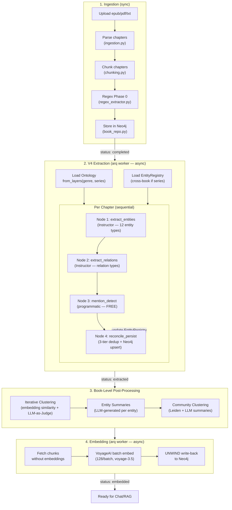
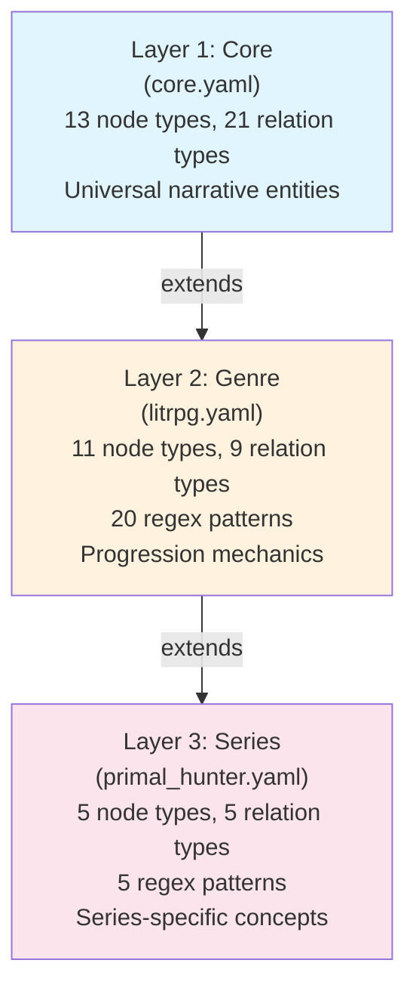
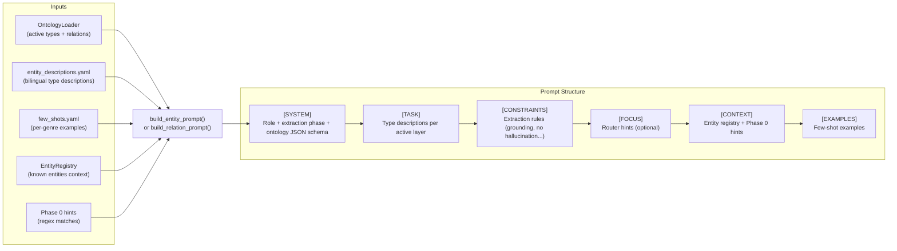
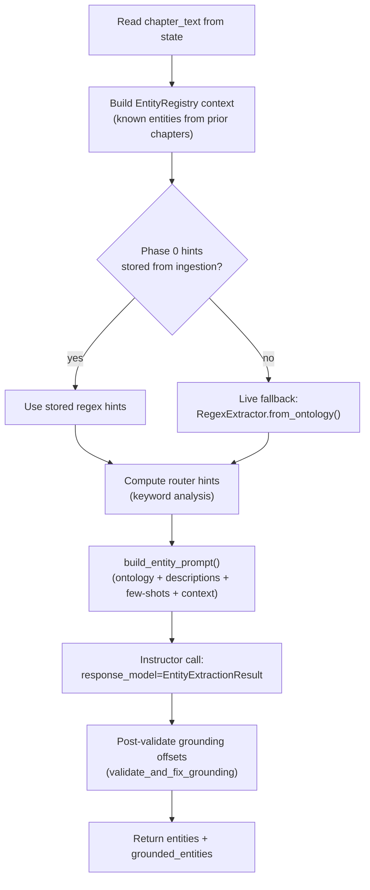
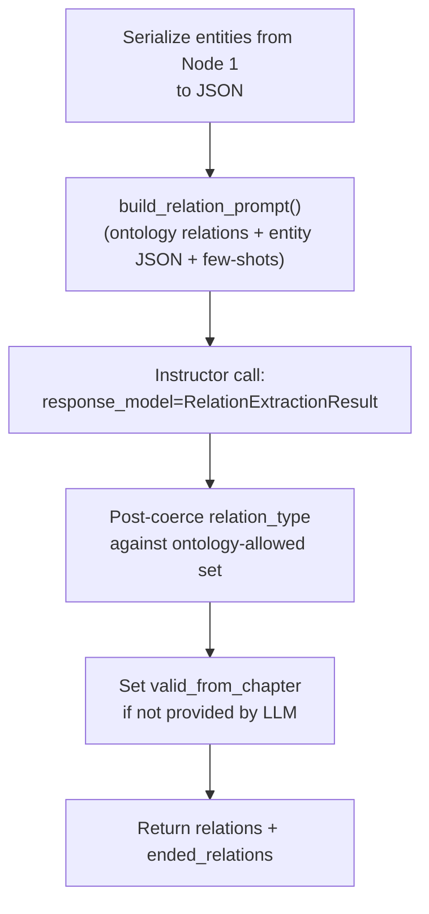
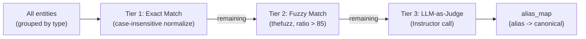
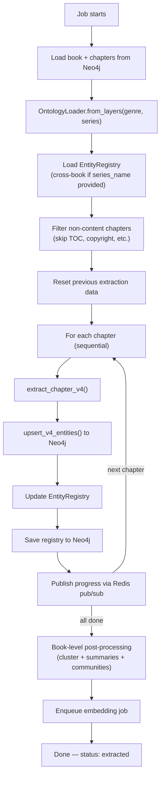
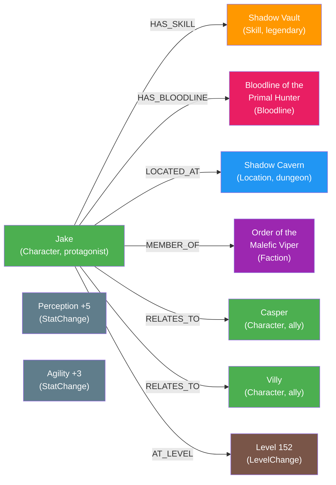

# V4 Extraction Pipeline — Complete Technical Documentation

> SOTA Knowledge Graph extraction from fiction novels using ontology-driven, single-pass Instructor pipeline with LangGraph orchestration.

**Back to**: [Documentation Hub](./README.md)

---

## Table of Contents

- [1. Overview](#1-overview)
- [2. Architecture](#2-architecture)
- [3. Ontology System](#3-ontology-system)
- [4. Pydantic Schema](#4-pydantic-schema)
- [5. Dynamic Prompt Generation](#5-dynamic-prompt-generation)
- [6. Extraction Nodes](#6-extraction-nodes-detailed)
- [7. Regex Phase 0](#7-regex-phase-0)
- [8. Worker and API](#8-worker-and-api)
- [9. Use Case: Primal Hunter](#9-use-case-primal-hunter)
- [10. Adding a New Genre](#10-adding-a-new-genre)
- [11. Configuration Reference](#11-configuration-reference)

---

## 1. Overview

### What WorldRAG Does

WorldRAG builds **Knowledge Graphs from fiction novels**. Given an epub, PDF, or plain text file containing a novel, it extracts every entity (characters, locations, skills, factions, events...) and every relationship between them, then persists the result as a Neo4j graph with temporal tracking, source grounding, and cross-book entity resolution.

The target genres are **LitRPG**, **progression fantasy**, **cultivation**, and **sci-fi** -- but the system is genre-agnostic by design. Adding a new genre requires only a YAML file and prompt templates, zero Python code changes.

### What the V4 Pipeline Is

V4 is the current **SOTA extraction pipeline**. It replaces the legacy V3 pipeline (4-pass parallel fan-out via LangExtract) with a simpler, more accurate approach:

- **Single-pass entity extraction**: One LLM call extracts all 12 entity types at once using Instructor (structured output via Pydantic)
- **Single-pass relation extraction**: One LLM call extracts all relation types, with temporal invalidation support
- **Programmatic mention detection**: Free (no LLM), word-boundary regex matching for precise char-offset spans
- **3-tier deduplication + reconciliation**: Exact match, fuzzy (thefuzz), embedding similarity

### Key Differentiators

| Feature | Description |
|---|---|
| **Ontology-driven** | Entity types, relation types, regex patterns, and prompts are all generated from YAML ontology files at runtime |
| **Genre-agnostic** | 3-layer inheritance (core, genre, series) means adding a genre is just adding a YAML file |
| **Multilingual** | Prompts and type descriptions are bilingual (EN/FR), extensible to any language |
| **Source-grounded** | Every entity links back to its source text with exact character offsets |
| **Temporally aware** | Chapter-based temporal model (valid_from_chapter / valid_to_chapter) tracks entity evolution |
| **Cost-optimized** | Regex Phase 0 is free; LLM calls use DeepSeek V3.2 ($0.26/M input) or Gemini Flash (free tier) |

---

## 2. Architecture

### Full Pipeline Diagram


```mermaid
flowchart TB
    subgraph Ingestion["1. Ingestion (sync)"]
        Upload["Upload epub/pdf/txt"]
        Parse["Parse chapters<br/>(ingestion.py)"]
        Chunk["Chunk chapters<br/>(chunking.py)"]
        Regex0["Regex Phase 0<br/>(regex_extractor.py)"]
        Store["Store in Neo4j<br/>(book_repo.py)"]
        Upload --> Parse --> Chunk --> Regex0 --> Store
    end

    subgraph Extraction["2. V4 Extraction (arq worker — async)"]
        direction TB
        LoadOntology["Load Ontology<br/>from_layers(genre, series)"]
        LoadRegistry["Load EntityRegistry<br/>(cross-book if series)"]

        subgraph PerChapter["Per Chapter (sequential)"]
            direction TB
            Node1["Node 1: extract_entities<br/>(Instructor — 12 entity types)"]
            Node2["Node 2: extract_relations<br/>(Instructor — relation types)"]
            Node3["Node 3: mention_detect<br/>(programmatic — FREE)"]
            Node4["Node 4: reconcile_persist<br/>(3-tier dedup + Neo4j upsert)"]
            Node1 --> Node2 --> Node3 --> Node4
        end

        LoadOntology --> PerChapter
        LoadRegistry --> PerChapter
        Node4 -->|"update EntityRegistry"| PerChapter
    end

    subgraph PostProcess["3. Book-Level Post-Processing"]
        Cluster["Iterative Clustering<br/>(embedding similarity + LLM-as-Judge)"]
        Summaries["Entity Summaries<br/>(LLM-generated per entity)"]
        Communities["Community Clustering<br/>(Leiden + LLM summaries)"]
        Cluster --> Summaries --> Communities
    end

    subgraph Embedding["4. Embedding (arq worker — async)"]
        FetchChunks["Fetch chunks<br/>without embeddings"]
        VoyageBatch["VoyageAI batch embed<br/>(128/batch, voyage-3.5)"]
        WriteBack["UNWIND write-back<br/>to Neo4j"]
        FetchChunks --> VoyageBatch --> WriteBack
    end

    Store -->|"status: completed"| Extraction
    Extraction -->|"status: extracted"| PostProcess
    PostProcess --> Embedding
    Embedding -->|"status: embedded"| Done["Ready for Chat/RAG"]
```

### Component Map

| Component | File | Role |
|---|---|---|
| arq task | `backend/app/workers/tasks.py` | Orchestrates per-book extraction |
| Entity extraction node | `backend/app/services/extraction/entities.py` | LangGraph Node 1 |
| Relation extraction node | `backend/app/services/extraction/relations.py` | LangGraph Node 2 |
| Mention detector | `backend/app/services/extraction/mention_detector.py` | LangGraph Node 3 |
| Reconciler | `backend/app/services/extraction/reconciler.py` | LangGraph Node 4 |
| Pydantic schemas | `backend/app/schemas/extraction_v4.py` | 12-type discriminated union |
| Ontology loader | `backend/app/core/ontology_loader.py` | 3-layer YAML loader |
| Prompt builder | `backend/app/prompts/extraction_unified.py` | Dynamic prompt generation |
| Prompt base | `backend/app/prompts/base.py` | Template structure |
| Regex extractor | `backend/app/services/extraction/regex_extractor.py` | Phase 0 |
| Entity registry | `backend/app/services/extraction/entity_registry.py` | Cross-chapter context |
| Book-level post-processing | `backend/app/services/extraction/book_level.py` | Clustering + summaries |
| LLM providers | `backend/app/llm/providers.py` | Multi-provider Instructor factory |

---

## 3. Ontology System

### 3-Layer Inheritance


```mermaid
flowchart TB
    Core["Layer 1: Core<br/>(core.yaml)<br/>13 node types, 21 relation types<br/>Universal narrative entities"]
    Genre["Layer 2: Genre<br/>(litrpg.yaml)<br/>11 node types, 9 relation types<br/>20 regex patterns<br/>Progression mechanics"]
    Series["Layer 3: Series<br/>(primal_hunter.yaml)<br/>5 node types, 5 relation types<br/>5 regex patterns<br/>Series-specific concepts"]

    Core -->|"extends"| Genre
    Genre -->|"extends"| Series

    style Core fill:#e1f5fe
    style Genre fill:#fff3e0
    style Series fill:#fce4ec
```

### Layer 1: Core (13 node types)

Universal narrative entities present in all fiction:

| Node Type | Key Properties | Academic Foundation |
|---|---|---|
| Series | name, author, genre | FRBRoo/LRMoo |
| Book | title, order_in_series | FRBRoo/LRMoo |
| Chapter | number, title, summary | FRBRoo/LRMoo |
| Chunk | text, position, embedding | - |
| Character | name, canonical_name, role, species, aliases | OntoMedia + Bamman |
| Faction | name, type, alignment | - |
| Event | name, event_type, significance, is_flashback | SEM + DOLCE |
| Arc | name, arc_type, status | Propp + Narratology |
| NarrativeFunction | name, propp_code | Propp |
| Location | name, location_type, parent_location | CIDOC-CRM |
| Item | name, item_type, rarity | - |
| Concept | name, domain | - |
| Prophecy | name, status | - |

### Layer 1: Core (21 relation types)

| Relation | From | To | Key Properties |
|---|---|---|---|
| CONTAINS_WORK | Series | Book | position |
| HAS_CHAPTER | Book | Chapter | position |
| HAS_CHUNK | Chapter | Chunk | position |
| RELATES_TO | Character | Character | type, subtype, sentiment, valid_from/to_chapter |
| MEMBER_OF | Character | Faction | role, valid_from/to_chapter |
| PARTICIPATES_IN | Character | Event | role |
| OCCURS_AT | Event | Location | - |
| CAUSES | Event | Event | - |
| ENABLES | Event | Event | - |
| OCCURS_BEFORE | Event | Event | - |
| PART_OF | Event | Arc | - |
| GROUNDED_IN | * | Chunk | char_offset_start/end |
| MENTIONED_IN | * | Chunk | char_offset_start/end |
| STRUCTURED_BY | Arc | NarrativeFunction | order |
| FULFILLS | Event | NarrativeFunction | - |
| LOCATION_PART_OF | Location | Location | - |
| CONNECTED_TO | Location | Location | method |
| LOCATED_AT | Character | Location | valid_from/to_chapter |
| POSSESSES | Character | Item | valid_from/to_chapter, acquisition_method |
| RETCONNED_BY | * | * | retcon_chapter, reason |
| PERCEIVED_BY | Event | Character | reliability, confidence |

### Layer 2: LitRPG (11 node types, 9 relation types)

Progression mechanics specific to LitRPG/GameLit:

| Node Type | Purpose | Key Properties |
|---|---|---|
| System | The progression system itself | system_type (cultivation, class_based...) |
| Class | Character classes | tier, requirements, system_name |
| Skill | Abilities and skills | skill_type, rank, effects |
| Title | Earned titles | effects, requirements |
| Level | Level values | value, realm, stage |
| Race | Character races | traits, typical_abilities |
| Creature | Monsters and beasts | species, threat_level, habitat |
| StatBlock | Stat snapshots | stats (JSON), source, chapter |
| QuestObjective | Quests | status, chapter_received/completed |
| Achievement | Earned achievements | effects, earned_by |
| Realm | Cultivation realms | grade, order |

Relations: HAS_CLASS, HAS_SKILL, HAS_TITLE, AT_LEVEL, IS_RACE, EVOLVES_INTO, SKILL_EVOLVES_INTO, BELONGS_TO, INHABITS.

### Layer 3: Primal Hunter (5 node types, 5 relation types)

Series-specific concepts for *The Primal Hunter* by Zogarth:

| Node Type | Purpose |
|---|---|
| Bloodline | Inherited bloodline powers |
| PrimordialChurch | Religious orders and deities |
| AlchemyRecipe | Alchemy recipes and potions |
| Profession | Crafting/combat professions |
| Floor | Dungeon/Nevermore floors |

Relations: HAS_BLOODLINE, WORSHIPS, CRAFTS, HAS_PROFESSION, CLEARS_FLOOR.

### OntologyLoader API

```python
from app.core.ontology_loader import OntologyLoader

# Load all 3 layers for Primal Hunter
ontology = OntologyLoader.from_layers(genre="litrpg", series="primal_hunter")

# Inspect what was loaded
ontology.layers_loaded          # ['core', 'litrpg', 'primal_hunter']
len(ontology.node_types)        # 29 (13 + 11 + 5)
len(ontology.relationship_types) # 35 (21 + 9 + 5)
len(ontology.regex_patterns)    # 25 (20 from litrpg + 5 from primal_hunter)

# Export for prompt injection
schema = ontology.to_json_schema()  # dict of {TypeName: {properties: {...}}}

# Get allowed relation types (for post-coercion)
ontology.get_relationship_type_names()  # ['CONTAINS_WORK', 'HAS_CHAPTER', ...]

# Validate an entity against ontology constraints
errors = ontology.validate_entity("Character", {"role": "wizard"})
# -> ["Character.role='wizard' not in ['protagonist', 'antagonist', ...]"]
```

---

## 4. Pydantic Schema

The V4 pipeline uses a **12-type discriminated union** via `Annotated[..., Field(discriminator="entity_type")]`. Each entity type is a Pydantic BaseModel with a `Literal` discriminator field.

### Entity Types

| # | Type | entity_type Literal | Category | Key Fields |
|---|---|---|---|---|
| 1 | `ExtractedCharacter` | `"character"` | Core | name, canonical_name, role, species, aliases, status |
| 2 | `ExtractedEvent` | `"event"` | Core | name, event_type, significance, participants, is_flashback |
| 3 | `ExtractedLocation` | `"location"` | Core | name, location_type, parent_location |
| 4 | `ExtractedItem` | `"item"` | Core | name, item_type, rarity, effects, owner |
| 5 | `ExtractedCreature` | `"creature"` | Core | name, species, threat_level, habitat |
| 6 | `ExtractedFaction` | `"faction"` | Core | name, faction_type, alignment |
| 7 | `ExtractedConcept` | `"concept"` | Core | name, domain |
| 8 | `ExtractedArc` | `"arc"` | Core | name, arc_type, status |
| 9 | `ExtractedProphecy` | `"prophecy"` | Core | name, status |
| 10 | `ExtractedLevelChange` | `"level_change"` | Progression | character, old_level, new_level, realm |
| 11 | `ExtractedStatChange` | `"stat_change"` | Progression | character, stat_name, value |
| 12 | `ExtractedGenreEntity` | `"genre_entity"` | Catch-all | sub_type, name, owner, tier, rank, effects, properties |

### GenreEntity: The Catch-All

`ExtractedGenreEntity` handles all genre/series-specific types through its `sub_type` field:

| Genre | sub_type values |
|---|---|
| LitRPG | skill, class, title, system, race, quest, achievement, realm, stat_block |
| Primal Hunter | bloodline, profession, church, alchemy_recipe, floor |
| Fantasy (future) | spell, magic_system, kingdom, house, bond |

### Coercion with BeforeValidators

LLMs generate close-but-not-exact values. Instead of rejecting with a `ValidationError`, the schema uses `BeforeValidator` coercers that normalize to the closest canonical value:

| Field | Coercer | Allowed Values | Default |
|---|---|---|---|
| role | `_coerce_role` | protagonist, antagonist, mentor, sidekick, ally, minor, neutral | `"minor"` |
| status | `_coerce_status` | alive, dead, unknown, transformed | `"unknown"` |
| event_type | `_coerce_event_type` | action, state_change, achievement, process, dialogue, encounter, discovery, revelation, transition, combat | `"action"` |
| significance | `_coerce_significance` | minor, moderate, major, critical, arc_defining | `"moderate"` |

The coercer normalizes input by lowering, stripping hyphens/underscores/spaces, then looks up in a precomputed map. If no match, returns the default.

### Relation Types

```python
class ExtractedRelation(BaseModel):
    source: str        # Source entity name (coerced to str)
    target: str        # Target entity name (coerced to str)
    relation_type: str # Neo4j relation type — post-validated by extraction node
    subtype: str = ""
    sentiment: float | None = None  # -1.0 to 1.0
    valid_from_chapter: int | None = None
    context: str = ""

class RelationEnd(BaseModel):
    source: str
    target: str
    relation_type: str
    ended_at_chapter: int
    reason: str = ""
```

### Result Types

```python
class EntityExtractionResult(BaseModel):
    entities: list[EntityUnion]   # 12-type discriminated union
    chapter_number: int = 0

class RelationExtractionResult(BaseModel):
    relations: list[ExtractedRelation]
    ended_relations: list[RelationEnd]  # Temporal invalidation
```

---

## 5. Dynamic Prompt Generation

Prompts are not hardcoded. They are **generated at runtime** from the active ontology, template YAML files, and the current entity registry.

### Prompt Assembly Flow


```mermaid
flowchart LR
    subgraph Inputs
        Ontology["OntologyLoader<br/>(active types + relations)"]
        Descriptions["entity_descriptions.yaml<br/>(bilingual type descriptions)"]
        FewShots["few_shots.yaml<br/>(per-genre examples)"]
        Registry["EntityRegistry<br/>(known entities context)"]
        Phase0["Phase 0 hints<br/>(regex matches)"]
    end

    Builder["build_entity_prompt()<br/>or build_relation_prompt()"]

    subgraph Sections["Prompt Structure"]
        S1["[SYSTEM]<br/>Role + extraction phase + ontology JSON schema"]
        S2["[TASK]<br/>Type descriptions per active layer"]
        S3["[CONSTRAINTS]<br/>Extraction rules (grounding, no hallucination...)"]
        S4["[FOCUS]<br/>Router hints (optional)"]
        S5["[CONTEXT]<br/>Entity registry + Phase 0 hints"]
        S6["[EXAMPLES]<br/>Few-shot examples"]
    end

    Ontology --> Builder
    Descriptions --> Builder
    FewShots --> Builder
    Registry --> Builder
    Phase0 --> Builder
    Builder --> S1 --> S2 --> S3 --> S4 --> S5 --> S6
```

### Template Files

**`prompts/templates/entity_descriptions.yaml`** — Bilingual type descriptions organized by layer:

```yaml
core:
  character:
    en: |
      CHARACTER:
      - name: primary name as used in text (exact spelling)
      - canonical_name: full name lowercase, no articles
      - role: protagonist | antagonist | mentor | ...
      ...
    fr: |
      CHARACTER :
      - name : nom principal ...
      ...

genre:
  skill:
    en: |
      SKILL (use entity_type="genre_entity", sub_type="skill"):
      - name: exact skill name as mentioned
      ...

series:
  bloodline:
    en: |
      BLOODLINE (use entity_type="genre_entity", sub_type="bloodline"):
      ...
```

**`prompts/templates/few_shots.yaml`** — Per-genre, per-phase, per-language examples:

```yaml
litrpg:
  entities:
    en: |
      Example input:
      ---
      Jake opened his eyes. His level had just reached 42...
      ---
      Example output:
      ```json
      [
        {"entity_type": "character", "name": "Jake", ...},
        {"entity_type": "genre_entity", "sub_type": "skill", ...},
        ...
      ]
      ```
  relations:
    en: |
      Example input (entities already extracted):
      ...
```

### Prompt Section Breakdown

| Section | Source | Purpose |
|---|---|---|
| `[SYSTEM]` | `build_extraction_prompt()` | Sets role, extraction phase, injects ontology JSON schema |
| `[TASK]` | `_build_type_descriptions()` + `entity_descriptions.yaml` | Lists active entity types with field descriptions, per layer |
| `[CONSTRAINTS]` | `build_extraction_prompt()` | Universal rules: grounding, no hallucination, canonical_name format |
| `[FOCUS]` | `compute_router_hints()` | Optional keyword-based hints to focus attention |
| `[CONTEXT]` | `EntityRegistry.to_prompt_context()` + Phase 0 | Known entities from previous chapters + regex hints |
| `[EXAMPLES]` | `few_shots.yaml` | Genre-specific few-shot examples |

### Language Support

The `language` parameter controls prompt language. Currently supported:

| Code | Language | Prompt Labels |
|---|---|---|
| `en` | English | SYSTEM, TASK, CONSTRAINTS, CONTEXT, EXAMPLES |
| `fr` | French | SYSTEM, TACHE, CONTRAINTES, CONTEXTE, EXEMPLES |

Both entity type descriptions and few-shot examples are bilingual. Adding a new language requires adding translations to the YAML template files.

---

## 6. Extraction Nodes (Detailed)

### Node 1: extract_entities

**File**: `backend/app/services/extraction/entities.py`

**Purpose**: Extract all entity types from chapter text in a single LLM call.

**State reads**: `chapter_text`, `chapter_number`, `regex_matches_json`, `genre`, `source_language`, `model_override`, `entity_registry`, `ontology`

**State writes**: `entities`, `grounded_entities`, `total_entities`

**Flow**:


```mermaid
flowchart TB
    Start["Read chapter_text from state"]
    Registry["Build EntityRegistry context<br/>(known entities from prior chapters)"]
    Phase0{"Phase 0 hints<br/>stored from ingestion?"}
    Phase0Yes["Use stored regex hints"]
    Phase0No["Live fallback:<br/>RegexExtractor.from_ontology()"]
    Router["Compute router hints<br/>(keyword analysis)"]
    Prompt["build_entity_prompt()<br/>(ontology + descriptions + few-shots + context)"]
    LLM["Instructor call:<br/>response_model=EntityExtractionResult"]
    Validate["Post-validate grounding offsets<br/>(validate_and_fix_grounding)"]
    Output["Return entities + grounded_entities"]

    Start --> Registry --> Phase0
    Phase0 -->|yes| Phase0Yes --> Router
    Phase0 -->|no| Phase0No --> Router
    Router --> Prompt --> LLM --> Validate --> Output
```

**Key details**:

- The `EntityRegistry` provides context about entities found in previous chapters (name, type, aliases, description). This prevents the LLM from re-extracting known entities with different names.
- Phase 0 regex hints are injected into the prompt as `[CONTEXT]` to help the LLM locate blue box system notifications.
- Grounding validation checks that `extraction_text` actually appears in `chapter_text` and fixes char offsets if needed.
- The response model is `EntityExtractionResult` which contains `list[EntityUnion]` -- the 12-type discriminated union.

**Instructor call**:

```python
client, model = get_instructor_for_extraction(model_override)
result = await client.chat.completions.create(
    model=model,
    response_model=EntityExtractionResult,
    messages=[
        {"role": "system", "content": prompt},
        {"role": "user", "content": chapter_text},
    ],
    max_retries=1,
)
```

### Node 2: extract_relations

**File**: `backend/app/services/extraction/relations.py`

**Purpose**: Extract relations between the entities found in Node 1.

**State reads**: `chapter_text`, `chapter_number`, `entities`, `source_language`, `model_override`, `ontology`

**State writes**: `relations`, `ended_relations`

**Flow**:


```mermaid
flowchart TB
    Entities["Serialize entities from Node 1<br/>to JSON"]
    Prompt["build_relation_prompt()<br/>(ontology relations + entity JSON + few-shots)"]
    LLM["Instructor call:<br/>response_model=RelationExtractionResult"]
    Coerce["Post-coerce relation_type<br/>against ontology-allowed set"]
    Temporal["Set valid_from_chapter<br/>if not provided by LLM"]
    Output["Return relations + ended_relations"]

    Entities --> Prompt --> LLM --> Coerce --> Temporal --> Output
```

**Key details**:

- Entities from Node 1 are serialized as JSON and injected into the prompt under `[EXTRACTED ENTITIES]`, so the LLM knows exactly which entities to connect.
- The relation_type is **post-coerced** against the ontology's allowed relation types using the same `_make_coercer` mechanism as entity fields. Unknown types fall back to `RELATES_TO`.
- `RelationEnd` objects handle temporal invalidation: when the text indicates a relation ended (death, betrayal, skill lost), the LLM produces an `ended_relations` list.
- `valid_from_chapter` defaults to the current chapter number if not specified by the LLM.

**Post-coercion example**:

```python
allowed = set(ontology.get_relationship_type_names())
coerce = _make_coercer(allowed, default="RELATES_TO")

for rel in result.relations:
    d = rel.model_dump()
    d["relation_type"] = coerce(d["relation_type"])  # "has_skill" -> "HAS_SKILL"
```

### Node 3: mention_detect

**File**: `backend/app/services/extraction/mention_detector.py`

**Purpose**: Find all exact name/alias mentions of known entities in chapter text.

**Cost**: **FREE** -- no LLM calls, pure regex matching.

**How it works**:

1. Collects all entity names, canonical names, and aliases from Node 1 results
2. Sorts by length descending (match longer terms first to avoid partial matches)
3. For each term, runs `\b{term}\b` regex (word-boundary, case-insensitive) against chapter text
4. Skips overlapping spans (longer matches take priority)
5. Returns `GroundedEntity` objects with exact char offsets and `mention_type` ("direct_name" or "alias")

**Purpose in the pipeline**: Provides word-level precise spans for entities that appear multiple times in the text. Node 1 only captures one `extraction_text` per entity; Node 3 finds every mention.

### Node 4: reconcile_persist

**File**: `backend/app/services/extraction/reconciler.py`

**Purpose**: Deduplicate entities across the chapter and update the cross-chapter EntityRegistry.

**3-tier deduplication**:


```mermaid
flowchart LR
    Input["All entities<br/>(grouped by type)"]
    T1["Tier 1: Exact Match<br/>(case-insensitive normalize)"]
    T2["Tier 2: Fuzzy Match<br/>(thefuzz, ratio > 85)"]
    T3["Tier 3: LLM-as-Judge<br/>(Instructor call)"]
    Output["alias_map<br/>{alias -> canonical}"]

    Input --> T1 -->|"remaining"| T2 -->|"remaining"| T3 --> Output
```

**Details**:

- **Tier 1 (Exact)**: Normalize to lowercase, strip whitespace. "Jake Thayne" == "jake thayne".
- **Tier 2 (Fuzzy)**: Uses `thefuzz.fuzz.ratio()` with a threshold of 85. Catches typos, partial names.
- **Tier 3 (LLM)**: For ambiguous cases, calls an LLM to judge if two entities are the same.
- The resulting `alias_map` maps alternate names to canonical names.
- The `EntityRegistry` is updated with new entities found in this chapter and persisted after each chapter.

---

## 7. Regex Phase 0

### What Blue Boxes Are

In LitRPG novels, **blue boxes** are system notification text that appears inline:

```
[Skill Acquired: Shadow Vault - Legendary]
+5 Perception, +3 Agility
Level: 151 => 152
[Achievement Unlocked: Dungeon Delver]
```

These are semi-structured and can be reliably extracted with regex patterns, **at zero cost** (no LLM calls).

### How Patterns Are Defined

Regex patterns live in the ontology YAML files under the `regex_patterns` key:

```yaml
# From ontology/litrpg.yaml
regex_patterns:
  skill_acquired:
    pattern: '\[(?:Skill|Ability)\s+(?:Acquired|Learned|Gained):\s*(.+?)(?:\s*-\s*(.+?))?\]'
    entity_type: Skill
    captures: { name: 1, rank: 2 }

  level_up:
    pattern: 'Level:\s*(\d+)\s*(?:→|->|=>)\s*(\d+)'
    entity_type: Level
    captures: { old_value: 1, new_value: 2 }

  stat_increase:
    pattern: '\+(\d+)\s+(Strength|Agility|Endurance|...)'
    entity_type: StatIncrease
    captures: { value: 1, stat_name: 2 }
```

### Pattern Counts by Layer

| Layer | Patterns | Examples |
|---|---|---|
| Core | 0 | (no blue boxes in generic fiction) |
| LitRPG | 20 | skill_acquired, level_up, class_obtained, title_earned, stat_increase, evolution, skill_evolved, skill_rank_up, class_evolved, stat_block, xp_gain, quest_received, quest_completed, achievement_unlocked, realm_breakthrough, item_acquired, death_event, dungeon_entered, damage_dealt, blue_box_generic |
| Primal Hunter | 5 | bloodline_notification, profession_obtained, blessing_received, grade_reference, nevermore_floor |

### Fallback Mechanism

Phase 0 runs in two contexts:

1. **During ingestion** (sync): Regex matches are computed and stored as JSON in Neo4j alongside each chapter. These are the "stored hints".
2. **During extraction** (async): The extraction node first checks for stored hints. If empty (e.g., the book was ingested before regex patterns existed), it runs `RegexExtractor.from_ontology(ontology)` as a live fallback.

```python
stored_hints = json.loads(state.get("regex_matches_json", "[]"))
if not stored_hints:
    extractor = RegexExtractor.from_ontology(ontology)
    stored_hints = extractor.extract(chapter_text)
```

### Why Fantasy Novels Get 0 Hits

Blue boxes are a LitRPG convention. A standard fantasy novel (e.g., *The Name of the Wind*) contains no system notifications, no `[Skill Acquired: ...]` text. The regex patterns will match nothing, and that is expected. The LLM-based extraction (Nodes 1-2) handles everything for non-LitRPG genres.

---

## 8. Worker and API

### API Endpoint

```
POST /books/{book_id}/extract/v4
```

**Request body** (`ExtractionRequestV4`):

```json
{
  "chapters": null,
  "language": "en",
  "series_name": "primal_hunter",
  "genre": "litrpg",
  "provider": "openrouter:deepseek/deepseek-v3.2"
}
```

| Field | Type | Default | Description |
|---|---|---|---|
| `chapters` | `list[int] \| null` | `null` (all) | Specific chapter numbers to extract |
| `language` | `str` | `"en"` | Source language of the book text |
| `series_name` | `str \| null` | `null` | Series name for Layer 3 ontology |
| `genre` | `str \| null` | `null` | Genre for Layer 2 ontology |
| `provider` | `str \| null` | `null` (config default) | LLM provider override (`provider:model` format) |

The endpoint enqueues an arq job and returns immediately with a job ID. Extraction runs in the background.

### arq Task: process_book_extraction_v4

**File**: `backend/app/workers/tasks.py`

**Execution flow**:


```mermaid
flowchart TB
    Start["Job starts"]
    LoadBook["Load book + chapters from Neo4j"]
    LoadOntology["OntologyLoader.from_layers(genre, series)"]
    LoadRegistry["Load EntityRegistry<br/>(cross-book if series_name provided)"]
    Filter["Filter non-content chapters<br/>(skip TOC, copyright, etc.)"]
    Reset["Reset previous extraction data"]
    Loop["For each chapter (sequential)"]
    Extract["extract_chapter_v4()"]
    Persist["upsert_v4_entities() to Neo4j"]
    UpdateRegistry["Update EntityRegistry"]
    SaveRegistry["Save registry to Neo4j"]
    Progress["Publish progress via Redis pub/sub"]
    PostProcess["Book-level post-processing<br/>(cluster + summaries + communities)"]
    Embed["Enqueue embedding job"]
    Done["Done — status: extracted"]

    Start --> LoadBook --> LoadOntology --> LoadRegistry --> Filter --> Reset --> Loop
    Loop --> Extract --> Persist --> UpdateRegistry --> SaveRegistry --> Progress
    Progress -->|"next chapter"| Loop
    Progress -->|"all done"| PostProcess --> Embed --> Done
```

**Key design decisions**:

1. **Per-job OntologyLoader creation**: Each extraction job creates its own `OntologyLoader` instance (not a singleton). This ensures that if the ontology YAML files are updated between jobs, the new definitions take effect.

2. **Sequential chapter processing**: Chapters MUST be processed in narrative order because the `EntityRegistry` accumulates context across chapters. Chapter 5's extraction benefits from knowing what was found in chapters 1-4.

3. **Cross-book registry loading**: When `series_name` is provided, the worker loads entity registries from previously-extracted books in the same series. This means book 3 of a series knows about all characters introduced in books 1 and 2.

4. **Auto-enqueue embedding**: After extraction completes, the worker automatically enqueues a `process_book_embeddings` job via arq job chaining.

5. **Error handling**: Per-chapter failures are pushed to a Dead Letter Queue (DLQ). The book continues processing remaining chapters. Only quota exhaustion (`QuotaExhaustedError`) or cost ceiling (`CostCeilingError`) stop the entire job.

6. **Progress publishing**: Each chapter's completion is published to a Redis pub/sub channel (`worldrag:progress:{book_id}`) for real-time SSE consumption by the frontend.

---

## 9. Use Case: Primal Hunter

This section walks through a complete extraction of a chapter from *The Primal Hunter* by Zogarth, from API call to Knowledge Graph.

### Step 1: API Call

```bash
curl -X POST http://localhost:8000/api/books/abc123/extract/v4 \
  -H "Content-Type: application/json" \
  -d '{
    "genre": "litrpg",
    "series_name": "primal_hunter",
    "language": "en"
  }'
```

### Step 2: Ontology Loading

The worker loads all 3 layers:

```
ontology = OntologyLoader.from_layers(genre="litrpg", series="primal_hunter")

Layers loaded: ['core', 'litrpg', 'primal_hunter']
Node types:    29 (13 core + 11 litrpg + 5 primal_hunter)
Relations:     35 (21 core + 9 litrpg + 5 primal_hunter)
Regex patterns: 25 (20 litrpg + 5 primal_hunter)
```

### Step 3: Sample Input Text

```
Jake crouched in the Shadow Cavern, the darkness pressing in from all sides.
His new skill, Shadow Vault, hummed with energy as he activated it.

[Skill Acquired: Shadow Vault - Legendary]
+5 Perception, +3 Agility

The Bloodline of the Primal Hunter pulsed through his veins, amplifying his
senses beyond what should be possible for someone at level 152.

"This dungeon is insane," Jake muttered, dodging a viper attack that came from
nowhere. He could feel Villy's presence, the Malefic Viper watching from
somewhere beyond.

Casper would have loved this place. Jake made a mental note to tell his friend
about the Order of the Malefic Viper's latest dungeon when he got back.
```

### Step 4: Regex Phase 0 Hits

The regex extractor matches:

| Pattern | Match | Entity Type | Captures |
|---|---|---|---|
| `skill_acquired` | `[Skill Acquired: Shadow Vault - Legendary]` | Skill | name="Shadow Vault", rank="Legendary" |
| `stat_increase` | `+5 Perception` | StatIncrease | value=5, stat_name="Perception" |
| `stat_increase` | `+3 Agility` | StatIncrease | value=3, stat_name="Agility" |

These hints are injected into the LLM prompt as context.

### Step 5: Entity Extraction (Node 1)

The LLM receives the prompt (with ontology schema, type descriptions, Phase 0 hints, and entity registry context) and the chapter text. It returns:

```
=== ENTITIES (12) ===
  [character]            jake
  [genre_entity:skill]   Shadow Vault
  [stat_change]          jake (+5 Perception)
  [stat_change]          jake (+3 Agility)
  [genre_entity:bloodline] Bloodline of the Primal Hunter
  [location]             Shadow Cavern
  [character]            Villy
  [event]                Jake mutters about the dungeon
  [event]                Viper attack dodged
  [character]            Casper
  [faction]              Order of the Malefic Viper
  [level_change]         jake (level 152)
```

### Step 6: Relation Extraction (Node 2)

The entities from Step 5 are serialized and injected into the relation prompt. The LLM returns:

```
=== RELATIONS (7) ===
  jake ──HAS_SKILL──────> shadow vault
  jake ──HAS_BLOODLINE──> bloodline of the primal hunter
  jake ──LOCATED_AT─────> shadow cavern
  jake ──MEMBER_OF──────> order of the malefic viper
  jake ──RELATES_TO─────> casper
  jake ──RELATES_TO─────> villy
  jake ──AT_LEVEL───────> level 152
```

Note: `HAS_SKILL` and `HAS_BLOODLINE` are from the litrpg and primal_hunter ontology layers respectively. The relation_type post-coercer maps LLM outputs to exact ontology names.

### Step 7: Extracted Knowledge Graph


```mermaid
graph LR
    Jake["Jake<br/>(Character, protagonist)"]
    Villy["Villy<br/>(Character, ally)"]
    Casper["Casper<br/>(Character, ally)"]
    SV["Shadow Vault<br/>(Skill, legendary)"]
    BPH["Bloodline of the<br/>Primal Hunter<br/>(Bloodline)"]
    SC["Shadow Cavern<br/>(Location, dungeon)"]
    OMV["Order of the<br/>Malefic Viper<br/>(Faction)"]
    L152["Level 152<br/>(LevelChange)"]
    P5["Perception +5<br/>(StatChange)"]
    A3["Agility +3<br/>(StatChange)"]

    Jake -->|HAS_SKILL| SV
    Jake -->|HAS_BLOODLINE| BPH
    Jake -->|LOCATED_AT| SC
    Jake -->|MEMBER_OF| OMV
    Jake -->|RELATES_TO| Casper
    Jake -->|RELATES_TO| Villy
    Jake -->|AT_LEVEL| L152

    style Jake fill:#4CAF50,color:#fff
    style Villy fill:#4CAF50,color:#fff
    style Casper fill:#4CAF50,color:#fff
    style SV fill:#FF9800,color:#fff
    style BPH fill:#E91E63,color:#fff
    style SC fill:#2196F3,color:#fff
    style OMV fill:#9C27B0,color:#fff
    style L152 fill:#795548,color:#fff
    style P5 fill:#607D8B,color:#fff
    style A3 fill:#607D8B,color:#fff
```

### Step 8: What Happens Next

1. **Mention detection** (Node 3) finds every occurrence of "Jake", "Shadow Vault", "Villy", etc. in the text with exact char offsets.
2. **Reconciliation** (Node 4) checks if any of these entities are duplicates of entities from previous chapters. For example, "Villy" might match "The Malefic Viper" from chapter 1 via the alias map.
3. **Neo4j upsert** persists all entities and relations with `MERGE` (not `CREATE`), using the `batch_id` for rollback capability.
4. **EntityRegistry** is updated and saved -- future chapters will know about Jake, Villy, Casper, Shadow Vault, etc.

---

## 10. Adding a New Genre

Adding a new genre (e.g., "fantasy") requires **zero Python code changes**. Here is the step-by-step process:

### Step 1: Create the Ontology YAML

Create `ontology/fantasy.yaml`:

```yaml
version: "3.0.0"
layer: genre
extends: core.yaml

node_types:
  Spell:
    properties:
      name: { type: string, required: true }
      description: { type: string }
      school: { type: enum, values: [evocation, abjuration, necromancy, illusion, transmutation, divination, conjuration, enchantment] }
      level: { type: integer }
      components: { type: string_array }

  MagicSystem:
    properties:
      name: { type: string, required: true, unique: true }
      description: { type: string }
      source: { type: enum, values: [divine, arcane, nature, psionic, blood, elemental] }

  Kingdom:
    properties:
      name: { type: string, required: true, unique: true }
      description: { type: string }
      government: { type: string }
      ruler: { type: string }

relationship_types:
  KNOWS_SPELL:
    from: Character
    to: Spell
    properties:
      mastery: { type: enum, values: [novice, adept, master, grandmaster] }
      valid_from_chapter: { type: integer, required: true }

  RULES:
    from: Character
    to: Kingdom
    properties:
      title: { type: string }
      valid_from_chapter: { type: integer, required: true }
```

### Step 2: Add Type Descriptions

Add to `backend/app/prompts/templates/entity_descriptions.yaml`:

```yaml
genre:
  # ... existing entries ...
  spell:
    en: |
      SPELL (use entity_type="genre_entity", sub_type="spell"):
      - name: spell name as mentioned
      - school: evocation | abjuration | necromancy | ...
      - level: spell level if mentioned
      - components: verbal, somatic, material
      - extraction_text: exact source passage
    fr: |
      SPELL (utiliser entity_type="genre_entity", sub_type="spell") :
      ...
```

### Step 3: Add Few-Shot Examples

Add to `backend/app/prompts/templates/few_shots.yaml`:

```yaml
fantasy:
  entities:
    en: |
      Example input:
      ---
      Gandalf raised his staff, channeling the ancient spell of Flame Wall.
      The barrier of fire rose before the bridge of Khazad-dum.
      ---
      Example output:
      ```json
      [
        {"entity_type": "character", "name": "Gandalf", "role": "mentor"},
        {"entity_type": "genre_entity", "sub_type": "spell", "name": "Flame Wall", "school": "evocation"},
        {"entity_type": "location", "name": "Khazad-dum", "location_type": "dungeon"}
      ]
      ```
  relations:
    en: |
      ...
```

### Step 4: Use It

```bash
curl -X POST http://localhost:8000/api/books/{id}/extract/v4 \
  -d '{"genre": "fantasy", "language": "en"}'
```

That is it. The `OntologyLoader.from_layers(genre="fantasy")` will automatically load `core.yaml` + `fantasy.yaml`, the prompt builder will pick up the new type descriptions and few-shots, and the extraction pipeline will handle the new entity types via the `ExtractedGenreEntity` catch-all.

---

## 11. Configuration Reference

All settings are in `backend/app/config.py` via Pydantic Settings (loaded from `.env` file or environment variables).

### Extraction Settings

| Setting | Default | Description |
|---|---|---|
| `langextract_model` | `"openrouter:deepseek/deepseek-v3.2"` | Default LLM for extraction (provider:model format) |
| `extraction_language` | `"en"` | Default language for extraction prompts |
| `default_genre` | `"litrpg"` | Default genre when none specified |
| `ontology_version` | `"3.0.0"` | Current ontology version string |
| `use_v3_pipeline` | `false` | Use legacy V3 pipeline instead of V4 |
| `cost_ceiling_per_chapter` | `0.50` | Max USD per chapter before stopping |
| `cost_ceiling_per_book` | `50.00` | Max USD per book before stopping |

### Provider Spec Format

All LLM settings use the `provider:model` format:

| Provider | Format | Example | Notes |
|---|---|---|---|
| OpenRouter | `openrouter:{model}` | `openrouter:deepseek/deepseek-v3.2` | Requires `OPENROUTER_API_KEY` |
| Gemini | `gemini:{model}` | `gemini:gemini-2.5-flash` | Requires `GEMINI_API_KEY` |
| Ollama (local) | `local:{model}` | `local:qwen3:32b` | Requires Ollama running |
| OpenAI | `openai:{model}` | `openai:gpt-4o` | Requires `OPENAI_API_KEY` |
| Anthropic | `anthropic:{model}` | `anthropic:claude-sonnet-4-20250514` | Requires `ANTHROPIC_API_KEY` |

### Task-Specific LLM Settings

| Setting | Default | Used For |
|---|---|---|
| `llm_reconciliation` | `openrouter:deepseek/deepseek-v3.2` | Entity reconciliation (Tier 3 dedup) |
| `llm_classification` | `openrouter:deepseek/deepseek-v3.2` | Entity classification |
| `llm_dedup` | `openrouter:deepseek/deepseek-v3.2` | Deduplication LLM-as-Judge |
| `llm_chat` | `gemini:gemini-2.5-flash` | User-facing chat/RAG |
| `llm_generation` | `gemini:gemini-2.5-flash-lite` | Text generation tasks |

### Worker Settings

| Setting | Default | Description |
|---|---|---|
| `arq_max_jobs` | `5` | Max concurrent arq jobs |
| `arq_job_timeout` | `3600` | Job timeout in seconds (1 hour) |
| `arq_keep_result` | `86400` | Keep job results for 24 hours |

### Embedding Settings

| Setting | Default | Description |
|---|---|---|
| `embedding_model` | `BAAI/bge-m3` | Embedding model |
| `embedding_device` | `cuda` | Device for embedding computation |
| `embedding_batch_size` | `64` | Batch size for embedding calls |
