# Extraction Pipeline — Deep Dive

> Complete technical documentation of WorldRAG's 5-pass extraction pipeline: regex pre-extraction, LangGraph parallel LLM passes, reconciliation, deduplication, graph building, and embedding.

**Back to**: [Documentation Hub](./README.md)

---

## Table of Contents

- [Pipeline Overview](#pipeline-overview)
- [Pass 0: Regex Pre-Extraction](#pass-0-regex-pre-extraction)
- [LangGraph Architecture](#langgraph-architecture)
- [Pass 1: Characters & Relationships](#pass-1-characters--relationships)
- [Pass 2: Systems & Progression](#pass-2-systems--progression)
- [Pass 3: Events & Timeline](#pass-3-events--timeline)
- [Pass 4: Lore & Worldbuilding](#pass-4-lore--worldbuilding)
- [Routing Logic](#routing-logic)
- [Reconciliation](#reconciliation)
- [3-Tier Deduplication](#3-tier-deduplication)
- [Source Grounding](#source-grounding)
- [Graph Building](#graph-building)
- [Entity Upsert](#entity-upsert)
- [Embedding Pipeline](#embedding-pipeline)
- [Cost Optimization](#cost-optimization)

---

## Pipeline Overview

WorldRAG transforms raw novel text into a rich knowledge graph through a multi-stage pipeline:

```mermaid
flowchart TB
    Upload["📄 Upload<br/>(epub/pdf/txt)"]
    Parse["📖 Parse Chapters<br/>(ingestion.py)"]
    Chunk["✂️ Chunk<br/>(~800 tokens each)"]
    Regex["🔍 Pass 0: Regex<br/>($0 — instant)"]
    Store["💾 Store in Neo4j<br/>(Book, Chapter, Chunk)"]
    Status1["Status: completed"]

    Route["🔀 Router<br/>(keyword analysis)"]
    P1["👤 Pass 1: Characters<br/>(always)"]
    P2["⚔️ Pass 2: Systems<br/>(conditional)"]
    P3["📅 Pass 3: Events<br/>(conditional)"]
    P4["🌍 Pass 4: Lore<br/>(conditional)"]
    Reconcile["🔗 Reconcile<br/>(Instructor + GPT-4o-mini)"]
    Dedup["🎯 3-Tier Dedup<br/>(exact → fuzzy → LLM)"]
    Upsert["💾 Upsert to Neo4j<br/>(MERGE + UNWIND)"]
    DLQ["💀 DLQ<br/>(failed chapters)"]
    Status2["Status: extracted"]

    Embed["🧮 Embed Chunks<br/>(Voyage AI batch)"]
    WriteBack["💾 Write-back<br/>(UNWIND → Neo4j)"]
    Status3["Status: embedded"]

    Upload --> Parse --> Chunk --> Regex --> Store --> Status1
    Status1 -.-> |"arq worker"| Route
    Route --> P1 & P2 & P3 & P4
    P1 & P2 & P3 & P4 --> Reconcile --> Dedup --> Upsert
    Upsert --> Status2
    Upsert -.- DLQ
    Status2 -.-> |"auto-chain"| Embed --> WriteBack --> Status3

    style Upload fill:#1e3a5f,stroke:#4a90d9,color:#fff
    style Regex fill:#2d4a2d,stroke:#4ad94a,color:#fff
    style Route fill:#5f3a1e,stroke:#d99a4a,color:#fff
    style Reconcile fill:#3a1e5f,stroke:#9a4ad9,color:#fff
    style DLQ fill:#5f1e1e,stroke:#d94a4a,color:#fff
    style Embed fill:#1e5f5f,stroke:#4ad9d9,color:#fff
```



### Two Phases, Three Jobs

| Phase | Trigger | Worker | Cost |
|-------|---------|--------|------|
| **Ingestion** | `POST /books` (sync) | FastAPI request | $0 (no LLM) |
| **Extraction** | `POST /books/{id}/extract` → arq | `process_book_extraction` | ~$0.05-0.30/chapter |
| **Embedding** | Auto-chained on extraction completion | `process_book_embedding` | ~$0.01/chapter |

---

## Pass 0: Regex Pre-Extraction

**File**: `app/services/extraction/regex_extractor.py`
**Cost**: $0 (pure regex, no LLM)
**Speed**: <1ms per chapter
**Confidence**: 0.95 (high — structural patterns are reliable)

LitRPG novels contain structured "blue box" notifications that follow predictable patterns. Pass 0 extracts these for free before any LLM involvement.

### Pattern Library (7 generic + 5 series-specific)

| # | Pattern | Matches | Example |
|---|---------|---------|---------|
| 1 | `skill_acquired` | `[Skill Acquired: X - Rank]` | `[Skill Acquired: Arcane Powershot - Legendary]` |
| 2 | `level_up` | `Level: N → M` | `Level: 87 -> 88` |
| 3 | `class_obtained` | `Class: X (tier)` | `Class: Arcane Hunter (Rare)` |
| 4 | `title_earned` | `Title earned: X` | `Title earned: Hydra Slayer` |
| 5 | `stat_increase` | `+N StatName` | `+5 Perception, +3 Agility` |
| 6 | `evolution` | `Evolution → X` | `Evolution → Arcane Hunter` |
| 7 | `blue_box_generic` | `[any text 5-200 chars]` | Catch-all for system messages |

### Output Schema

Each match produces a `RegexMatch`:
```python
RegexMatch(
    pattern_name="skill_acquired",
    entity_type="Skill",
    captures={"name": "Arcane Powershot", "rank": "Legendary"},
    raw_text="[Skill Acquired: Arcane Powershot - Legendary]",
    char_offset_start=342,
    char_offset_end=393,
    chapter_number=42,
    confidence=0.95,
)
```

### Why Regex First?

1. **$0 cost** — no API calls
2. **Deterministic** — same input always gives same output
3. **High precision** — blue box patterns are highly structured
4. **Feeds Pass 2** — regex matches are injected as context into the Systems pass, so the LLM can validate and enrich them
5. **Fallback** — if LLM extraction fails, regex results still capture progression data

---

## LangGraph Architecture

**File**: `app/agents/state.py` (state definition)
**Library**: LangGraph with `StateGraph` and `Send()` API

### State Schema

The extraction pipeline uses a `TypedDict` with 17 fields:

```python
class ExtractionPipelineState(TypedDict, total=False):
    # Input (set before invocation)
    book_id: str
    chapter_number: int
    chapter_text: str
    chunk_texts: list[str]
    regex_matches_json: str
    genre: str
    series_name: str

    # Pass results
    characters: CharacterExtractionResult
    systems: SystemExtractionResult
    events: EventExtractionResult
    lore: LoreExtractionResult

    # Grounding (reducer: operator.add — appends across passes)
    grounded_entities: Annotated[list[GroundedEntity], operator.add]

    # Control flow
    passes_to_run: list[str]
    passes_completed: Annotated[list[str], operator.add]
    errors: Annotated[list[dict[str, Any]], operator.add]

    # Reconciliation
    alias_map: dict[str, str]

    # Metrics
    total_cost_usd: float
    total_entities: int
```

**Three fields use `operator.add` reducers**: `grounded_entities`, `passes_completed`, and `errors`. This means each parallel pass appends to these lists rather than overwriting. The `alias_map` field is populated by the `reconcile` node after merge, carrying entity name deduplication results downstream.

### Graph Topology

```mermaid
flowchart LR
    Start(("●")) --> Router["route_extraction_passes"]
    Router --> |"Send('characters', state)"| P1["extract_characters"]
    Router --> |"Send('systems', state)"| P2["extract_systems"]
    Router --> |"Send('events', state)"| P3["extract_events"]
    Router --> |"Send('lore', state)"| P4["extract_lore"]
    P1 --> Merge["merge_results"]
    P2 --> Merge
    P3 --> Merge
    P4 --> Merge
    Merge --> Reconcile["reconcile"]
    Reconcile --> End(("●"))

    style Router fill:#5f3a1e,stroke:#d99a4a,color:#fff
    style P1 fill:#1e3a5f,stroke:#4a90d9,color:#fff
    style P2 fill:#3a1e5f,stroke:#9a4ad9,color:#fff
    style P3 fill:#5f1e3a,stroke:#d94a90,color:#fff
    style P4 fill:#1e5f3a,stroke:#4ad99a,color:#fff
    style Merge fill:#3a3a3a,stroke:#999,color:#fff
    style Reconcile fill:#2d4a2d,stroke:#4ad94a,color:#fff
```



The router uses LangGraph's `Send()` API for native parallel fan-out. Only the passes selected by the router are executed — skipped passes cost $0.

---

## Pass 1: Characters & Relationships

**File**: `app/services/extraction/characters.py`
**Always runs**: Characters appear in every chapter
**LLM**: LangExtract + Gemini 2.5 Flash

### Extracted Entities

| Schema | Key Fields |
|--------|-----------|
| `ExtractedCharacter` | `name`, `canonical_name`, `aliases[]`, `description`, `role`, `species`, `first_appearance_chapter` |
| `ExtractedRelationship` | `source`, `target`, `rel_type` (ally/enemy/mentor/family/romantic/rival), `subtype`, `context`, `since_chapter` |

### Extraction Method

- **LangExtract** provides grounded extraction with source offsets (char positions in the original text)
- **Gemini 2.5 Flash** for the LLM backend ($0.15/M tokens) — best cost/quality ratio for structured extraction
- The prompt includes ontology definitions and few-shot examples from the series Layer 3

### Output

```python
CharacterExtractionResult(
    characters=[ExtractedCharacter(...)],
    relationships=[ExtractedRelationship(...)],
)
```

---

## Pass 2: Systems & Progression

**File**: `app/services/extraction/systems.py`
**Conditional**: Runs when system keywords or regex matches are detected
**LLM**: LangExtract + Gemini 2.5 Flash

### Extracted Entities

| Schema | Key Fields |
|--------|-----------|
| `ExtractedSkill` | `name`, `description`, `skill_type`, `rank`, `owner`, `acquired_chapter` |
| `ExtractedClass` | `name`, `description`, `tier`, `owner`, `acquired_chapter` |
| `ExtractedTitle` | `name`, `description`, `effects[]`, `owner`, `acquired_chapter` |
| `ExtractedLevelChange` | `character`, `old_level`, `new_level`, `realm`, `chapter` |
| `ExtractedStatChange` | `character`, `stat_name`, `value` |

### Regex Enrichment

Pass 2 receives the regex matches from Pass 0 as JSON context. This allows the LLM to:
1. **Validate** regex findings (confirm the regex match is a real skill, not a false positive)
2. **Enrich** with metadata (add description, owner, rank that regex can't extract)
3. **Deduplicate** overlapping regex and LLM findings
4. **Fill gaps** — extract entities that regex patterns don't cover

---

## Pass 3: Events & Timeline

**File**: `app/services/extraction/events.py`
**Conditional**: Runs when event keywords ≥ 2
**LLM**: LangExtract + Gemini 2.5 Flash

### Extracted Entities

| Schema | Key Fields |
|--------|-----------|
| `ExtractedEvent` | `name`, `description`, `event_type`, `significance`, `participants[]`, `location`, `chapter`, `is_flashback`, `causes[]` |

### Event Type Taxonomy (DOLCE-derived)

| Type | Description | Example |
|------|------------|---------|
| `action` | Deliberate character action | "Jake fires an arrow" |
| `state_change` | Status transition | "Jake reaches level 88" |
| `achievement` | Milestone reached | "Jake earns Hydra Slayer title" |
| `process` | Ongoing change | "The war escalates" |
| `dialogue` | Significant conversation | "Villy warns Jake" |

### Significance Levels

| Level | Meaning | Typical Count |
|-------|---------|--------------|
| `minor` | Background detail | 5-10/chapter |
| `moderate` | Notable event | 2-5/chapter |
| `major` | Plot turning point | 0-2/chapter |
| `critical` | Arc-defining moment | 1-3/book |
| `arc_defining` | Story direction change | 0-1/book |

---

## Pass 4: Lore & Worldbuilding

**File**: `app/services/extraction/lore.py`
**Conditional**: Runs when lore keywords ≥ 3
**LLM**: LangExtract + Gemini 2.5 Flash

### Extracted Entities

| Schema | Key Fields |
|--------|-----------|
| `ExtractedLocation` | `name`, `description`, `location_type`, `parent_location` |
| `ExtractedItem` | `name`, `description`, `item_type`, `rarity`, `owner` |
| `ExtractedCreature` | `name`, `description`, `species`, `threat_level`, `habitat` |
| `ExtractedFaction` | `name`, `description`, `faction_type`, `alignment` |
| `ExtractedConcept` | `name`, `description`, `domain` |

---

## Routing Logic

**File**: `app/services/extraction/router.py`

The router is a cost optimization gate. Not every chapter needs all 4 LLM passes.

### Decision Algorithm

```python
passes = ["characters"]  # Pass 1: ALWAYS

# Short chapters (< 2000 chars): run everything
if len(chapter_text) < SHORT_CHAPTER_CHARS:
    return ["characters", "systems", "events", "lore"]

# Pass 2 (Systems): keyword OR regex OR genre boost
if system_hits >= 3 or has_regex_matches or (is_litrpg and system_hits >= 1):
    passes.append("systems")

# Pass 3 (Events): keyword threshold
if event_hits >= 2:
    passes.append("events")

# Pass 4 (Lore): keyword threshold
if lore_hits >= 3:
    passes.append("lore")

# Safety net: events if any event signal exists
if "events" not in passes and event_hits >= 1:
    passes.append("events")
```

### Keyword Thresholds

| Pass | Keywords | Threshold | Genre Boost |
|------|----------|-----------|-------------|
| Characters | — | Always | — |
| Systems | skill, level, class, title, stat, evolution, +N ... | ≥ 3 | LitRPG: ≥ 1 |
| Events | battle, killed, discovered, quest, arrived, decided ... | ≥ 2 | — |
| Lore | dungeon, realm, artifact, creature, guild, ancient ... | ≥ 3 | — |

### Cost Impact

Typical novel chapter routing:
- **Action chapter** (fights, progression): all 4 passes → ~$0.25
- **Dialogue chapter** (conversations, planning): passes 1+3 → ~$0.10
- **Worldbuilding chapter** (descriptions, lore): passes 1+3+4 → ~$0.20
- **Short interlude** (<2000 chars): all passes forced → ~$0.15 (less text)

---

## Reconciliation

**File**: `app/services/extraction/reconciler.py`
**LLM**: Instructor + GPT-4o-mini ($0.15/M tokens)
**Scope**: All 10 entity types (Characters, Skills, Classes, Titles, Events, Locations, Items, Creatures, Factions, Concepts)
**Integration**: Runs as a LangGraph node (`reconcile_in_graph`) after `merge`, before `END`

After the 4 parallel passes complete, entities may be duplicated or referenced inconsistently. The reconciler:

1. Collects all entity names from all pass results
2. Groups by entity type (10 groups)
3. Runs 3-tier deduplication per group (see next section)
4. Builds a unified alias map (`{"Jake" → "Jake Thayne", "Thayne" → "Jake Thayne"}`)
5. The alias_map is carried in `ExtractionPipelineState` and applied by the graph builder

### Alias Map Normalization

After extraction, `graph_builder._apply_alias_map()` normalizes all entity references:
- Character `canonical_name`, `name`, and `aliases`
- Relationship `source` and `target`
- Skill/Class/Title `name` and `owner`
- StatChange `character`
- Event `participants` and `location`
- All lore entity names (Location, Item, Creature, Faction, Concept)

### Why a Separate LLM?

- **Gemini 2.5 Flash** is excellent at extraction but weaker at structured reasoning
- **GPT-4o-mini via Instructor** provides reliable Pydantic model outputs for merge decisions
- The reconciler uses ~1/10th the tokens of extraction, so cost is minimal

---

## 3-Tier Deduplication

**File**: `app/services/deduplication.py`


### Tier 1: Exact Match ($0)

- Case-insensitive string comparison
- Whitespace normalization
- Catches: "Jake Thayne" vs "jake thayne", "  Jake " vs "Jake"

### Tier 2: Fuzzy Match ($0)

- **Library**: `thefuzz` (Python port of FuzzyWuzzy)
- **Algorithm**: Levenshtein ratio
- **Threshold**: ≥ 85% similarity
- Catches: "Jake Thayn" (typo) vs "Jake Thayne", "Arch Hunter" vs "Arcane Hunter"

### Tier 3: LLM-as-Judge (~$0.001/pair)

- **Library**: Instructor + GPT-4o-mini
- **Prompt**: "Are these the same entity? Return canonical_name, confidence, reason"
- **Output**: `EntityMergeCandidate` Pydantic model
- Catches: "The Viper" vs "Villy" vs "Vilastromoz" (same character, different names)

### Why Three Tiers?

| Tier | Precision | Recall | Cost | Speed |
|------|-----------|--------|------|-------|
| Exact | 100% | Low | $0 | <1ms |
| Fuzzy | ~95% | Medium | $0 | <10ms |
| LLM | ~90% | High | ~$0.001 | ~500ms |

The cascade maximizes cost efficiency: most duplicates are caught by the free tiers, and only truly ambiguous cases go to the LLM.

---

## Source Grounding

Every extracted entity maintains a link to its exact position in the source text.

### GroundedEntity Schema

```python
GroundedEntity(
    entity_type="Skill",
    entity_name="Arcane Powershot",
    extraction_text="channeling Arcane Powershot",
    char_offset_start=97,
    char_offset_end=123,
    pass_name="systems",
)
```

### Grounding Flow

1. **LangExtract** provides character offsets during extraction (native feature)
2. Each pass appends to `grounded_entities` via the `operator.add` reducer
3. After entity upsert, `store_grounding()` creates `GROUNDED_IN` relationships
4. A JSON summary is also stored on Chapter nodes for quick access
5. Future reader UI can highlight source text based on these offsets

### Storage

**GROUNDED_IN relationships** (label-aware UNWIND):
```cypher
-- Per entity label group (e.g., Character, Skill, Event...)
UNWIND $items AS item
MATCH (ch:Chapter {book_id: $book_id, number: $chapter_number})
MATCH (ck:Chunk {chapter_id: ch.id, position: item.chunk_position})
MATCH (e:Character {canonical_name: item.entity_name})
MERGE (e)-[r:GROUNDED_IN]->(ck)
SET r.char_offset_start = item.char_offset_start,
    r.char_offset_end = item.char_offset_end
```

Each entity type uses its own label and match property (e.g., `Character` matches on `canonical_name`, `Skill` matches on `name`). The `_GROUNDING_LABEL_MAP` in `entity_repo.py` maps all 10 entity types.

**JSON summary** on Chapter nodes (for quick access):
```cypher
SET c.grounding_data = $grounding_json,
    c.grounding_count = $count
```

---

## Graph Building

**Service**: `app/services/extraction/` → `EntityRepository.upsert_extraction_result()`

### Per-Chapter Processing

```
For each chapter in book:
    1. Check cost ceiling (CostTracker)
    2. Prepare ExtractionPipelineState
    3. Invoke LangGraph extraction (includes reconciliation node)
    4. Apply alias_map normalization
    5. Upsert entities to Neo4j
    6. Store GROUNDED_IN relationships
    7. On failure → DLQ (Redis)
    8. On cost ceiling → status: cost_ceiling_hit, break
```

### Dead Letter Queue (DLQ)

Failed chapters are sent to a Redis-backed DLQ with:
- `book_id`, `chapter` number
- `error_type`, `error_message`
- `timestamp`, `attempt_count`

Admin API provides:
- `GET /admin/dlq` — list all entries
- `GET /admin/dlq/size` — count
- `POST /admin/dlq/clear` — purge all
- `POST /admin/dlq/retry/{book_id}/{chapter}` — retry a single chapter (removes DLQ entry, re-enqueues extraction job via arq)
- `POST /admin/dlq/retry-all` — retry all failed chapters (groups by book_id, enqueues one job per book, clears DLQ)

---

## Entity Upsert

**File**: `app/repositories/entity_repo.py`

### 13 Upsert Methods + 1 Orchestrator

| Method | Entity Type | MERGE Key |
|--------|-----------|-----------|
| `upsert_characters` | Character | `canonical_name` |
| `upsert_relationships` | RELATES_TO | `(source, target, type, valid_from_chapter)` |
| `upsert_skills` | Skill | `name` |
| `upsert_classes` | Class | `name` |
| `upsert_titles` | Title | `name` |
| `upsert_events` | Event | `(name, chapter_start)` |
| `upsert_locations` | Location | `name` |
| `upsert_items` | Item | `name` |
| `upsert_creatures` | Creature | `name` |
| `upsert_factions` | Faction | `name` |
| `upsert_concepts` | Concept | `name` |
| `upsert_level_changes` | Event (level_change) | `(name, chapter_start)` |
| `upsert_stat_changes` | HAS_STAT | `(character, stat)` |

### Orchestration Phases

`upsert_extraction_result()` runs in 3 phases:

```
Phase 1 (sequential):   Characters → Relationships
                         (relationships reference character nodes)

Phase 2 (parallel):     asyncio.gather(
                           skills, classes, titles, level_changes,
                           stat_changes, events, locations, items,
                           creatures, factions, concepts
                         )

Phase 3 (sequential):   Grounding data
                         (requires entities to exist)
```

### MERGE + Enrichment Pattern

All writes follow the same pattern:
```cypher
UNWIND $data AS d
MERGE (n:Label {key: d.key})
ON CREATE SET n.prop1 = d.prop1, ...
ON MATCH SET
    n.description = CASE
        WHEN size(d.description) > size(coalesce(n.description, ''))
        THEN d.description ELSE n.description END
```

**Principle**: Longer descriptions win, alias lists merge, nothing is lost.

---

## Embedding Pipeline

**Worker**: `process_book_embedding` (arq)
**Model**: Voyage AI `voyage-3.5` (1024 dimensions)
**Auto-chained**: Enqueued automatically when extraction completes

### Pipeline Steps

1. Fetch all Chunk nodes without embeddings (`WHERE ck.embedding IS NULL`)
2. Batch into groups of 128 chunks
3. Call Voyage AI batch embed (`input_type="document"` for asymmetric retrieval)
4. UNWIND write-back to Neo4j:
   ```cypher
   UNWIND $items AS item
   MATCH (ck:Chunk {chapter_id: item.chapter_id, position: item.position})
   SET ck.embedding = item.embedding
   ```
5. Track cost via CostTracker
6. Handle partial failures (failed batches tracked, pipeline continues)
7. Update book status to `"embedded"`

### Batch Configuration

| Parameter | Value | Rationale |
|-----------|-------|-----------|
| Batch size | 128 | Voyage AI max per request |
| Dimensions | 1024 | voyage-3.5 native output |
| Similarity | Cosine | Standard for text embeddings |
| Input type | `"document"` | Asymmetric (queries use `"query"`) |

---

## Cost Optimization

### Provider Selection

| Task | Provider | Model | Cost |
|------|----------|-------|------|
| Extraction (Passes 1-4) | Google | Gemini 2.5 Flash | $0.15/M tokens |
| Reconciliation | OpenAI | GPT-4o-mini | $0.15/M tokens |
| Embedding | Voyage AI | voyage-3.5 | $0.06/M tokens |

### Cost Controls

The `CostTracker` enforces budgets:

| Ceiling | Value | Action |
|---------|-------|--------|
| Per-chapter | $0.50 | Abort chapter extraction |
| Per-book | $50.00 | Abort book extraction |

### Cost Breakdown (typical 100-chapter novel)

| Component | Estimated Cost |
|-----------|---------------|
| Regex extraction | $0.00 |
| LLM extraction (all chapters) | $15-25 |
| Reconciliation | $1-2 |
| Embedding | $2-4 |
| **Total** | **~$20-30** |

---

**Next**: [API Reference](./api-reference.md) for the complete REST API documentation.
