# Ontology System — 3-Layer Narrative Knowledge Representation

> Formal ontology design behind WorldRAG's knowledge graph: academic foundations, layer architecture, entity taxonomy, and extensibility model.

**Back to**: [Documentation Hub](./README.md)

---

## Table of Contents

- [Design Philosophy](#design-philosophy)
- [Academic Foundations](#academic-foundations)
- [3-Layer Architecture](#3-layer-architecture)
- [Layer 1: Core Narrative (Universal)](#layer-1-core-narrative-universal)
- [Layer 2: Genre — LitRPG / Progression Fantasy](#layer-2-genre--litrpg--progression-fantasy)
- [Layer 3: Series — The Primal Hunter](#layer-3-series--the-primal-hunter)
- [Regex Pattern Library](#regex-pattern-library)
- [Extensibility Model](#extensibility-model)
- [Ontology vs. Neo4j Schema](#ontology-vs-neo4j-schema)

---

## Design Philosophy

WorldRAG's ontology answers a deceptively hard question: **How do you formally represent a fictional universe?**

Fiction doesn't have schemas. Characters evolve, facts get retconned, narrators are unreliable, and the same entity may be called ten different names. Traditional knowledge representation assumes stable, verifiable facts — fiction gives us the opposite.

Our design principles:

1. **Temporal-first**: Every fact has a validity window (`valid_from_chapter` / `valid_to_chapter`)
2. **Source-grounded**: Every entity traces back to its exact position in the source text
3. **Genre-layered**: Universal narrative patterns first, genre-specific mechanics second, series quirks third
4. **Enrichment over overwrite**: Longer descriptions win, alias lists merge, nothing is lost
5. **Epistemically honest**: `is_flashback`, `confidence`, `reliability` fields acknowledge uncertainty

---

## Academic Foundations

The ontology synthesizes concepts from eight established knowledge representation frameworks:


| Framework | Origin | What We Borrow |
|-----------|--------|---------------|
| **CIDOC-CRM** (ISO 21127) | Cultural heritage | Event-temporal model, property-centric design |
| **SEM** (VU Amsterdam) | Semantic Web | Simple Event Model: Event → Actor → Place → Time |
| **DOLCE** | ISTC-CNR | Event taxonomy: `action`, `state_change`, `process`, `achievement`, `dialogue` |
| **OntoMedia** (Southampton) | Digital media | Narrative entities, fabula (story order) vs. sjuzhet (telling order) |
| **FRBRoo / LRMoo** | IFLA | Bibliographic hierarchy: Series → Book → Chapter |
| **Wikidata** | Wikimedia | Temporal qualifiers (valid_from / valid_to) on relationships |
| **Bamman et al.** (CMU) | Computational NLP | Character model: roles, agency, relationships, sentiment |
| **GOLEM** (MDPI 2025) | Formal fiction | Validation reference for fiction ontology completeness |

---

## 3-Layer Architecture

```mermaid
graph TB
    L3["🎯 Layer 3: Series-Specific<br/><i>Primal Hunter: Bloodline, PrimordialChurch,<br/>AlchemyRecipe, Profession, Floor</i>"]
    L2["⚔️ Layer 2: Genre (LitRPG)<br/><i>System, Class, Skill, Title, Level,<br/>Race, Creature + progression rels</i>"]
    L1["📖 Layer 1: Core Narrative<br/><i>Series, Book, Chapter, Chunk, Character,<br/>Event, Location, Item, Faction, Concept,<br/>Arc, Prophecy, NarrativeFunction</i>"]

    L3 --> |extends| L2
    L2 --> |extends| L1

    style L3 fill:#5f3a1e,stroke:#d99a4a,color:#fff
    style L2 fill:#3a1e5f,stroke:#9a4ad9,color:#fff
    style L1 fill:#1e3a5f,stroke:#4a90d9,color:#fff
```



Each layer uses `extends:` in its YAML definition, forming a clean inheritance chain:

```
ontology/
├── core.yaml           # Layer 1 — Universal narrative (13 node types, 18 relationship types)
├── litrpg.yaml         # Layer 2 — LitRPG genre (7 node types, 9 relationship types, 7 regex)
└── primal_hunter.yaml  # Layer 3 — Series-specific (5 node types, 5 relationship types, 5 regex)
```

---

## Layer 1: Core Narrative (Universal)

**File**: `ontology/core.yaml`
**Applies to**: All fiction, regardless of genre

### Node Types (13)

| Category | Type | Key Properties | Academic Source |
|----------|------|---------------|----------------|
| **Bibliographic** | `Series` | `name`, `author`, `genre` | FRBRoo |
| | `Book` | `title`, `order_in_series` | FRBRoo |
| | `Chapter` | `number`, `title`, `word_count`, `summary` | FRBRoo |
| | `Chunk` | `text`, `position`, `token_count`, `embedding` | RAG practice |
| **Characters** | `Character` | `canonical_name`, `aliases[]`, `role`, `species` | Bamman + OntoMedia |
| | `Faction` | `name`, `type`, `alignment` | OntoMedia |
| **Events** | `Event` | `name`, `event_type`, `significance`, `chapter_start`, `is_flashback`, `fabula_order` | SEM + DOLCE + OntoMedia |
| | `Arc` | `name`, `arc_type`, `chapter_start`, `chapter_end`, `status` | Narratology |
| | `NarrativeFunction` | `name`, `propp_code` | Propp / structuralism |
| **World** | `Location` | `name`, `location_type`, `parent_location_name` | CIDOC-CRM |
| | `Item` | `name`, `item_type`, `rarity` | Domain |
| | `Concept` | `name`, `domain` | General KR |
| | `Prophecy` | `name`, `status` (unfulfilled/fulfilled/subverted) | OntoMedia |

### Event Taxonomy (DOLCE-derived)

The `event_type` enum maps to DOLCE's upper ontology:

| Value | DOLCE Class | Example |
|-------|------------|---------|
| `action` | Accomplishment | "Jake fires an arrow at the hydra" |
| `state_change` | Achievement | "Jake levels up to 88" |
| `achievement` | Achievement | "Jake earns the Hydra Slayer title" |
| `process` | Process | "The war between factions escalates" |
| `dialogue` | Stative | "Villy warns Jake about the trial" |

### Significance Scale

| Value | Meaning | Typical Density |
|-------|---------|----------------|
| `minor` | Background detail, flavor | 5-10 per chapter |
| `moderate` | Notable event, skill acquisition | 2-5 per chapter |
| `major` | Plot turning point, boss fight | 0-2 per chapter |
| `critical` | Arc-defining moment | 1-3 per book |
| `arc_defining` | Changes the entire story direction | 0-1 per book |

### Relationship Types (18)

Grouped by function:

**Bibliographic**: `CONTAINS_WORK`, `HAS_CHAPTER`, `HAS_CHUNK`

**Character**: `RELATES_TO` (with temporal `type`: ally/enemy/mentor/family/romantic/rival/patron/subordinate), `MEMBER_OF`, `LOCATED_AT`

**Events**: `PARTICIPATES_IN` (with role: agent/patient/beneficiary/witness/cause), `OCCURS_AT`, `CAUSES`, `ENABLES`, `OCCURS_BEFORE`, `PART_OF`

**Grounding**: `GROUNDED_IN` (char offsets), `MENTIONED_IN`

**Narrative**: `STRUCTURED_BY`, `FULFILLS`

**World**: `LOCATION_PART_OF`, `CONNECTED_TO`, `POSSESSES`

**Coherence**: `RETCONNED_BY` (retcon tracking), `PERCEIVED_BY` (POV reliability)

---

## Layer 2: Genre — LitRPG / Progression Fantasy

**File**: `ontology/litrpg.yaml`
**Extends**: `core.yaml`
**Applies to**: LitRPG, progression fantasy, cultivation novels, GameLit

### Node Types (7)

| Type | Key Properties | Purpose |
|------|---------------|---------|
| `System` | `name`, `system_type` (cultivation/class_based/skill_based/stat_based/hybrid) | The overarching game-like system |
| `Class` | `name`, `description`, `tier`, `requirements[]` | Character class (e.g., "Arcane Hunter") |
| `Skill` | `name`, `skill_type`, `rank`, `effects[]` | Active/passive abilities |
| `Title` | `name`, `effects[]`, `requirements` | Achievement titles |
| `Level` | `value`, `realm`, `stage` | Discrete power level |
| `Race` | `name`, `traits[]`, `typical_abilities[]` | Character species/race |
| `Creature` | `name`, `species`, `threat_level`, `habitat` | Monsters and beasts |

### Progression Relationships (9)

| Relationship | From → To | Temporal? | Purpose |
|-------------|-----------|-----------|---------|
| `HAS_CLASS` | Character → Class | ✅ | Class assignment with chapter range |
| `HAS_SKILL` | Character → Skill | ✅ | Skill acquisition timeline |
| `HAS_TITLE` | Character → Title | ✅ | Title earning moment |
| `AT_LEVEL` | Character → Level | ✅ | Level progression history |
| `IS_RACE` | Character → Race | ❌ | Race assignment |
| `EVOLVES_INTO` | Class → Class | ❌ | Class evolution tree |
| `SKILL_EVOLVES_INTO` | Skill → Skill | ❌ | Skill upgrade paths |
| `BELONGS_TO` | Skill → Class | ❌ | Class skill associations |
| `INHABITS` | Creature → Location | ❌ | Monster habitats |

### Skill Rank Hierarchy

```
common → uncommon → rare → epic → legendary → transcendent → divine
```

---

## Layer 3: Series — The Primal Hunter

**File**: `ontology/primal_hunter.yaml`
**Extends**: `litrpg.yaml`
**Applies to**: The Primal Hunter by Zogarth (and similar grade-based systems)

### Series-Specific Configuration

```yaml
series_info:
  name: "The Primal Hunter"
  author: "Zogarth"
  genre: "LitRPG / Progression Fantasy"
  grade_system: [F, E, D, C, B, A, S, SS, SSS]
  protagonist: "Jake Thayne"
```

### Node Types (5)

| Type | Key Properties | Unique To |
|------|---------------|-----------|
| `Bloodline` | `name`, `owner_name`, `effects[]`, `origin` | Primal Hunter's bloodline system |
| `PrimordialChurch` | `deity_name`, `domain`, `blessing_effects[]` | The 12 Primordials |
| `AlchemyRecipe` | `name`, `ingredients[]`, `effects[]`, `rarity` | Jake's alchemy progression |
| `Profession` | `name`, `tier`, `type` (crafting/combat/utility/social) | Dual-track progression |
| `Floor` | `number`, `name`, `dungeon_name` | Nevermore dungeon floors |

### Series Relationships (5)

| Relationship | From → To | Properties |
|-------------|-----------|-----------|
| `HAS_BLOODLINE` | Character → Bloodline | `awakened_chapter`, `evolution_chapter` |
| `WORSHIPS` | Character → PrimordialChurch | `blessing`, `valid_from_chapter` |
| `CRAFTS` | Character → AlchemyRecipe | `first_crafted_chapter` |
| `HAS_PROFESSION` | Character → Profession | `valid_from_chapter`, `valid_to_chapter` |
| `CLEARS_FLOOR` | Character → Floor | `cleared_chapter` |

### Few-Shot Examples

Layer 3 includes few-shot examples for LLM extraction prompts:

```yaml
few_shot_examples:
  character_extraction:
    - input: "Jake drew his bow, channeling Arcane Powershot. The arrow flew true..."
      entities:
        - { name: "Jake Thayne", type: "Character", role: "protagonist" }
        - { name: "Arcane Powershot", type: "Skill", skill_type: "active" }
```

These examples are embedded in LangExtract prompts to improve extraction accuracy for series-specific patterns.

---

## Regex Pattern Library

Each layer can define regex patterns for free, instant pre-extraction (Passe 0). These patterns match structured "blue box" notifications common in LitRPG novels.

### Layer 2 Patterns (7)

| Pattern | Regex | Captures | Entity Type |
|---------|-------|----------|-------------|
| `skill_acquired` | `\[(?:Skill\|Ability)\s+(?:Acquired\|Learned\|Gained):\s*(.+?)(?:\s*-\s*(.+?))?\]` | name, rank | Skill |
| `level_up` | `Level:\s*(\d+)\s*(?:→\|->)=>\s*(\d+)` | old_value, new_value | Level |
| `class_obtained` | `Class:\s*(.+?)\s*\((.+?)\)` | name, tier_info | Class |
| `title_earned` | `Title\s+(?:earned\|obtained\|acquired):\s*(.+?)` | name | Title |
| `stat_increase` | `\+(\d+)\s+(Strength\|Agility\|...)` | value, stat_name | StatIncrease |
| `evolution` | `(?:Evolution\|Upgrade\|Breakthrough).*?(?:→\|->)` | target | Evolution |
| `blue_box_generic` | `\[([^\[\]]{5,200})\]` | content | SystemNotification |

### Layer 3 Patterns (5, Primal Hunter specific)

| Pattern | Captures | Entity Type |
|---------|----------|-------------|
| `bloodline_notification` | name | Bloodline |
| `profession_obtained` | name, tier | Profession |
| `blessing_received` | deity | Blessing |
| `grade_reference` | grade (F-SSS) | GradeReference |
| `nevermore_floor` | number | Floor |

---

## Extensibility Model

### Adding a New Genre (Layer 2)

Create `ontology/cultivation.yaml`:

```yaml
extends: core.yaml

node_types:
  Realm:
    properties:
      name: { type: string, required: true, unique: true }
      rank: { type: integer }
      description: { type: string }

  Technique:
    properties:
      name: { type: string, required: true }
      element: { type: enum, values: [fire, water, earth, wind, lightning, void] }
      tier: { type: string }

relationship_types:
  CULTIVATES:
    from: Character
    to: Realm
    properties:
      valid_from_chapter: { type: integer, required: true }
      valid_to_chapter: { type: integer }
      breakthrough_method: { type: string }

regex_patterns:
  realm_breakthrough:
    pattern: 'Breakthrough.*?(\w+)\s+Realm'
    entity_type: Realm
    captures: { name: 1 }
```

### Adding a New Series (Layer 3)

Create `ontology/your_series.yaml` extending the appropriate Layer 2.

### Steps

1. Define YAML with `extends:` pointing to the parent layer
2. Add `node_types` for series-specific entities
3. Add `relationship_types` for series-specific connections
4. Add `regex_patterns` for free pre-extraction of structured text
5. Optionally add `few_shot_examples` for LLM extraction prompts
6. Update `scripts/init_neo4j.cypher` with new constraints and indexes

---

## Ontology vs. Neo4j Schema

The ontology YAMLs are the **source of truth** for the data model, but they are **not yet consumed programmatically at runtime** (this is a planned feature). Currently:

| Aspect | Ontology YAML | Neo4j Schema |
|--------|--------------|-------------|
| **Format** | YAML files in `ontology/` | Cypher constraints in `scripts/init_neo4j.cypher` |
| **Role** | Design-time specification | Runtime enforcement |
| **Maintains** | Full property definitions, academic references, regex patterns | Constraints, indexes, vector index |
| **Status** | Manual sync | Applied on database initialization |

**Planned**: A runtime ontology loader that reads YAML files and dynamically configures extraction prompts, entity resolution rules, and Neo4j constraints.

---

**Next**: [Extraction Pipeline](./extraction-pipeline.md) for the deep dive into how entities are extracted from raw text.
