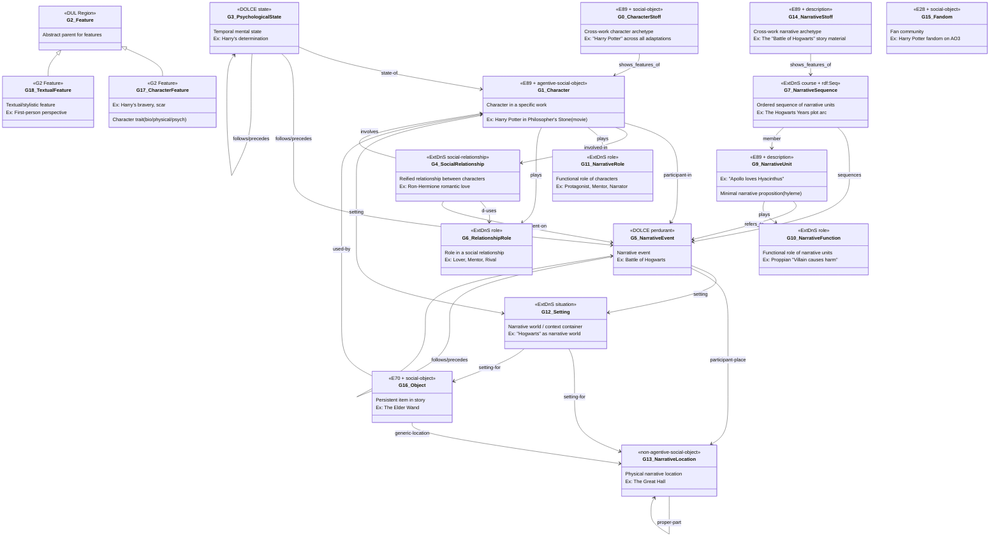
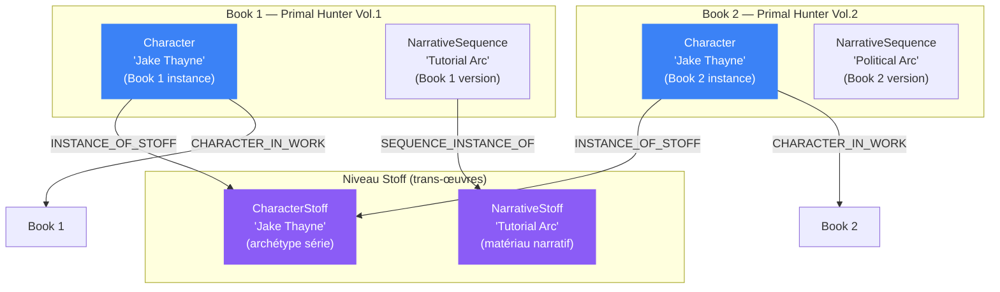

# Cahier des charges v2 : Refondation ontologique complète sur GOLEM v1.1

> **Version** : 3.0 — ontologie + implémentation opérationnelle complète  
> **Date** : 2026-04-05  
> **Objectif** : Refonder la couche core de WorldRAG sur GOLEM v1.1, en exploitant **100%** des classes et propriétés pertinentes, y compris le support multi-série (Stoff), la structure narrative formelle, et les contraintes opérationnelles concrètes (extraction, induction, registry, rétro-compatibilité, RAG).
>
> **Sections 1-5 + Annexes** : Mapping ontologique GOLEM (94% classes, 89% propriétés)  
> **Sections 6-6sexies** : Implémentation opérationnelle (extraction strategy, induction, registry, backward compat, RAG)  
> **Section 9** : Plan de migration en 6 phases avec inventaire complet des fichiers impactés

---

## 1. Contexte et motivation

### 1.1 Problème actuel

L'ontologie `core.yaml` actuelle est un assemblage empirique de 9 types d'entités et 18 types de relations. Elle cite des références académiques (CIDOC-CRM, SEM, DOLCE, OntoMedia, Bamman) sans les implémenter formellement. Les problèmes concrets :

| Problème | Conséquence |
|----------|-------------|
| `Character.role` est une propriété statique (`protagonist`, `antagonist`...) | Un personnage ne peut pas changer de rôle au cours de l'histoire |
| `RELATES_TO` est un edge fourre-tout (Character → Character) | La relation entre deux personnages n'a pas d'histoire — pas de temporalité, pas de cause |
| Pas de modèle d'état psychologique | L'arc émotionnel des personnages est perdu (peur → détermination → rage) |
| Pas de distinction Setting / Location | "The Tutorial" (monde narratif) et "The Forest" (lieu physique) sont confondus |
| `Arc` n'a pas de séquençage d'événements | Les événements d'un arc n'ont pas d'ordre (juste un lien PART_OF non ordonné) |
| `NarrativeFunction` existe mais est sous-utilisé | Déjà dans core.yaml mais pas connecté à GOLEM G10 formellement |
| Pas de modèle multi-série | "Jake Thayne" dans Book 1 et Book 2 sont fusionnés — impossible de comparer l'évolution entre livres |
| Pas de traits de personnage temporels | "Jake a les yeux verts" et "Jake est solitaire" ne sont pas modélisés |
| Les features textuelles sont ad-hoc | `dialogue_ratio`, `pov_character` sont extraits dans `verify.py` sans modèle ontologique |
| Item au lieu d'Object | Non aligné avec GOLEM G16 |

### 1.2 Pourquoi GOLEM

**GOLEM** (General Ontology for Literary and Narrative Entities and Metadata) est :

- La **seule ontologie OWL 2 formelle** conçue spécifiquement pour la fiction narrative (publiée 2024-2025)
- Construite sur 3 standards internationaux :
  - **DOLCE** (upper ontology) — catégories fondamentales : endurant/perdurant, agentive/non-agentive
  - **CIDOC-CRM** (ISO 21127) — modèle événement-temporel, provenance des assertions
  - **LRMoo** (IFLA/CIDOC) — hiérarchie bibliographique Work/Expression
- Activement maintenue (ERC StG 2023-2027, Université de Groningen)
- 18 classes spécialisées couvrant : personnages, relations, événements, psychologie, rôles narratifs, settings, objets, structure narrative, archétypes trans-œuvres, traits de personnage, features textuelles
- Licence CC BY 4.0

### 1.3 Principe de la migration

```
AVANT                                    APRÈS
=====                                    =====
core.yaml (custom, 9 types)             core.yaml (GOLEM-aligned, ~20 types)
  + litrpg.yaml (genre)                   + litrpg.yaml (genre, inchangé)
  + series.yaml (série)                   + series.yaml (série, inchangé)
  + induced (runtime)                     + induced (runtime, inchangé)
```

Seule la **couche 1 (core)** change. Les couches 2 (genre), 3 (série) et induced restent identiques.

---

## 2. Inventaire complet de GOLEM v1.1

### 2.1 Classes GOLEM (18 classes)



### 2.2 Propriétés spécifiques GOLEM

| Propriété | Domaine | Range | Sémantique |
|-----------|---------|-------|------------|
| **GP0 has_feature** | E70 Thing | G2 Feature | Lien entité → feature (caractère ou textuel) |
| **GP0i is_feature_of** | G2 Feature | E70 Thing | Inverse |
| **GP1 is_character_in** | G1 Character | F1 Work | Personnage apparaît dans une œuvre |
| **GP1i has_Character** | F1 Work | G1 Character | Inverse |

### 2.3 Propriétés importées clés (DOLCE/CIDOC-CRM/LRMoo)

| Propriété | Source | Utilisation dans GOLEM |
|-----------|--------|----------------------|
| `participant / participant-in` | DOLCE | G1 ↔ G5 (personnage participe à événement) |
| `involved-in / involves` | ExtendedDnS | G1 ↔ G4 (personnage impliqué dans relation sociale) |
| `plays / played-by` | ExtendedDnS | G1 → G11 (joue rôle narratif), G1 → G6 (joue rôle dans relation), G9 → G10 (unité joue fonction) |
| `d-uses / d-used-by` | ExtendedDnS | G4 → G6 (relation utilise rôle), F1 → G7 (œuvre utilise séquence) |
| `setting / setting-for` | ExtendedDnS | G12 ↔ {G1, G5, G13, G16, time-interval} |
| `follows / precedes` | TemporalRelations | G3 ↔ G3, G3 ↔ G5, G5 ↔ G5 (chaînes temporelles) |
| `temporally-included-in` | TemporalRelations | G3 ↔ G3 (état contenu dans un autre) |
| `proper-part / proper-part-of` | DOLCE | G13 ↔ G13 (hiérarchie spatiale), G9 → F1 |
| `generic-location / generic-location-of` | DOLCE | G13 ↔ {G1, G16} (localisation) |
| `participant-place` | SpatialRelations | G5 → G13 (événement a lieu à) |
| `has-state / state-of` | FunctionalParticipation | G1 ↔ G3 |
| `sequences / sequenced-by` | ExtendedDnS | G7 → G5 (séquence ordonne événements) |
| `satisfies / satisfied-by` | ExtendedDnS | G12 ↔ F1 (setting satisfait œuvre) |
| `modal-target` | ExtendedDnS | G10/G11 → G7 (fonction/rôle cible séquence) |
| `P130 shows_features_of` | CIDOC-CRM | G0 → G1, G14 → G7, F1 → G15 (Stoff → instance) |
| `P67 refers_to` | CIDOC-CRM | G9 → G5 (unité réfère événement) |
| `P16 used_specific_object` | CIDOC-CRM | G5 → G16 (événement utilise objet) |
| `generically-dependent-on` | DOLCE | G4 → G5 (relation dépend d'événement) |
| `R3 is_realised_in` | LRMoo | F1 → F2 (œuvre réalisée en expression) |
| `R5 has_component` | LRMoo | F2 → F2 (expression contient composant) |

### 2.4 Classes importées (LRMoo / CIDOC-CRM)

| Classe | Source | Utilisation |
|--------|--------|-----------|
| **F1 Work** | LRMoo | Œuvre intellectuelle (roman, film). Contient G9 Narrative Units, utilise G7 Narrative Sequences, est satisfait par G12 Setting |
| **F2 Expression** | LRMoo | Réalisation d'une œuvre (le texte spécifique). Composable (R5 has_component) |
| **E13 Attribute Assignment** | CIDOC-CRM | Activité d'attribution d'un attribut (provenance des assertions) |
| **E54 Dimension** | CIDOC-CRM | Propriété quantifiable (nombre de mots, kudos) |
| **E55 Type** | CIDOC-CRM | Terme de taxonomie (hiérarchie P127 broader/narrower) |

---

## 3. Mapping exhaustif : GOLEM → WorldRAG

### 3.1 Types existants — enrichissement GOLEM

| WorldRAG actuel | GOLEM | Changements |
|----------------|-------|-------------|
| **Character** | G1 | + `agency: enum [active, passive, ambiguous]` (DOLCE agentive)<br>+ `fictional_status: enum [fictional, semi_fictional, historical]`<br>- `role` supprimé (→ NarrativeRole temporel) |
| **Event** | G5 | Renommer `event_type` → `event_category` (alignement DOLCE perdurant taxonomy)<br>Valeurs enrichies : `[action, state_change, process, achievement, dialogue, encounter, discovery, revelation, transition, combat]` |
| **Location** | G13 | + `fictional_status: enum [fictional, real, semi_fictional]`<br>+ `setting_name: string` (lien vers le Setting parent) |
| **Item → Object** | G16 | **Renommer** en Object (alignement GOLEM G16)<br>Propriétés inchangées |
| **Arc → NarrativeSequence** | G7 | **Renommer** en NarrativeSequence (alignement GOLEM G7)<br>+ `sequence_order: integer` (position dans l'œuvre)<br>Enrichir PART_OF avec `order` pour séquençage |
| **NarrativeFunction** | G10 | **Déjà dans core.yaml** — aligner formellement sur G10<br>Ajouter `scope: enum [work, sequence, unit]` pour indiquer le niveau |
| **Book** | F1 Work | Ajouter commentaire d'alignement LRMoo dans YAML<br>Book EST une F1 Work dans GOLEM |

### 3.2 Nouveaux types (depuis GOLEM)

| Nouveau type | GOLEM | Description | Pourquoi indispensable |
|-------------|-------|-------------|----------------------|
| **CharacterStoff** | G0 | Archétype trans-œuvres d'un personnage | Multi-série : "Jake Thayne" comme identité persistante à travers tous les livres. Permet de comparer l'évolution du personnage entre Book 1 et Book 5. |
| **PsychologicalState** | G3 | État mental temporel : émotion, motivation, croyance, objectif | Arc émotionnel : Jake passe de "curious" (ch1) → "determined" (ch15) → "desperate" (ch30) → "transcendent" (ch75). Actuellement perdu. |
| **SocialRelationship** | G4 | Relation sociale réifiée comme nœud | La relation Jake↔Casper est "amitié" (ch1-20) puis "mentorship" (ch21+), causée par l'Event "Battle of the Clearing". La relation a une histoire. |
| **RelationshipRole** | G6 | Rôle d'un personnage dans une relation sociale | Jake est "mentee" dans la relation Jake-Villy. Villy est "patron". Chaque personnage a un rôle différent dans la même relation. |
| **NarrativeUnit** | G9 | Proposition narrative minimale (hylème) | Granularité d'extraction : "Jake tue le Beastkin" est un hylème. Lie l'extraction aux événements et aux fonctions narratives. |
| **NarrativeRole** | G11 | Rôle narratif temporel d'un personnage | Jake est "hero" (ch1-30), "mentor" pour Miranda (ch31-50), "anti-hero" dans l'arc politique (ch51+). Remplace `Character.role` statique. |
| **Setting** | G12 | Univers narratif / contexte global | "The Tutorial", "The Multiverse", "Nevermore" sont des Settings, pas des Locations. Conteneur pour personnages, événements, lieux, objets. |
| **CharacterFeature** | G17 | Trait de personnage temporel | `biographical`: "Jake est humain", "Jake est né à New Haven"<br>`physical`: "Jake a les yeux verts"<br>`psychological`: "Jake est solitaire"<br>Les traits changent → temporal (valid_from/to) |
| **TextualFeature** | G18 | Feature textuelle / stylistique | `dialogue_ratio`, `pov_type`, `narrative_voice` — formalise ce que `verify.py` extrait déjà de manière ad-hoc. |
| **NarrativeStoff** | G14 | Archétype narratif trans-œuvres | Le "Tutorial Arc" comme matériau narratif réutilisable. Si la saga a plusieurs adaptations ou si on compare des arcs entre séries. |

### 3.3 Types existants SANS équivalent GOLEM (conservés tels quels)

| Type | Pourquoi pas dans GOLEM | Justification de conservation |
|------|------------------------|-------------------------------|
| **Concept** | GOLEM n'a pas de type "concept abstrait du monde fictionnel" | Indispensable pour modéliser magie, politique, cosmologie, systèmes de pouvoir |
| **Prophecy** | Pas dans GOLEM (trop spécifique) | Type narratif utile pour fantasy/LitRPG. Pourrait être modélisé comme G9+G10 mais la commodité d'extraction justifie un type dédié |
| **Creature** | GOLEM ne distingue pas créatures et personnages (tout est G1 ou G16) | WorldRAG en a besoin pour la fiction de genre (monstres, boss, faune) |
| **Faction** | GOLEM modélise les groupes via G4, pas comme entités first-class | Un nœud Faction est plus pratique pour l'extraction que de réifier chaque membership comme G4 |

### 3.4 Types GOLEM hors périmètre (différés)

| Type GOLEM | Raison du report | Phase future |
|-----------|-----------------|-------------|
| **G15 Fandom** | Côté réception, pas structure narrative. WorldRAG n'extrait pas de données de communauté fan. | Si intégration AO3/Goodreads |
| **F2 Expression** | Nos Chapter/Chunk sont déjà des expressions implicites. La distinction Work/Expression est utile pour les adaptations (livre vs film) mais pas encore notre cas d'usage. | Si support multi-média (livre + audiobook + adaptation) |
| **E13 Attribute Assignment** | Notre pipeline track déjà la provenance (extraction_text, confidence, source_reliability). Formaliser en E13 nodes serait sur-ingénierie pour l'instant. | Si annotation collaborative ou scholarly review |
| **E54 Dimension** | Metrics de réception (word_count, kudos). Nos Chapter.word_count suffit. | Si analytics dashboard |

### 3.5 Relations existantes — alignement GOLEM

| Relation actuelle | Équivalent GOLEM | Changement |
|------------------|-----------------|-----------|
| `PARTICIPATES_IN` (Character → Event) | `participant-in` (DOLCE) | Aucun — déjà aligné |
| `OCCURS_AT` (Event → Location) | `participant-place` (SpatialRelations) | Aucun — déjà aligné |
| `CAUSES` (Event → Event) | Implicite via `follows`/`precedes` (TemporalRelations) | Conserver CAUSES en plus du séquençage temporel — CAUSES est plus spécifique |
| `ENABLES` (Event → Event) | Pas d'équivalent direct GOLEM | Conserver |
| `OCCURS_BEFORE` (Event → Event) | `precedes` (TemporalRelations) | Renommer en `PRECEDES` (alignement GOLEM). Ajouter `FOLLOWS` inverse. |
| `PART_OF` (Event → Arc) | `member` (G7 → G9), `sequences` (G7 → G5) | Enrichir : ajouter `order: integer` pour le séquençage. Event → NarrativeSequence via SEQUENCED_IN |
| `STRUCTURED_BY` (Arc → NarrativeFunction) | `modal-target-of` (G10 → G7) | Renommer Arc → NarrativeSequence, garder la relation |
| `FULFILLS` (Event → NarrativeFunction) | `plays` (G9 → G10) via G9 | Conserver comme raccourci (Event → NarrativeFunction) |
| `POSSESSES` (Character → Item) | `used-by` inverse (G16 → G1) | Conserver POSSESSES + ajouter `USED_IN` (Object → Event) via P16 |
| `LOCATED_AT` (Character → Location) | `generic-location` (DOLCE) | Aucun — déjà aligné |
| `LOCATION_PART_OF` (Location → Location) | `proper-part` (DOLCE) | Aucun — déjà aligné |
| `MEMBER_OF` (Character → Faction) | Pas d'équivalent direct (G4 modélise les relations sociales, pas les memberships institutionnels) | Conserver |
| `PERCEIVED_BY` (Event → Character) | E13 Attribute Assignment (provenance) | Conserver — plus pratique pour notre modèle d'extraction |
| `MENTIONED_IN` / `GROUNDED_IN` | Pas d'équivalent direct GOLEM | Conserver — indispensable pour le source grounding |
| `RETCONNED_BY` | Pas dans GOLEM | Conserver — spécifique aux séries longues |
| `CONTAINS_WORK` / `HAS_CHAPTER` / `HAS_CHUNK` | `R5 has_component` (LRMoo) + `proper-part` | Conserver la hiérarchie actuelle |

### 3.6 Nouvelles relations (depuis GOLEM)

| Nouvelle relation | Source → Target | GOLEM source | Sémantique |
|------------------|----------------|-------------|------------|
| **HAS_STATE** | Character → PsychologicalState | `has-state` (FP) | État mental à un moment donné |
| **STATE_TRIGGERED_BY** | PsychologicalState → Event | G3 `follows` G5 | L'événement qui a causé cet état |
| **TRIGGERS_EVENT** | PsychologicalState → Event | G3 `precedes` G5 | L'état mental qui cause une action |
| **FOLLOWS_STATE** | PsychologicalState → PsychologicalState | G3 `follows` G3 | Chaîne émotionnelle (peur → détermination) |
| **STATE_INCLUDES** | PsychologicalState → PsychologicalState | G3 `temporally-included-in` G3 | Un état contenu dans un autre (colère incluse dans désespoir) |
| **IN_SETTING** | Character/Event/Location/Object → Setting | `setting` (ExtDnS) | Rattachement à un univers narratif |
| **SETTING_CONTAINS** | Setting → Location | `setting-for` (ExtDnS) | Le setting contient ce lieu |
| **HAS_FEATURE** | Character → CharacterFeature | GP0 `has_feature` | Trait de personnage (temporel) |
| **HAS_TEXTUAL_FEATURE** | Book/Chapter → TextualFeature | GP0 `has_feature` | Feature stylistique d'un texte |
| **PLAYS_ROLE** | Character → NarrativeRole | `plays` (ExtDnS) | Rôle narratif temporel |
| **ROLE_IN_SEQUENCE** | NarrativeRole → NarrativeSequence | `modal-target` (ExtDnS) | Dans quelle séquence ce rôle s'applique |
| **INVOLVED_IN** | Character → SocialRelationship | `involved-in` (ExtDnS) | Participation à une relation sociale |
| **HAS_RELATIONSHIP_ROLE** | SocialRelationship → RelationshipRole | `d-uses` (ExtDnS) | La relation utilise ce type de rôle |
| **PLAYS_RELATIONSHIP_ROLE** | Character → RelationshipRole | `plays` (ExtDnS) | Le personnage joue ce rôle dans la relation |
| **RELATIONSHIP_CAUSED_BY** | SocialRelationship → Event | `generically-dependent-on` (DOLCE) | L'événement qui a créé/modifié la relation |
| **SEQUENCED_IN** | Event → NarrativeSequence | `sequences` inverse (G7 → G5) | L'événement fait partie de cette séquence (avec ordre) |
| **UNIT_REFERS_TO** | NarrativeUnit → Event | `refers_to` (CIDOC P67) | L'unité narrative réfère à cet événement |
| **UNIT_PLAYS_FUNCTION** | NarrativeUnit → NarrativeFunction | `plays` (ExtDnS) | L'unité joue cette fonction narrative |
| **UNIT_IN_WORK** | NarrativeUnit → Book | `proper-part-of` (DOLCE) | L'unité fait partie de cette œuvre |
| **INSTANCE_OF_STOFF** | Character → CharacterStoff | `shows_features_of` (P130) | Ce personnage est une instance de cet archétype |
| **SEQUENCE_INSTANCE_OF** | NarrativeSequence → NarrativeStoff | `shows_features_of` (P130) | Cette séquence est une instance de ce matériau narratif |
| **CHARACTER_IN_WORK** | Character → Book | GP1 `is_character_in` | Ce personnage apparaît dans cette œuvre |
| **USED_IN** | Object → Event | `P16i was_used_for` | Cet objet est utilisé dans cet événement |
| **SETTING_OF_WORK** | Setting → Book | `satisfies` (ExtDnS) | Ce Setting est le contexte narratif de cette œuvre |
| **PRECEDES** | Event → Event | `precedes` (TemporalRelations) | Remplacement de OCCURS_BEFORE |
| **FOLLOWS** | Event → Event | `follows` (TemporalRelations) | Inverse de PRECEDES |

### 3.7 Relations dépréciées

| Relation | Remplacement | Migration |
|----------|-------------|-----------|
| **RELATES_TO** (Character → Character edge) | **INVOLVED_IN** (Character → SocialRelationship) × 2 | Chaque RELATES_TO edge → 1 nœud SocialRelationship + 2 edges INVOLVED_IN + 2 RelationshipRole |
| **OCCURS_BEFORE** | **PRECEDES** | Simple renommage |

---

## 4. Architecture multi-série (Stoff)

### 4.1 Le concept Stoff

Le **Stoff** (allemand : "matériau") est le concept le plus distinctif de GOLEM. Il modélise l'**archétype qui transcende les œuvres individuelles**.



### 4.2 Character-Stoff (G0) : identité trans-livres

**Problème actuel** : WorldRAG crée UN nœud Character par `canonical_name` et le réutilise entre les livres. Ça fonctionne pour les propriétés temporelles (`valid_from_chapter`), mais on perd :
- La distinction entre "Jake tel qu'il est dans Book 1" et "Jake tel qu'il est dans Book 5"
- La capacité de comparer l'évolution d'un personnage entre livres
- La capacité de détecter des réapparitions trans-séries (personnages partagés)

**Solution GOLEM** :

```
CharacterStoff: "Jake Thayne"           ← archétype série (1 par série)
  ├── Character: "Jake Thayne (Book 1)" ← instance par livre
  │     ├── HAS_FEATURE: "human" (ch1-76)
  │     ├── PLAYS_ROLE: "protagonist" (ch1-76)
  │     └── HAS_STATE: "curious" (ch1) → "determined" (ch15)
  └── Character: "Jake Thayne (Book 2)" ← instance par livre
        ├── HAS_FEATURE: "D-grade human" (ch77-150)
        ├── PLAYS_ROLE: "politician" (ch77-100)
        └── HAS_STATE: "weary" (ch77) → "resolute" (ch100)
```

**Impact sur EntityRegistry** : Le reconciler crée un nœud CharacterStoff automatiquement quand il détecte le même `canonical_name` dans un nouveau livre. Le Character-level node est scopé au book_id.

### 4.3 Narrative-Stoff (G14) : arcs trans-livres

Le "Tutorial Arc" dans Primal Hunter se retrouve (transformé) dans d'autres LitRPGs. Le NarrativeStoff permet de :
- Comparer les arcs narratifs entre séries
- Identifier les patterns narratifs récurrents (le "zero to hero" arc, le "training arc")
- Enrichir le RAG avec des requêtes comparatives ("compare l'arc tutorial de Primal Hunter et Cradle")

### 4.4 Quand créer un Stoff

| Situation | Créer Stoff ? | Raison |
|-----------|--------------|--------|
| Premier livre d'une série | Non | Pas encore de comparaison possible |
| Deuxième livre de la même série | **Oui** | Le reconciler détecte les personnages récurrents → crée les CharacterStoff |
| Personnage apparaissant dans deux séries | **Oui** | CharacterStoff partagé entre séries |
| Arc narratif récurrent (tutorial, training) | Optionnel | NarrativeStoff utile pour analyse comparative |

---

## 5. Nouveau schéma core.yaml (structure complète)

Le nouveau core.yaml aura cette structure :

```yaml
version: "4.0.0"  # Major version bump
layer: core
golem_version: "1.1"
golem_source: "https://w3id.org/golem/ontology#"

node_types:
  # === BIBLIOGRAPHIC (LRMoo F1/F2) ===
  Series:         # ... inchangé
  Book:           # ... + golem_alignment: "F1_Work"
  Chapter:        # ... + golem_alignment: "F2_Expression (component)"
  Chunk:          # ... inchangé

  # === CHARACTERS (GOLEM G0, G1, G17) ===
  CharacterStoff:
    golem_alignment: "G0_Character-Stoff"
    properties:
      canonical_name: { type: string, required: true, unique: true }
      description: { type: string }
      series_id: { type: string }

  Character:
    golem_alignment: "G1_Character"
    properties:
      name: { type: string, required: true }
      canonical_name: { type: string, required: true }
      aliases: { type: string_array }
      description: { type: string }
      agency: { type: enum, values: [active, passive, ambiguous] }
      fictional_status: { type: enum, values: [fictional, semi_fictional, historical] }
      species: { type: string }
      gender: { type: string }
      first_appearance_chapter: { type: integer }
      book_id: { type: string, required: true }
    constraints:
      - unique: [canonical_name, book_id]
    indexes:
      - fulltext: [name, canonical_name, aliases, description]

  CharacterFeature:
    golem_alignment: "G17_Character_Feature"
    properties:
      name: { type: string, required: true }
      feature_type: { type: enum, values: [biographical, physical, psychological] }
      description: { type: string }
      character_name: { type: string, required: true }
      valid_from_chapter: { type: integer, required: true }
      valid_to_chapter: { type: integer }

  # === PSYCHOLOGICAL (GOLEM G3) ===
  PsychologicalState:
    golem_alignment: "G3_Psychological_State"
    properties:
      name: { type: string, required: true }
      state_type: { type: enum, values: [emotion, motivation, belief, goal, fear] }
      character_name: { type: string, required: true }
      description: { type: string }
      intensity: { type: float }  # 0.0 to 1.0
      chapter_start: { type: integer, required: true }
      chapter_end: { type: integer }

  # === SOCIAL RELATIONSHIPS (GOLEM G4, G6) ===
  SocialRelationship:
    golem_alignment: "G4_Social_Relationship"
    properties:
      name: { type: string, required: true }
      relationship_type: { type: enum, values: [friendship, rivalry, romance, family, mentorship, patron, alliance, enmity, professional, worship] }
      description: { type: string }
      valid_from_chapter: { type: integer, required: true }
      valid_to_chapter: { type: integer }
      book_id: { type: string, required: true }
    indexes:
      - fulltext: [name, description]

  RelationshipRole:
    golem_alignment: "G6_Relationship_Role"
    properties:
      role_type: { type: string, required: true }  # mentor, mentee, lover, rival, patron, protege, leader, follower
      character_name: { type: string, required: true }
      relationship_name: { type: string, required: true }

  # === EVENTS (GOLEM G5) ===
  Event:
    golem_alignment: "G5_Narrative_Event"
    properties:
      name: { type: string, required: true }
      description: { type: string }
      event_category: { type: enum, values: [action, state_change, process, achievement, dialogue, encounter, discovery, revelation, transition, combat] }
      significance: { type: enum, values: [minor, moderate, major, critical, arc_defining] }
      chapter_start: { type: integer, required: true }
      chapter_end: { type: integer }
      fabula_order: { type: integer }
      is_flashback: { type: boolean, default: false }
    indexes:
      - fulltext: [name, description]

  # === NARRATIVE STRUCTURE (GOLEM G7, G9, G10, G11) ===
  NarrativeSequence:
    golem_alignment: "G7_Narrative_Sequence"
    properties:
      name: { type: string, required: true }
      description: { type: string }
      sequence_type: { type: enum, values: [main_plot, subplot, character_arc, world_arc] }
      chapter_start: { type: integer }
      chapter_end: { type: integer }
      status: { type: enum, values: [active, completed, abandoned] }
      sequence_order: { type: integer }

  NarrativeUnit:
    golem_alignment: "G9_Narrative_Unit"
    properties:
      proposition: { type: string, required: true }  # "Jake kills the Beastkin"
      chapter: { type: integer, required: true }
      chunk_position: { type: integer }

  NarrativeFunction:
    golem_alignment: "G10_Narrative_Function"
    properties:
      name: { type: string, required: true }
      propp_code: { type: string }
      description: { type: string }
      scope: { type: enum, values: [work, sequence, unit] }

  NarrativeRole:
    golem_alignment: "G11_Narrative_Role"
    properties:
      role_type: { type: enum, values: [protagonist, antagonist, mentor, trickster, herald, guardian, shadow, shapeshifter, narrator, deuteragonist, foil] }
      character_name: { type: string, required: true }
      context: { type: string }
      valid_from_chapter: { type: integer, required: true }
      valid_to_chapter: { type: integer }

  # === WORLD (GOLEM G12, G13) ===
  Setting:
    golem_alignment: "G12_Setting"
    properties:
      name: { type: string, required: true, unique: true }
      description: { type: string }
      setting_type: { type: enum, values: [world, era, dimension, realm, zone, instance] }
      chapter_start: { type: integer }
      chapter_end: { type: integer }
    indexes:
      - fulltext: [name, description]

  Location:
    golem_alignment: "G13_Narrative_Location"
    properties:
      name: { type: string, required: true, unique: true }
      description: { type: string }
      location_type: { type: enum, values: [city, dungeon, realm, continent, pocket_dimension, planet, forest, mountain, building, region] }
      fictional_status: { type: enum, values: [fictional, real, semi_fictional] }
      parent_location_name: { type: string }
    indexes:
      - fulltext: [name, description]

  # === ITEMS (GOLEM G16) ===
  Object:
    golem_alignment: "G16_Object"
    properties:
      name: { type: string, required: true }
      description: { type: string }
      object_type: { type: enum, values: [weapon, armor, consumable, artifact, key_item, tool, material] }
      rarity: { type: enum, values: [common, uncommon, rare, epic, legendary, unique] }

  # === STOFF — CROSS-WORK ARCHETYPES (GOLEM G0, G14) ===
  NarrativeStoff:
    golem_alignment: "G14_Narrative-Stoff"
    properties:
      name: { type: string, required: true, unique: true }
      description: { type: string }
      pattern_type: { type: enum, values: [hero_journey, training_arc, tournament, dungeon_crawl, political_intrigue, romance, revenge, redemption] }

  # === TEXTUAL FEATURES (GOLEM G18) ===
  TextualFeature:
    golem_alignment: "G18_Textual_Feature"
    properties:
      name: { type: string, required: true }
      feature_type: { type: enum, values: [pov, narrative_voice, dialogue_density, pacing, tone] }
      value: { type: string }  # "first_person", "0.45", "fast", etc.
      chapter: { type: integer }
      book_id: { type: string, required: true }

  # === CONCEPTS & LORE (WorldRAG, pas GOLEM) ===
  Concept:
    properties:
      name: { type: string, required: true, unique: true }
      description: { type: string }
      domain: { type: string }

  Prophecy:
    properties:
      name: { type: string, required: true }
      description: { type: string }
      status: { type: enum, values: [unfulfilled, fulfilled, subverted] }

  Faction:
    properties:
      name: { type: string, required: true, unique: true }
      description: { type: string }
      type: { type: string }
      alignment: { type: string }

  Creature:
    properties:
      name: { type: string, required: true }
      description: { type: string }
      species: { type: string }
      threat_level: { type: string }
```

---

## 6. Impact détaillé sur le pipeline d'extraction

### 6.1 Schemas Pydantic (`extraction_v4.py`)

**Nouveaux modèles Instructor** (8 modèles) :

```python
class ExtractedCharacterStoff(BaseModel):
    entity_type: Literal["character_stoff"]
    canonical_name: str
    description: str = ""

class ExtractedPsychologicalState(BaseModel):
    entity_type: Literal["psychological_state"]
    character: str           # personnage concerné
    state_type: Literal["emotion", "motivation", "belief", "goal", "fear"]
    name: str                # "determination", "fear of failure"
    description: str = ""
    trigger_event: str = ""  # nom de l'event déclencheur
    intensity: float = 0.5   # 0.0-1.0

class ExtractedSetting(BaseModel):
    entity_type: Literal["setting"]
    name: str                # "The Tutorial", "Nevermore"
    setting_type: Literal["world", "era", "dimension", "realm", "zone", "instance"] = "world"
    description: str = ""

class ExtractedCharacterFeature(BaseModel):
    entity_type: Literal["character_feature"]
    character: str
    feature_type: Literal["biographical", "physical", "psychological"]
    name: str                # "green eyes", "human", "loner"
    description: str = ""

class ExtractedNarrativeRole(BaseModel):
    entity_type: Literal["narrative_role"]
    character: str
    role_type: Literal["protagonist", "antagonist", "mentor", "trickster",
                       "herald", "guardian", "shadow", "shapeshifter",
                       "narrator", "deuteragonist", "foil"]
    context: str = ""        # dans quel arc/contexte

class ExtractedSocialRelationship(BaseModel):
    entity_type: Literal["social_relationship"]
    participants: list[str]  # 2+ personnages
    relationship_type: Literal["friendship", "rivalry", "romance", "family",
                               "mentorship", "patron", "alliance", "enmity",
                               "professional", "worship"]
    description: str = ""
    trigger_event: str = ""

class ExtractedNarrativeUnit(BaseModel):
    entity_type: Literal["narrative_unit"]
    proposition: str         # "Jake kills the Beastkin"
    event_reference: str = ""  # nom de l'event référencé
    function: str = ""       # fonction narrative optionnelle

class ExtractedTextualFeature(BaseModel):
    entity_type: Literal["textual_feature"]
    feature_type: Literal["pov", "narrative_voice", "dialogue_density", "pacing", "tone"]
    name: str                # "first_person_pov", "high_dialogue"
    value: str = ""          # "0.45", "fast"
```

**Modifications aux modèles existants** :

| Modèle | Changement |
|--------|-----------|
| `ExtractedCharacter` | Retirer `role`. Ajouter `agency: Literal["active", "passive", "ambiguous"]` |
| `ExtractedEvent` | Renommer `event_type` → `event_category`. Étendre les valeurs. |
| `ExtractedItem` → `ExtractedObject` | Renommer. `entity_type: Literal["object"]` |
| `ExtractedArc` → `ExtractedNarrativeSequence` | Renommer. `entity_type: Literal["narrative_sequence"]`. Ajouter `sequence_order: int = 0` |
| `EntityUnion` | Ajouter les 8 nouveaux types au discriminated union |

### 6.2 Prompts (`entity_descriptions.yaml`, `few_shots.yaml`)

**Nouvelles descriptions de types** (8) avec exemples positifs et négatifs :

| Type | Exemple positif | Exemple négatif |
|------|----------------|-----------------|
| PsychologicalState | "Jake felt a surge of determination" → `{name: "determination", character: "Jake", state_type: "emotion"}` | "Jake ran fast" → PAS un état psychologique, c'est une action |
| Setting | "Welcome to the Tutorial" → `{name: "The Tutorial", setting_type: "instance"}` | "The forest north of camp" → PAS un Setting, c'est une Location |
| CharacterFeature | "Jake's green eyes" → `{name: "green eyes", feature_type: "physical"}` | "Jake smiled" → PAS un trait, c'est une action |
| NarrativeRole | "Jake took on the role of mentor for Miranda" → `{role_type: "mentor", character: "Jake"}` | "Jake is strong" → PAS un rôle narratif, c'est un CharacterFeature |
| SocialRelationship | "The friendship between Jake and Casper deepened" → `{participants: ["Jake", "Casper"], relationship_type: "friendship"}` | "Jake hit Casper" → PAS une relation, c'est un Event |
| NarrativeUnit | "Apollo kills Hyacinthus" → `{proposition: "Apollo kills Hyacinthus"}` | (extraction automatique, pas guidée par LLM) |
| TextualFeature | Chapter narrated in first person → `{feature_type: "pov", name: "first_person"}` | (extraction programmatique dans verify.py) |
| Object (ex-Item) | "The Elder Wand" → identique à avant, juste renommé | |

**Modifications aux descriptions existantes** :
- CHARACTER : retirer la mention de `role` statique, ajouter `agency`
- EVENT : utiliser `event_category` avec la taxonomie DOLCE enrichie
- ARC → NARRATIVE_SEQUENCE : renommer dans toutes les descriptions

### 6.3 Nœud de vérification (`verify.py`)

**Nouvelles règles de vérification** :

| Règle | Vérification |
|-------|-------------|
| PsychologicalState.character | Doit référencer un Character connu dans le chapitre ou le registry |
| CharacterFeature.character | Idem |
| NarrativeRole.character | Idem |
| SocialRelationship.participants | Au moins 2 participants connus (characters) |
| Setting ≠ Location | Un Setting ne doit pas être un lieu physique spécifique (heuristique : pas de Location.location_type match) |
| NarrativeRole ≠ CharacterFeature | "brave" est un trait (G17), pas un rôle (G11) |
| RelationshipRole cohérent | Le rôle doit correspondre au relationship_type (pas "lover" dans une "enmity") |

### 6.4 Reconciler (`reconciler.py`)

**Nouveau priority map** (cross-type dedup) :

```python
_TYPE_PRIORITY = {
    "character": 10,
    "character_stoff": 10,
    "social_relationship": 9,
    "location": 9,
    "setting": 8,
    "creature": 8,
    "object": 7,           # ex-item
    "faction": 7,
    "psychological_state": 6,
    "character_feature": 6,
    "narrative_role": 6,
    "relationship_role": 6,
    "level_change": 6,
    "stat_change": 6,
    "narrative_sequence": 5,  # ex-arc
    "event": 5,
    "narrative_unit": 4,
    "narrative_function": 4,
    "prophecy": 4,
    "textual_feature": 3,
    "narrative_stoff": 3,
    "concept": 3,
    "genre_entity": 2,
}
```

**Stoff reconciliation** : Quand on traite le Book N (N > 1) :
1. Charger les CharacterStoff existants de la série
2. Pour chaque Character extrait dont le `canonical_name` matche un Stoff existant → créer le lien INSTANCE_OF_STOFF
3. Si aucun Stoff n'existe pour ce `canonical_name` et que le personnage apparaît dans 2+ livres → créer le CharacterStoff

### 6.5 Validation des relations (`validation.py`)

**Nouvelles contraintes domain/range** :

```yaml
validation_rules:
  domain_range:
    # Psychological states
    HAS_STATE:
      from: [Character]
      to: [PsychologicalState]
    STATE_TRIGGERED_BY:
      from: [PsychologicalState]
      to: [Event]
    TRIGGERS_EVENT:
      from: [PsychologicalState]
      to: [Event]
    FOLLOWS_STATE:
      from: [PsychologicalState]
      to: [PsychologicalState]
    STATE_INCLUDES:
      from: [PsychologicalState]
      to: [PsychologicalState]
    # Settings
    IN_SETTING:
      from: [Character, Event, Location, Object, Creature, Faction]
      to: [Setting]
    SETTING_CONTAINS:
      from: [Setting]
      to: [Location]
    # Features
    HAS_FEATURE:
      from: [Character]
      to: [CharacterFeature]
    HAS_TEXTUAL_FEATURE:
      from: [Book, Chapter]
      to: [TextualFeature]
    # Roles
    PLAYS_ROLE:
      from: [Character]
      to: [NarrativeRole]
    ROLE_IN_SEQUENCE:
      from: [NarrativeRole]
      to: [NarrativeSequence]
    # Social relationships
    INVOLVED_IN:
      from: [Character]
      to: [SocialRelationship]
    HAS_RELATIONSHIP_ROLE:
      from: [SocialRelationship]
      to: [RelationshipRole]
    PLAYS_RELATIONSHIP_ROLE:
      from: [Character]
      to: [RelationshipRole]
    RELATIONSHIP_CAUSED_BY:
      from: [SocialRelationship]
      to: [Event]
    # Narrative structure
    SEQUENCED_IN:
      from: [Event]
      to: [NarrativeSequence]
    UNIT_REFERS_TO:
      from: [NarrativeUnit]
      to: [Event]
    UNIT_PLAYS_FUNCTION:
      from: [NarrativeUnit]
      to: [NarrativeFunction]
    UNIT_IN_WORK:
      from: [NarrativeUnit]
      to: [Book]
    # Stoff
    INSTANCE_OF_STOFF:
      from: [Character]
      to: [CharacterStoff]
    SEQUENCE_INSTANCE_OF:
      from: [NarrativeSequence]
      to: [NarrativeStoff]
    CHARACTER_IN_WORK:
      from: [Character]
      to: [Book]
    # Settings ↔ Work
    SETTING_OF_WORK:
      from: [Setting]
      to: [Book]
    # Objects
    USED_IN:
      from: [Object]
      to: [Event]
    # Temporal
    PRECEDES:
      from: [Event]
      to: [Event]
    FOLLOWS:
      from: [Event]
      to: [Event]
    # Existing (conserved)
    PARTICIPATES_IN:
      from: [Character, Creature]
      to: [Event]
    OCCURS_AT:
      from: [Event]
      to: [Location]
    CAUSES:
      from: [Event]
      to: [Event]
    ENABLES:
      from: [Event]
      to: [Event]
    LOCATED_AT:
      from: [Character, Object, Event, Creature, Faction]
      to: [Location]
    MEMBER_OF:
      from: [Character]
      to: [Faction]
    POSSESSES:
      from: [Character]
      to: [Object]
```

### 6.6 Persistance Neo4j (`entity_repo.py`)

**Nouveaux handlers d'upsert** (8) :

| Handler | Clé de MERGE | Notes |
|---------|-------------|-------|
| `_upsert_character_stoff()` | `(canonical_name)` | Un par série, créé au book 2+ |
| `_upsert_psychological_states()` | `(character_name + name + chapter_start + book_id)` | Temporel |
| `_upsert_settings()` | `(name + book_id)` | Un par Setting par book |
| `_upsert_character_features()` | `(character_name + name + book_id)` | Temporel (valid_from/to) |
| `_upsert_narrative_roles()` | `(character_name + role_type + book_id)` | Temporel |
| `_upsert_social_relationships()` | `(name + book_id)` | + INVOLVED_IN edges |
| `_upsert_narrative_units()` | `(proposition + chapter + book_id)` | Lié à Event + Chunk |
| `_upsert_textual_features()` | `(feature_type + chapter + book_id)` | |

**Renommages dans les handlers existants** :
- `_upsert_items()` → `_upsert_objects()` (label `Object` au lieu de `Item`)
- `_upsert_arcs()` → `_upsert_narrative_sequences()` (label `NarrativeSequence` au lieu de `Arc`)

**Migration RELATES_TO → SocialRelationship** :

```cypher
// Pour chaque edge RELATES_TO existant
MATCH (a:Character)-[r:RELATES_TO]->(b:Character)
WHERE r.book_id IS NOT NULL

// Créer le nœud SocialRelationship
CREATE (sr:SocialRelationship {
    name: a.canonical_name + " — " + b.canonical_name,
    relationship_type: CASE
        WHEN r.type IS NOT NULL THEN r.type
        WHEN r.subtype IS NOT NULL THEN r.subtype
        ELSE "relates_to"
    END,
    book_id: r.book_id,
    valid_from_chapter: r.valid_from_chapter,
    valid_to_chapter: r.valid_to_chapter,
    description: coalesce(r.context, ""),
    batch_id: "golem_migration_v4"
})

// Créer les INVOLVED_IN edges
CREATE (a)-[:INVOLVED_IN {
    role: "participant",
    valid_from_chapter: r.valid_from_chapter,
    batch_id: "golem_migration_v4"
}]->(sr)
CREATE (b)-[:INVOLVED_IN {
    role: "participant",
    valid_from_chapter: r.valid_from_chapter,
    batch_id: "golem_migration_v4"
}]->(sr)

// Supprimer l'ancien edge
DELETE r
```

**Migration Item → Object** :

```cypher
MATCH (n:Item)
SET n:Object
REMOVE n:Item
```

**Migration Arc → NarrativeSequence** :

```cypher
MATCH (n:Arc)
SET n:NarrativeSequence
REMOVE n:Arc

// Renommer les propriétés
MATCH (n:NarrativeSequence)
WHERE n.arc_type IS NOT NULL
SET n.sequence_type = n.arc_type
REMOVE n.arc_type
```

**Migration OCCURS_BEFORE → PRECEDES** :

```cypher
MATCH (a)-[r:OCCURS_BEFORE]->(b)
CREATE (a)-[:PRECEDES]->(b)
DELETE r
```

### 6.7 Neo4j schema (`init_neo4j.cypher`)

**Nouvelles contraintes** :

```cypher
-- Nouveaux types GOLEM
CREATE CONSTRAINT IF NOT EXISTS FOR (cs:CharacterStoff) REQUIRE cs.canonical_name IS NOT NULL;
CREATE CONSTRAINT IF NOT EXISTS FOR (cs:CharacterStoff) REQUIRE cs.canonical_name IS UNIQUE;
CREATE CONSTRAINT IF NOT EXISTS FOR (ps:PsychologicalState) REQUIRE ps.name IS NOT NULL;
CREATE CONSTRAINT IF NOT EXISTS FOR (s:Setting) REQUIRE s.name IS NOT NULL;
CREATE CONSTRAINT IF NOT EXISTS FOR (s:Setting) REQUIRE s.name IS UNIQUE;
CREATE CONSTRAINT IF NOT EXISTS FOR (cf:CharacterFeature) REQUIRE cf.name IS NOT NULL;
CREATE CONSTRAINT IF NOT EXISTS FOR (nr:NarrativeRole) REQUIRE nr.role_type IS NOT NULL;
CREATE CONSTRAINT IF NOT EXISTS FOR (sr:SocialRelationship) REQUIRE sr.name IS NOT NULL;
CREATE CONSTRAINT IF NOT EXISTS FOR (rr:RelationshipRole) REQUIRE rr.role_type IS NOT NULL;
CREATE CONSTRAINT IF NOT EXISTS FOR (nu:NarrativeUnit) REQUIRE nu.proposition IS NOT NULL;
CREATE CONSTRAINT IF NOT EXISTS FOR (ns:NarrativeStoff) REQUIRE ns.name IS NOT NULL;
CREATE CONSTRAINT IF NOT EXISTS FOR (ns:NarrativeStoff) REQUIRE ns.name IS UNIQUE;
CREATE CONSTRAINT IF NOT EXISTS FOR (tf:TextualFeature) REQUIRE tf.name IS NOT NULL;

-- Renommages
-- Item → Object (après migration des données)
CREATE CONSTRAINT IF NOT EXISTS FOR (o:Object) REQUIRE o.name IS NOT NULL;
-- Arc → NarrativeSequence (après migration)
CREATE CONSTRAINT IF NOT EXISTS FOR (ns:NarrativeSequence) REQUIRE ns.name IS NOT NULL;
```

**Nouveaux index fulltext** :

```cypher
CREATE FULLTEXT INDEX setting_fulltext IF NOT EXISTS
    FOR (s:Setting) ON EACH [s.name, s.description];
CREATE FULLTEXT INDEX social_rel_fulltext IF NOT EXISTS
    FOR (sr:SocialRelationship) ON EACH [sr.name, sr.description];
CREATE FULLTEXT INDEX character_stoff_fulltext IF NOT EXISTS
    FOR (cs:CharacterStoff) ON EACH [cs.canonical_name, cs.description];
CREATE FULLTEXT INDEX narrative_stoff_fulltext IF NOT EXISTS
    FOR (ns:NarrativeStoff) ON EACH [ns.name, ns.description];
```

### 6.8 Book-level post-processing (`book_level.py`)

**Nouveaux checks de consistance** :

| Check | Logique |
|-------|---------|
| Orphan PsychologicalState | Tout PsychologicalState doit avoir un HAS_STATE entrant depuis un Character |
| Orphan CharacterFeature | Tout CharacterFeature doit avoir un HAS_FEATURE entrant |
| Orphan NarrativeRole | Tout NarrativeRole doit avoir un PLAYS_ROLE entrant |
| SocialRelationship sans participants | Tout SocialRelationship doit avoir ≥ 2 INVOLVED_IN entrants |
| Setting sans contenu | Warning si un Setting n'a aucun IN_SETTING entrant |
| Stoff consistency | Si Book N > 1 : vérifier que les personnages récurrents ont un CharacterStoff |
| PsychologicalState chains | Vérifier que les FOLLOWS_STATE forment des chaînes cohérentes (pas de cycles) |
| NarrativeSequence ordering | Vérifier que les events SEQUENCED_IN ont des `order` uniques et croissants |

---

## 6bis. Stratégie d'extraction — contraintes opérationnelles

> Les sections 6.1-6.8 décrivent le **quoi** (quels types, quelles validations). Cette section décrit le **comment** : la stratégie concrète d'extraction, les choix d'architecture, et les contraintes découvertes par audit du code existant.

### 6bis.1 Single-pass avec 20 types : faisabilité et limites

**Architecture actuelle** : Le pipeline V4 extrait TOUS les types d'entités en un seul appel LLM via Instructor (`EntityExtractionResult` = discriminated union de 12 types). Le prompt statique (cacheable Gemini) fait ~3,500 tokens. Le chapitre moyen fait ~5,000 tokens.

**Impact de +8 types** :
- +550 tokens au prompt statique (8 descriptions × ~70 tokens)
- Avec le cache préfixe Gemini : overhead = **0** pour les chapitres après le 1er
- Sans cache (OpenRouter) : +1,100 tokens/chapitre × 200 chapitres = +220K tokens = **$0.057/livre** → négligeable

**Limite qualitative** : La littérature et l'expérience montrent que le single-pass reste fiable jusqu'à ~15-20 types nommés avec définitions claires. Passer de 12 à 20 types est à la **limite haute**. Au-delà, risque de :
- Confusion inter-types (PsychologicalState vs CharacterFeature vs NarrativeRole)
- Omission de types rares (NarrativeUnit extrait 0 fois si le LLM "oublie")
- Augmentation du taux de hallucination

**Décision** : Rester en single-pass. Atténuer le risque via :
1. Descriptions de types très distinctes avec des exemples positifs ET négatifs discriminants
2. Le nœud `verify_coverage` existant (2e appel LLM) rattrape les omissions
3. NarrativeUnit et TextualFeature ne sont PAS extraits par le LLM (voir ci-dessous)

### 6bis.2 Stratégie par type : LLM vs programmatique

Tous les nouveaux types ne nécessitent pas une extraction LLM. Stratégie hybride :

| Type | Méthode d'extraction | Justification |
|------|---------------------|---------------|
| **PsychologicalState** | LLM (single-pass) | Sémantique, pas détectable par regex |
| **Setting** | LLM (single-pass) | Sémantique, distinction Setting/Location nécessite compréhension |
| **CharacterFeature** | LLM (single-pass) | Sémantique |
| **NarrativeRole** | LLM (single-pass) | Sémantique |
| **SocialRelationship** | LLM (relation pass) | Extrait dans `extract_relations_node`, pas `extract_entities_node` — c'est une relation réifiée |
| **RelationshipRole** | LLM (relation pass) | Idem, découle de SocialRelationship |
| **NarrativeUnit** | **Programmatique** (per-Event) | Chaque Event extrait génère automatiquement un NarrativeUnit. Zéro coût LLM. |
| **TextualFeature** (structural) | **Programmatique** (verify.py) | `dialogue_ratio`, `pov_character`, `scene_count` restent heuristiques — plus précis que le LLM |
| **TextualFeature** (enriched) | LLM (optionnel, futur) | `narrative_tension`, `prose_style` — LLM nécessaire. Phase future. |

**Conséquence** : Le LLM single-pass passe de 12 à **16 types** (pas 20), ce qui reste dans la zone fiable. NarrativeUnit et TextualFeature structural sont générés sans LLM.

### 6bis.3 Dépendances inter-types à l'extraction

PsychologicalState, NarrativeRole, CharacterFeature, SocialRelationship référencent tous un Character par nom. Deux scénarios :

**Intra-chapitre** (même appel LLM) : Le LLM produit le Character ET les types dépendants dans la même réponse JSON. La résolution est naturelle — le Character apparaît dans la liste avant les dépendants. **Aucun changement nécessaire.**

**Cross-chapitre** : Le Character a été extrait dans un chapitre précédent. L'EntityRegistry injecte les noms canoniques dans le prompt. Le reconciler fait du fuzzy matching (thefuzz, seuil ≥90%). **Risque** : si le nom dans PsychologicalState.character ne matche pas exactement → référence pendante.

**Mitigation** : Dans `reconcile_and_persist_v4_node`, ajouter une étape de résolution des références :
```python
for entity in entities:
    if entity.get("character"):
        resolved = registry.resolve_name(entity["character"])
        if resolved:
            entity["character"] = resolved.canonical_name
```

### 6bis.4 NarrativeUnit : définition opérationnelle

**Décision** : Un NarrativeUnit par Event extrait (Option C de l'audit).

**Implémentation** :
- Dans `reconcile_and_persist_v4_node`, après extraction des entités, pour chaque Event : créer automatiquement un NarrativeUnit
- `proposition` = résumé court de l'Event (déjà disponible dans `Event.description`)
- Lier via `UNIT_REFERS_TO` (NarrativeUnit → Event)
- Lier via `UNIT_IN_WORK` (NarrativeUnit → Book)
- Volume : 5-15 par chapitre → 400-1,200 par livre. Acceptable.
- **Pas dans le prompt LLM**, pas dans l'EntityRegistry, pas dans le fulltext index

### 6bis.5 TextualFeature : migration depuis verify.py

**Décision** : Approche hybride — les métriques structurelles restent heuristiques, formalisées comme n��uds Neo4j.

**Implémentation** :
- `verify_extractions_node` (verify.py) continue de calculer `dialogue_ratio`, `pov_character`, `scene_count` via regex
- **Nouveau** : au lieu de stocker dans `chunk_metadata` (actuellement non persisté !), créer des nœuds TextualFeature et les persister
- Chaque chapitre produit 3 TextualFeature : `{feature_type: "pov", name: pov_character}`, `{feature_type: "dialogue_density", value: "0.45"}`, `{feature_type: "pacing", value: scene_count}`
- Relation `HAS_TEXTUAL_FEATURE` : Chapter → TextualFeature
- Pas de coût LLM additionnel

---

## 6ter. Interaction co-évolutionnaire : induction + GOLEM

> L'audit du `pattern_inducer.py` et de l'`OntologyLoader` révèle des **problèmes critiques** d'interaction entre les types GOLEM core et les types induits à runtime.

### 6ter.1 Problème : collision sémantique non détectée

Le filtre anti-collision actuel (`pattern_inducer.py:267-275`) est **lexical uniquement** (lowercase match). Il détecte :
- ✅ `PsychologicalState` induit vs `PsychologicalState` core → même nom, bloqué
- ❌ `EmotionalState` induit vs `PsychologicalState` core → noms différents, **passe entre les mailles**

Résultat : le graphe contient deux types sémantiquement identiques sans lien formel.

### 6ter.2 Solution : inducer GOLEM-aware

**Changement 1** — Le prompt d'induction reçoit les descriptions, pas juste les noms :

```python
# AVANT (pattern_inducer.py:222)
entity_types_str = ", ".join(existing_entity_names)

# APRÈS
entity_types_context = ontology.to_induction_context()
# Produit: "PsychologicalState: Temporal mental state of a character (emotion, motivation, belief)"
```

Nouvelle méthode `OntologyLoader.to_induction_context()` : retourne `name: description` pour chaque type, permettant au LLM de comprendre la couverture sémantique existante.

**Changement 2** — Filtre de similarité sémantique post-induction :

```python
for proposed_type in induced_types:
    for existing_type in ontology.get_all_types():
        similarity = cosine_similarity(
            embed(proposed_type.name + ": " + proposed_type.description),
            embed(existing_type.name + ": " + existing_type.description)
        )
        if similarity > 0.85:
            # Map to existing type instead of creating new one
            proposed_type.parent_type = existing_type.name
            break
```

Utilise l'infrastructure BGE-m3 déjà disponible. Seuil 0.85 pour éviter les faux positifs.

### 6ter.3 Sous-typage : induced comme spécialisation de GOLEM

**Changement 3** — `InducedEntityType` gagne un champ `parent_type: str | None` :

```python
class InducedEntityType(BaseModel):
    name: str
    description: str
    parent_type: str | None = None  # NOUVEAU : type GOLEM parent
    properties: list[dict] = []
```

Le prompt d'induction instruit le LLM : *"If a discovered type is a specialization of an existing type, set parent_type to the existing type's name."*

**Impact sur Neo4j** : Les entités induites avec `parent_type` portent un **double label** :
```cypher
CREATE (n:PsychologicalState:SkillEmotion {name: "berserker_rage", ...})
```

**Impact sur les prompts** : Dans `_build_type_descriptions()`, les types induits avec `parent_type` apparaissent **sous la section de leur parent**, pas dans `=== AUTO-DISCOVERED ENTITY TYPES ===`.

### 6ter.4 Protection regex patterns

**Changement 4** — Guard anti-écrasement dans `extend_with_induced()` :

```python
# AVANT (ontology_loader.py:442-447) — écrasement silencieux
self.regex_patterns[name] = pattern_dict

# APRÈS — skip si existant
if name not in self.regex_patterns:
    self.regex_patterns[name] = pattern_dict
```

### 6ter.5 Validation des relations induites

Les relations induites (découvertes par le LLM) doivent respecter les contraintes `domain_range` GOLEM. Appliquer `validate_domain_range()` **au moment de l'induction**, pas seulement à l'extraction :

```python
for induced_rel in induced.relationship_types:
    if not ontology.validate_domain_range(induced_rel.name, induced_rel.source_type, induced_rel.target_type):
        induced_rel.rejected = True  # Exclure de l'ontologie étendue
```

---

## 6quater. EntityRegistry — stratégie pour les types GOLEM

### 6quater.1 Découverte critique : Characters déjà book-scoped

L'audit révèle que les Characters sont **déjà scopés par book_id** dans Neo4j :
```cypher
MERGE (ch:Character {canonical_name: c.canonical_name, book_id: $book_id})
```

Le CDC v1 proposait cela comme un changement — c'est **le comportement actuel**. Le CharacterStoff est donc un **ajout pur**, pas un refactoring du scoping.

### 6quater.2 Quels types mettre dans le registry

| Type | Dans le registry ? | Raison |
|------|-------------------|--------|
| Character | ✅ Oui (déjà) | Disambiguation cross-chapitre essentielle |
| Location | ✅ Oui (déjà) | Idem |
| Event, Concept, etc. | ✅ Oui (déjà) | Idem |
| **PsychologicalState** | ��� **Non** | Ce sont des attributs de Character, pas des entités indépendantes. Pollueraient le budget de 2000 mots sans améliorer la disambiguation. |
| **NarrativeRole** | ❌ **Non** | Idem — attribut de Character |
| **CharacterFeature** | ❌ **Non** | Idem |
| **SocialRelationship** | ⚠️ **Oui mais limité** | Les relations nommées (ex: "Jake-Casper Alliance") méritent d'être dans le registry pour éviter les doublons cross-chapitre |
| **Setting** | ✅ **Oui** | Entité indépendante, nécessite disambiguation ("The Tutorial" doit rester stable) |
| **Object** (ex-Item) | ✅ Oui (déjà) | Inchangé |
| **NarrativeSequence** (ex-Arc) | ✅ Oui (déjà) | Inchangé |
| **NarrativeUnit** | ❌ **Non** | Généré programmatiquement, pas besoin de disambiguation |
| **TextualFeature** | ❌ **Non** | Généré programmatiquement |

**Impact budget** : Le registry est cappé à 2000 mots (~2,600 tokens). Ajouter Setting + SocialRelationship augmente le nombre d'entrées mais **ne gonfle pas le prompt** — le cap tronque les entrées les plus anciennes. Risque : les entités rares du worldbuilding (lieux mineurs, PNJ uniques) sont éjectées plus tôt.

### 6quater.3 Multi-book : cross-book loading et CharacterStoff

**Mécanisme existant** : `process_book_extraction_v4` (tasks.py:461-483) charge déj�� les registries des livres précédents via `EntityRegistry.merge()` **si `series_name` est fourni**. Pas de détection automatique.

**Changements pour Stoff** :

1. `series_name` devient **obligatoire** si un Book fait partie d'une Series (pré-rempli depuis la relation CONTAINS_WORK)
2. Après `EntityRegistry.merge()`, ajouter une étape de création des CharacterStoff :
```python
for entry in merged_registry.get_cross_book_entities():
    # entry apparaît dans 2+ books
    if entry.entity_type == "character":
        stoff = CharacterStoff(canonical_name=entry.canonical_name)
        neo4j.merge_character_stoff(stoff)
        neo4j.link_instance_of_stoff(entry.canonical_name, book_id, stoff)
```
3. Le V4 pipeline manque `reconcile_with_cross_book()` (V3 only). Ajouter un équivalent V4 qui résout les entités nouvellement extraites contre le registry multi-book.

### 6quater.4 Fix : `significance` est dead code en V4

L'audit révèle que `significance` n'est **jamais peuplé** par le pipeline V4 (seul V3 le fait). Le TYPE CONSTRAINTS block et le tri protagonist/major dans `to_prompt_context()` sont du dead code.

**Fix** : Populer `significance` dans `reconcile_and_persist_v4_node` à partir du `NarrativeRole` extrait :
```python
if entity.entity_type == "narrative_role" and entity.role_type == "protagonist":
    registry.update_significance(entity.character, "protagonist")
```

---

## 6quinquies. Inventaire complet de rétro-compatibilité

> Audit exhaustif de tous les breaking changes causés par les renommages (Item→Object, Arc→NarrativeSequence, RELATES_TO→INVOLVED_IN, event_type→event_category, OCCURS_BEFORE→PRECEDES).

### Tier 1 — Hard breaks (erreurs runtime immédiates)

| # | Fichier | Ligne(s) | Problème | Fix |
|---|---------|----------|----------|-----|
| 1 | `api/routes/graph.py` | 27-40 | `ALLOWED_LABELS` contient `"Item"`, `"Arc"` | Remplacer par `"Object"`, `"NarrativeSequence"` |
| 2 | `api/routes/graph.py` | 123-133 | `_CORE_TYPES` contient `"Item"`, `"Arc"` | Idem |
| 3 | `api/routes/graph.py` | 699, 757 | `ev.event_type AS type` | → `ev.event_category AS type` |
| 4 | `api/routes/reader.py` | 226-239 | Whitelist contient `"Item"` | → `"Object"` |
| 5 | `repositories/entity_repo.py` | 714 | `MERGE (it:Item ...)` | → `MERGE (o:Object ...)` |
| 6 | `repositories/entity_repo.py` | 1092 | `_GROUNDING_LABEL_MAP` : `"item": ("Item", "name")` | → `"object": ("Object", "name")` |
| 7 | `repositories/entity_repo.py` | 1519-1525 | `label_map = {"item": "Item", ...}` | → `"object": "Object"` |
| 8 | `repositories/entity_repo.py` | 1779, 1815, 1830 | `MERGE/MATCH (n:Arc ...)` | → `(n:NarrativeSequence ...)` |
| 9 | `repositories/character_state_repo.py` | 118 | `MATCH ... (it:Item)` | → `(o:Object)` |
| 10 | `scripts/init_neo4j.cypher` | 71, 154-208, 243, 263, 305-337, 358-375 | 15+ contraintes/index sur `:Item`, `:Arc`, `event_type`, `RELATES_TO` | DROP + RECREATE avec nouveaux noms |
| 11 | `scripts/init_neo4j.cypher` | 263 | `entity_fulltext` hardcodé sur 10 labels (pas Object, NarrativeSequence, ni les 8 nouveaux types) | DROP + RECREATE avec tous les labels |

### Tier 2 — Corruption silencieuse (résultats faux, pas d'erreur)

| # | Fichier | Ligne(s) | Problème | Fix |
|---|---------|----------|----------|-----|
| 12 | `repositories/entity_repo.py` | 199, 2407, 2535 | Fallback `"RELATES_TO"` pour relations invalides | → `"UNKNOWN"` ou rejet |
| 13 | `services/extraction/relations.py` | 82 | `coerce default="RELATES_TO"` | → supprimer le fallback, rejeter |
| 14 | `services/extraction/book_level.py` | 190, 211 | Fallback `"RELATES_TO"` | → idem |
| 15 | `agents/chat/nodes/context_assembly.py` | 107 | `rel_type fallback "RELATES_TO"` | → `"UNKNOWN"` |
| 16 | `services/embedding_pipeline.py` | 157, 185 | Commentaire/fallback `"RELATES_TO"` | → nettoyer |
| 17 | `repositories/entity_repo.py` | 2231 | `ev.event_type = "action"` | → `ev.event_category` |

### Tier 3 — Breaks frontend/UX

| # | Fichier | Ligne(s) | Problème | Fix |
|---|---------|----------|----------|-----|
| 18 | `frontend/lib/constants.ts` | 1-44, 79 | `EntityType` union + `ENTITY_HEX` manquent `Object`, `NarrativeSequence` + 8 nouveaux types | Mettre à jour la union, les couleurs, et `getEntityHex()` |
| 19 | `frontend/components/graph/graph-detail-panel.tsx` | 62, 76 | Fallback `"RELATES_TO"` | → `"INVOLVED_IN"` |
| 20 | `frontend/components/graph/graph-container.tsx` | 93-95 | nuqs `labels` param stocke `"Item"`, `"Arc"` | Ignorer silencieusement les labels inconnus (déjà le cas via `ALLOWED_LABELS` no-op) |

### Tier 4 — Tests (20+ fichiers)

| Fichier | Impact |
|---------|--------|
| `test_extraction_schemas_v4.py` | 15+ assertions sur `ExtractedItem`, `ExtractedArc`, `event_type`, `RELATES_TO` |
| `test_ontology_loader.py` | Assertion `event_type in schema` |
| `test_extraction_unified.py` | Assertion `"RELATES_TO" in prompt` |
| `test_golden_extraction.py` | `event_type="action"/"process"` |
| `test_verify_node.py` | `entity_type: "item"` |
| `test_validation.py` | `entity_type: "item"` |
| `test_state_change_writes.py` | `ExtractedItem`, `category=="item"` |
| `test_character_state_*.py` (3 files) | `ItemSnapshot`, `get_items_at_chapter`, `category="item"` |
| `test_entity_repo_v3.py` | `source_type="item"`, `label_map["item"]` |
| `test_relation_extraction.py` | `relation_type="RELATES_TO"` |
| `conftest.py` | `event_type="combat"` |

### Cross-layer YAML

| Fichier | Problème | Fix |
|---------|----------|-----|
| `ontology/litrpg.yaml:192-202` | `type_exclusions` key `item` | → `object` |
| `ontology/litrpg.yaml:216-227` | `domain_range` references `item` | → `object` |
| `ontology/core.yaml` | Types `Item`, `Arc`, propriété `event_type`, relation `RELATES_TO`, `OCCURS_BEFORE` | Réécrire entièrement (déjà prévu §5) |

---

## 6sexies. Chat RAG — mises à jour nécessaires

### 6sexies.1 Index fulltext : blocker critique

L'index `entity_fulltext` (`init_neo4j.cypher:263`) est hardcodé sur 10 labels. **Les nouveaux types seront invisibles pour le RAG** sans DROP+RECREATE :

```cypher
-- AVANT
CREATE FULLTEXT INDEX entity_fulltext IF NOT EXISTS
FOR (n:Character|Skill|Class|Title|Event|Location|Item|Creature|Faction|Concept)
ON EACH [n.name, n.description];

-- APRÈS
DROP INDEX entity_fulltext IF EXISTS;
CREATE FULLTEXT INDEX entity_fulltext IF NOT EXISTS
FOR (n:Character|Skill|Class|Title|Event|Location|Object|Creature|Faction|Concept
     |Setting|SocialRelationship|NarrativeSequence|PsychologicalState|CharacterFeature
     |NarrativeRole|CharacterStoff|NarrativeStoff)
ON EACH [n.name, n.description];
```

### 6sexies.2 Nouvelles routes de requête

Le router actuel a 7 routes mais aucune pour les questions émotionnelles/psychologiques.

**Ajout** : Route `psychological_qa` dans `router.py` :
- Trigger : "how does X feel", "what is X's emotional arc", "X's state of mind"
- Dispatche vers une traversée dédiée PsychologicalState chains

**Ajout** : Étendre `relationship_qa` pour traverser SocialRelationship nodes :
- Actuellement : traversée 2-hop depuis Character via tous les edges
- Après : traversée spécifique Character → INVOLVED_IN → SocialRelationship → INVOLVED_IN → Character, avec tri par valid_from_chapter

### 6sexies.3 Traversées temporelles (nouvelles Cypher patterns)

**PsychologicalState chains** :
```cypher
MATCH (c:Character {canonical_name: $name, book_id: $book_id})
      -[:HAS_STATE]->(ps:PsychologicalState)
OPTIONAL MATCH (ps)-[:STATE_TRIGGERED_BY]->(ev:Event)
RETURN ps.name, ps.state_type, ps.chapter_start, ps.intensity,
       ev.name AS trigger_event
ORDER BY ps.chapter_start
```

**SocialRelationship evolution** :
```cypher
MATCH (c1:Character {canonical_name: $name1, book_id: $book_id})-[:INVOLVED_IN]->(sr:SocialRelationship)
      <-[:INVOLVED_IN]-(c2:Character {canonical_name: $name2, book_id: $book_id})
RETURN sr.name, sr.relationship_type, sr.valid_from_chapter, sr.valid_to_chapter, sr.description
ORDER BY sr.valid_from_chapter
```

**Stoff comparison** :
```cypher
MATCH (cs:CharacterStoff {canonical_name: $name})<-[:INSTANCE_OF_STOFF]-(c:Character)
OPTIONAL MATCH (c)-[:HAS_FEATURE]->(cf:CharacterFeature)
OPTIONAL MATCH (c)-[:PLAYS_ROLE]->(nr:NarrativeRole)
RETURN c.book_id, collect(DISTINCT cf.name) AS features, collect(DISTINCT nr.role_type) AS roles
ORDER BY c.book_id
```

### 6sexies.4 Token budget dans context_assembly

Actuellement, `context_assembly.py` n'a **aucun plafond de tokens**. Avec les chaînes PsychologicalState (50 états × 30 tokens = 1,500 tokens par personnage) et SocialRelationship graphs, le contexte peut exploser.

**Fix** : Ajouter un budget token explicite dans context_assembly :
```python
MAX_CONTEXT_TOKENS = 8000  # ~6000 chars
context = ""
for section in [source_passages, kg_entities, community, relationship_context]:
    if count_tokens(context + section) > MAX_CONTEXT_TOKENS:
        break
    context += section
```

### 6sexies.5 Embeddings : fonctionnent automatiquement

L'audit confirme que `embed_book_entities` (`embedding_pipeline.py:273`) utilise une requête **label-agnostique** :
```cypher
MATCH (n {book_id: $book_id})
WHERE n.embedding IS NULL AND n.canonical_name IS NOT NULL
  AND NOT n:Book AND NOT n:Chapter AND NOT n:Chunk
```

**Aucun changement nécessaire** pour les embeddings d'entités. Les nouveaux types avec `canonical_name` + `book_id` seront embedés automatiquement.

Idem pour les embeddings de relations (type-agnostique) et la traversée multi-hop (label-agnostique).

---

## 7. Impact sur le frontend

### 7.1 Graph Explorer

| Composant | Changement |
|-----------|-----------|
| `constants.ts` | Nouvelles couleurs pour les ~10 nouveaux types de nœuds |
| `graph-canvas.tsx` | SocialRelationship comme nœuds intermédiaires (Character → SR → Character). Taille de nœud réduite pour les types auxiliaires (RelationshipRole, NarrativeUnit). |
| `graph-toolbar.tsx` | Filtres mis à jour pour les nouveaux types. Grouper par catégorie GOLEM (Characters, Social, Events, Narrative, World, Meta). |
| `graph-detail-panel.tsx` | Affichage enrichi : panneau Character montre PsychologicalState timeline, features, roles. Panneau SocialRelationship montre l'évolution temporelle. |
| `graph-legend.tsx` | Légende mise à jour avec regroupement GOLEM |

**Visualisation Setting** : Les Settings peuvent être visualisés comme des **clusters** (containment visuel) regroupant les nœuds Location, Character, Event qui sont IN_SETTING.

**Visualisation Stoff** (multi-série) : Vue comparative montrant le CharacterStoff au centre avec les instances Character par Book en étoile. Timeline d'évolution trans-livres.

### 7.2 Review step

- Tables d'entités : supporter les 8 nouveaux types
- Tables de relations : INVOLVED_IN vers SocialRelationship, PLAYS_ROLE, HAS_STATE, etc.
- Filtres par type mis à jour et regroupés par catégorie GOLEM

### 7.3 Ontology viewer

- Schema graph mis à jour avec les ~20 types core et toutes les relations GOLEM
- Annotation `golem_alignment` visible dans le détail de chaque type
- Lien vers la documentation GOLEM pour chaque type aligné

### 7.4 Chat RAG

**Nouvelles capacités de requête** :

| Requête utilisateur | Traversée graphe |
|--------------------|-----------------|
| "Comment la relation entre Jake et Casper évolue ?" | Character → INVOLVED_IN → SocialRelationship (filtré par participants) + timeline valid_from/to |
| "Quel est l'arc émotionnel de Jake ?" | Character → HAS_STATE → PsychologicalState (ordonné par chapter) + FOLLOWS_STATE chains |
| "Dans quel Setting se passe le chapitre 15 ?" | Chapter → Events → IN_SETTING → Setting |
| "Compare Jake Book 1 vs Book 2" | CharacterStoff → INSTANCE_OF_STOFF → Character (filtré par book_id) |
| "Quels traits de personnage changent pour Jake ?" | Character → HAS_FEATURE → CharacterFeature (avec valid_from/to) |
| "Quel rôle joue Jake dans l'arc Tutorial ?" | Character → PLAYS_ROLE → NarrativeRole → ROLE_IN_SEQUENCE → NarrativeSequence |

---

## 8. Impact sur les tests

### Tests à modifier

| Fichier test | Modifications |
|-------------|-------------|
| `test_extraction_schemas_v4.py` | Ajouter tests pour les 8 nouveaux modèles Pydantic. Renommer Item→Object, Arc→NarrativeSequence. |
| `test_verify_node.py` | Tester les 7 nouvelles règles de vérification (§6.3) |
| `test_reconciler_v4.py` | Tester le nouveau priority map. Tester la reconciliation Stoff (multi-book). |
| `test_validation.py` | Tester les ~25 nouvelles contraintes domain/range |
| `test_consistency_checks.py` | Tester les 8 nouveaux checks (§6.8) |
| `test_entity_registry.py` | Tester to_prompt_context() avec les nouveaux types |
| `test_book_level.py` | Tester clustering/summaries avec les nouveaux types |

### Tests à créer

| Nouveau fichier | Ce qu'il teste |
|----------------|---------------|
| `test_social_relationship_reification.py` | Migration RELATES_TO → SocialRelationship. Vérifier : nœud créé, 2 INVOLVED_IN, RelationshipRoles, temporalité conservée. |
| `test_stoff_reconciliation.py` | Multi-book : Book 2 extraction → CharacterStoff créé automatiquement. INSTANCE_OF_STOFF liens corrects. |
| `test_psychological_state_chains.py` | Chaînes FOLLOWS_STATE cohérentes. STATE_TRIGGERED_BY et TRIGGERS_EVENT bidirectionnels. Pas de cycles. |
| `test_golem_alignment.py` | Vérifier que core.yaml a un `golem_alignment` pour chaque type aligné. Vérifier que les propriétés requises par GOLEM sont présentes. |
| `test_setting_location_distinction.py` | "The Tutorial" → Setting, "The Forest" → Location. Verify ne confond pas. |
| `test_narrative_structure.py` | NarrativeSequence contient Events ordonnés. NarrativeUnit réfère Events. NarrativeFunction connecté. |
| `test_migration_scripts.py` | RELATES_TO → SocialRelationship, Item → Object, Arc → NarrativeSequence, OCCURS_BEFORE → PRECEDES. Intégrité après migration. |

---

## 9. Plan de migration (6 phases)

### Phase A : Schemas + Ontologie (sans casser l'existant) — ~3 jours

**Objectif** : Tout le code compile, les anciens types marchent encore, les nouveaux sont déclarés.

1. Créer le nouveau `core.yaml` v4.0.0 GOLEM-aligned (§5)
2. Mettre à jour `OntologyLoader` : parser `golem_alignment`, `to_induction_context()`, section `disjointness`
3. Ajouter les 6 nouveaux modèles Pydantic LLM-extracted dans `extraction_v4.py` (PsychologicalState, Setting, CharacterFeature, NarrativeRole, SocialRelationship, RelationshipRole)
4. Renommer `ExtractedItem` → `ExtractedObject`, `ExtractedArc` → `ExtractedNarrativeSequence` + mise à jour `EntityUnion`
5. Mettre à jour `_VALID_ENTITY_TYPES` dans extraction_v4.py
6. Mettre à jour `base.py:125-164` — liste des entity_type dans `[CONSTRAINTS]` block (EN + FR)
7. Ajouter descriptions des 6 nouveaux types dans `entity_descriptions.yaml` (core section)
8. Ajouter negative examples discriminants dans `few_shots.yaml` (PsychologicalState vs Event, Setting vs Location, CharacterFeature vs NarrativeRole)
9. Mettre à jour `litrpg.yaml` : renommer `item` → `object` dans type_exclusions et domain_range
10. Mettre à jour les validation rules (domain_range + disjointness) dans core.yaml
11. **Tester** : compilation, tests existants passent (avec renommages dans fixtures)

### Phase B : Rétro-compatibilité codebase (renommages partout) — ~2 jours

**Objectif** : Éliminer TOUTES les références aux anciens noms avant de toucher Neo4j.

1. `entity_repo.py` : renommer toutes les Cypher queries (Item→Object, Arc→NarrativeSequence, event_type→event_category) — **14 sites** identifiés
2. `character_state_repo.py` : renommer Item→Object dans les MATCH queries
3. `graph.py` API routes : `ALLOWED_LABELS`, `_CORE_TYPES`, `ev.event_type` → `ev.event_category`
4. `reader.py` : whitelist label Item→Object
5. Supprimer les 6 fallbacks `"RELATES_TO"` : `entity_repo.py` (3 sites), `relations.py` (1), `book_level.py` (2), `context_assembly.py` (1), `embedding_pipeline.py` (1)
6. `reconciler.py` : nouveau `_TYPE_PRIORITY` avec tous les types GOLEM (§6.4)
7. `frontend/lib/constants.ts` : `EntityType` union + `ENTITY_HEX` + `ENTITY_COLORS` pour tous les nouveaux types
8. `frontend/components/graph/graph-detail-panel.tsx` : fallback edge label
9. Mettre à jour **tous les tests** (20+ fichiers, inventaire §6quinquies Tier 4)
10. **Tester** : `uv run pytest -x` — 100% vert

### Phase C : Migration Neo4j + Pipeline extraction — ~3 jours

**Objectif** : Neo4j migré, pipeline V4 extrait les nouveaux types.

1. Script Cypher de migration :
   - `SET n:Object REMOVE n:Item` (labels)
   - `SET n:NarrativeSequence REMOVE n:Arc` + `SET n.sequence_type = n.arc_type REMOVE n.arc_type`
   - RELATES_TO → SocialRelationship + INVOLVED_IN (��6.6)
   - OCCURS_BEFORE → PRECEDES
   - `SET e.event_category = e.event_type REMOVE e.event_type`
   - `REMOVE c.role` sur Character (déplacé vers NarrativeRole)
2. DROP + RECREATE `entity_fulltext` index avec **tous les labels** (§6sexies.1)
3. DROP + RECREATE contraintes/index obsolètes (Item, Arc, RELATES_TO, event_type)
4. Créer contraintes/index pour les 12 nouveaux types (§6.7)
5. `entity_repo.py` : 8 nouveaux handlers d'upsert (§6.6)
6. `verify.py` : 7 nouvelles règles de vérification + TextualFeature persist (§6bis.5)
7. NarrativeUnit génération programmatique dans reconcile_and_persist (§6bis.4)
8. Référence resolution dans reconciler (§6bis.3)
9. `init_neo4j.cypher` : réécriture complète
10. **Tester** : re-extraire Primal Hunter complet, comparer avant/après

### Phase D : Co-evolutionary induction GOLEM-aware — ~2 jours

**Objectif** : Le pattern_inducer ne crée plus de doublons avec les types GOLEM.

1. `OntologyLoader.to_induction_context()` : retourne name+description (§6ter.2)
2. `pattern_inducer.py` : filtre similarité sémantique BGE-m3 post-induction (§6ter.2)
3. `InducedEntityType` + `OntologyNodeType` : champ `parent_type` (§6ter.3)
4. `extend_with_induced()` : guard anti-écrasement regex (§6ter.4)
5. Validation domain_range des relations induites à l'induction (§6ter.5)
6. `_build_type_descriptions()` : sous-types induits sous leur parent GOLEM
7. **Tester** : induire sur chapitres 1-3 de Primal Hunter, vérifier zéro collision

### Phase E : Multi-série (Stoff) — ~2 jours

**Objectif** : CharacterStoff créé automatiquement au Book 2+.

1. `series_name` auto-rempli depuis CONTAINS_WORK (§6quater.3)
2. Création CharacterStoff dans `reconcile_and_persist_v4_node` au merge registry (§6quater.3)
3. Lien INSTANCE_OF_STOFF : Character → CharacterStoff
4. NarrativeStoff pour les arcs récurrents (optionnel, peut être reporté)
5. Fix `significance` dead code : populer depuis NarrativeRole (§6quater.4)
6. **Tester** : mock Book 2 extraction, vérifier CharacterStoff + INSTANCE_OF_STOFF

### Phase F : Chat RAG + Frontend polish — ~3 jours

**Objectif** : Le RAG exploite les nouveaux types, le frontend les affiche.

1. Route `psychological_qa` dans le router (§6sexies.2)
2. Traversées temporelles Cypher : PsychologicalState chains, SocialRelationship evolution, Stoff comparison (§6sexies.3)
3. Token budget dans `context_assembly.py` (§6sexies.4)
4. Étendre `KG_QUERY_SYSTEM` prompt avec les nouveaux types de requête
5. Graph explorer : SocialRelationship comme nœud intermédiaire, Setting clusters
6. Ontology viewer : `golem_alignment` visible
7. Tables Review : 8 nouveaux types + groupement par catégorie GOLEM
8. **Tester** : requêtes RAG de bout en bout sur les 6 types de traversée

---

## 10. Ce qui ne change PAS

| Composant | Raison |
|-----------|--------|
| **Couche 2 (genre) — `litrpg.yaml`** | GOLEM ne couvre pas les game mechanics. Skill, Class, Level, Stat restent tels quels. |
| **Couche 3 (série) — `primal_hunter.yaml`** | Bloodline, Profession sont série-spécifiques. |
| **Induction ontologique** | Le pattern_inducer continue de découvrir des types supplémentaires. |
| **Regex Passe 0** | Les captures naïves sont indépendantes de l'ontologie. |
| **Chunking narratif** | Indépendant du schema ontologique. |
| **Déduplication 5-tier** | Les mécanismes de dedup sont type-agnostiques. |
| **EntityRegistry** | Structure inchangée (canonical_name, entity_type, aliases). Supporte les nouveaux types nativement. |
| **Embedding pipeline** | Indépendant du schema (vectorise des textes, pas des types). |
| **Architecture LangGraph** | 6 nœuds identiques, contenu différent dans les prompts. |
| **Providers LLM** | Aucun changement. |
| **arq workers** | Aucun changement structurel. |

---

## 11. Références complètes

### Ontologie GOLEM

| Référence | Utilisation |
|-----------|-----------|
| Pianzola, F., Pannach, F., Cheng, L., Yang, X, & Scotti, L. (2024). GOLEM Ontology for Narrative and Fiction. v1.1. DOI: 10.5281/zenodo.14911392 | Ontologie de référence |
| GOLEM Lab GitHub — `GOLEM-lab/golem-ontology` | Source OWL, documentation wiki |
| Pianzola, F. (2018). Looking at narrative as a complex system: The proteus principle. | Fondement théorique GOLEM |
| Pannach, F. et al. (2021). Of lions and Yakshis. *Semantic Web*, 12(2). | Propp Ontology intégrée dans GOLEM |

### Ontologies fondatrices

| Référence | Utilisation |
|-----------|-----------|
| DOLCE-Lite-Plus (LOA, ISTC-CNR) | Upper ontology — endurant/perdurant, agentive/non-agentive, state/process |
| CIDOC-CRM v7.3 (ISO 21127, Bekiari et al., 2024) | Modèle événement-temporel, E13 Attribute Assignment, E55 Type |
| LRMoo v1.0 (IFLA/CIDOC, 2024) | Hiérarchie bibliographique F1 Work / F2 Expression |
| SEM (VU Amsterdam) | Simple Event Model (Actor → Event → Place → Time) |

### Narratologie computationnelle

| Référence | Utilisation |
|-----------|-----------|
| Propp, V. (1968). Morphology of the Folktale. | Fonctions narratives (G10) |
| Bamman, D. et al. (2014). A Bayesian Mixed Effects Model of Literary Character. ACL. | Modèle computationnel de personnage |
| Jannidis, F. (2019). Character. In *The Living Handbook of Narratology*. | Théorie du personnage |
| Ryan, M.-L. (2019). Space. In *The Living Handbook of Narratology*. | Distinction Setting / Location |

### Extraction de KG

| Référence | Utilisation |
|-----------|-----------|
| Buitelaar et al. (2005). Bootstrap Ontology Learning with Extraction Grammar Learning. | Co-construction ontologie + patterns (notre co-evolutionary induction) |
| Nakashole et al. (2012). PATTY. EMNLP. | Patterns organisés par types sémantiques |
| Li et al. (2025). Agentic-KGR. | Multi-agent RL avec schema co-evolving |
| Bai et al. (2025). AutoSchemaKG. HKUST. | Schema induction autonome |

---

## 12. Critères de succès

| Critère | Mesure | Seuil |
|---------|--------|-------|
| **Ontologique** | | |
| Aucune perte de fonctionnalité | Les 9 types actuels conservés ou enrichis. Aucune entité existante perdue. | 100% |
| Alignement GOLEM vérifiable | Chaque type core a un `golem_alignment` dans le YAML avec ref GOLEM | 100% des types alignables |
| Contraintes de disjonction | Toutes les paires disjointWith de GOLEM enforcées dans validation_rules | 20/20 |
| **Extraction** | | |
| Extraction des nouveaux types | PsychologicalState, Setting, CharacterFeature, NarrativeRole, SocialRelationship extraits sur Primal Hunter | ≥ 80% des chapitres produisent au moins 1 nouveau type |
| Single-pass stable | Pas de dégradation de qualité par rapport à l'extraction pre-GOLEM | F1-score entity ≥ baseline |
| NarrativeUnit programmatique | Chaque Event extrait génère un NarrativeUnit automatiquement | 1:1 ratio Event:NarrativeUnit |
| TextualFeature persisté | dialogue_ratio, pov_character, scene_count stockés comme nœuds Neo4j | 100% chapitres |
| **Induction** | | |
| Zéro collision induced/core | Le pattern_inducer ne crée aucun type sémantiquement identique à un type GOLEM core | 0 doublons sur Primal Hunter |
| Sous-typage fonctionnel | Les types induits avec parent_type portent un double label Neo4j | Vérifiable par Cypher |
| **Relations & Registry** | | |
| Relations réifiées | SocialRelationship remplace RELATES_TO pour Character↔Character | 0 RELATES_TO restant post-migration |
| Zéro fallback RELATES_TO | Aucun fallback `"RELATES_TO"` dans le codebase | grep returns 0 |
| Registry strategy | PsychologicalState, NarrativeRole, CharacterFeature NON dans le registry | Vérifiable dans code |
| **Multi-série** | | |
| CharacterStoff automatique | Créé au Book 2 quand series_name fourni | Test avec mock Book 2 |
| INSTANCE_OF_STOFF correct | Chaque Character book-scoped lié à son Stoff | Cypher count = 0 orphans |
| **Qualité KG** | | |
| Chaînes émotionnelles | PsychologicalState connectés via FOLLOWS_STATE | ≥ 3 chaînes de longueur ≥ 2 |
| Settings distincts | "The Tutorial" est un Setting, pas une Location | 0 confusion Setting/Location |
| Narrative structure | NarrativeSequence avec Events ordonnés (SEQUENCED_IN + order) | ≥ 3 séquences avec ≥ 3 events ordonnés |
| **Rétro-compatibilité** | | |
| Zéro hard break | Tous les 11 hard breaks Tier 1 fixés | 0 erreurs runtime |
| Zéro corruption silencieuse | Tous les 6 silent corruption Tier 2 fixés | 0 fallbacks RELATES_TO |
| entity_fulltext à jour | Index couvre tous les 18+ labels | Vérifiable par `SHOW INDEXES` |
| **Chat RAG** | | |
| Route psychological_qa | Le router dispatche correctement "how does Jake feel" | Test de classification |
| Traversées temporelles | Chaînes PsychologicalState et SocialRelationship evolution fonctionnent | 3 requêtes de test |
| Token budget | context_assembly ne dépasse jamais 8000 tokens | Max observé < seuil |
| **Infrastructure** | | |
| Tests verts | 1069+ tests passent après migration | 100% |
| Documentation alignée | core.yaml documente la correspondance GOLEM pour chaque type | 100% |
| Qualité KG globale | Comparaison avant/après sur Primal Hunter (entity count, relation count, type diversity) | Amélioration mesurable sur ≥ 3 métriques |

---

## 13. Diagramme de synthèse : nouveau core.yaml

```mermaid
graph TD
    subgraph "BIBLIOGRAPHIC (LRMoo)"
        Series --> |CONTAINS_WORK| Book
        Book --> |HAS_CHAPTER| Chapter
        Chapter --> |HAS_CHUNK| Chunk
    end

    subgraph "CHARACTERS (GOLEM G0, G1, G17)"
        CS[CharacterStoff] --> |INSTANCE_OF_STOFF| Character
        Character --> |CHARACTER_IN_WORK| Book
        Character --> |HAS_FEATURE| CF[CharacterFeature]
    end

    subgraph "PSYCHOLOGICAL (GOLEM G3)"
        Character --> |HAS_STATE| PS[PsychologicalState]
        PS --> |FOLLOWS_STATE| PS
        PS --> |STATE_TRIGGERED_BY| Event
        PS --> |TRIGGERS_EVENT| Event
    end

    subgraph "SOCIAL (GOLEM G4, G6)"
        Character --> |INVOLVED_IN| SR[SocialRelationship]
        SR --> |HAS_RELATIONSHIP_ROLE| RR[RelationshipRole]
        Character --> |PLAYS_RELATIONSHIP_ROLE| RR
        SR --> |RELATIONSHIP_CAUSED_BY| Event
    end

    subgraph "EVENTS (GOLEM G5)"
        Character --> |PARTICIPATES_IN| Event
        Event --> |OCCURS_AT| Location
        Event --> |IN_SETTING| Setting
        Event --> |PRECEDES| Event
        Event --> |CAUSES| Event
        Object --> |USED_IN| Event
    end

    subgraph "NARRATIVE STRUCTURE (GOLEM G7, G9, G10, G11)"
        Event --> |SEQUENCED_IN| NS2[NarrativeSequence]
        NS2 --> |STRUCTURED_BY| NF[NarrativeFunction]
        NU[NarrativeUnit] --> |UNIT_REFERS_TO| Event
        NU --> |UNIT_PLAYS_FUNCTION| NF
        Character --> |PLAYS_ROLE| NR[NarrativeRole]
        NR --> |ROLE_IN_SEQUENCE| NS2
        NStoff[NarrativeStoff] --> |SEQUENCE_INSTANCE_OF| NS2
    end

    subgraph "WORLD (GOLEM G12, G13, G16)"
        Setting --> |SETTING_CONTAINS| Location
        Location --> |LOCATION_PART_OF| Location
        Character --> |LOCATED_AT| Location
        Character --> |POSSESSES| Object
    end

    subgraph "LORE (WorldRAG)"
        Concept
        Prophecy
        Faction
        Creature
        Character --> |MEMBER_OF| Faction
    end

    subgraph "TEXTUAL (GOLEM G18)"
        Chapter --> |HAS_TEXTUAL_FEATURE| TF[TextualFeature]
    end

    style CS fill:#8b5cf6,stroke:#8b5cf6,color:#fff
    style Character fill:#3b82f6,stroke:#3b82f6,color:#fff
    style CF fill:#06b6d4,stroke:#06b6d4,color:#fff
    style PS fill:#f43f5e,stroke:#f43f5e,color:#fff
    style SR fill:#f59e0b,stroke:#f59e0b,color:#fff
    style RR fill:#fbbf24,stroke:#fbbf24,color:#fff
    style Event fill:#10b981,stroke:#10b981,color:#fff
    style Setting fill:#6366f1,stroke:#6366f1,color:#fff
    style Location fill:#14b8a6,stroke:#14b8a6,color:#fff
    style Object fill:#a78bfa,stroke:#a78bfa,color:#fff
    style NS2 fill:#ec4899,stroke:#ec4899,color:#fff
    style NF fill:#f472b6,stroke:#f472b6,color:#fff
    style NR fill:#fb923c,stroke:#fb923c,color:#fff
    style NU fill:#e879f9,stroke:#e879f9,color:#fff
    style NStoff fill:#8b5cf6,stroke:#8b5cf6,color:#fff
    style TF fill:#94a3b8,stroke:#94a3b8,color:#fff
    style Concept fill:#64748b,stroke:#64748b,color:#fff
    style Prophecy fill:#64748b,stroke:#64748b,color:#fff
    style Faction fill:#64748b,stroke:#64748b,color:#fff
    style Creature fill:#64748b,stroke:#64748b,color:#fff
```



---

## Annexe A : Couverture GOLEM

| Classe GOLEM | Statut WorldRAG | Notes |
|-------------|----------------|-------|
| G0 Character-Stoff | ✅ **CharacterStoff** | Multi-série |
| G1 Character | ✅ **Character** (enrichi) | + agency, fictional_status |
| G2 Feature | ⚡ Parent abstrait | Pas de nœud Neo4j, taxonomie dans YAML |
| G3 Psychological State | ✅ **PsychologicalState** | Avec chaînes temporelles complètes |
| G4 Social Relationship | ✅ **SocialRelationship** | Réifié comme nœud |
| G5 Narrative Event | ✅ **Event** (enrichi) | + event_category DOLCE |
| G6 Relationship Role | ✅ **RelationshipRole** | |
| G7 Narrative Sequence | ✅ **NarrativeSequence** (ex-Arc) | + séquençage ordonné |
| G9 Narrative Unit | ✅ **NarrativeUnit** | Proposition minimale |
| G10 Narrative Function | ✅ **NarrativeFunction** (existait déjà) | Formellement aligné |
| G11 Narrative Role | ✅ **NarrativeRole** | Temporel (remplace Character.role) |
| G12 Setting | ✅ **Setting** | Conteneur narratif |
| G13 Narrative Location | ✅ **Location** (enrichi) | + fictional_status |
| G14 Narrative-Stoff | ✅ **NarrativeStoff** | Multi-série |
| G15 Fandom | ⏳ Différé | Pas pertinent pour extraction narrative |
| G16 Object | ✅ **Object** (ex-Item) | Renommé |
| G17 Character Feature | ✅ **CharacterFeature** | Temporel |
| G18 Textual Feature | ✅ **TextualFeature** | Formalise verify.py |
| F1 Work | ✅ **Book** (aligné) | Annotation golem_alignment |
| F2 Expression | ⏳ Différé | Chapter/Chunk implicite |
| E13 Attribute Assignment | ⏳ Différé | Provenance implicite |

**Couverture classes** : **16/18** classes GOLEM natives implémentées comme nœuds Neo4j (89%).

---

## Annexe B : Justification des 2 classes non implémentées comme nœuds

### G2 Feature — classe abstraite parent

**Ce que c'est dans GOLEM** : G2_Feature est la superclasse OWL de G17_Character_Feature et G18_Textual_Feature. Elle hérite de `DUL:Region` (DOLCE). Sa définition : *"A feature in the context of narrative refers to a distinct element or characteristic that contributes to the structure and meaning of a story."*

**Pourquoi pas de nœud Neo4j** : G2 est un **nœud abstrait dans la hiérarchie OWL** — il n'a pas d'instances directes. Dans GOLEM, on ne crée jamais un G2 Feature, on crée toujours un G17 ou G18. C'est exactement comme `E70 Thing` dans CIDOC-CRM : utile pour la taxonomie, mais jamais instancié.

**Comment c'est couvert** :
- G17 → CharacterFeature ✅
- G18 → TextualFeature ✅
- La propriété GP0 `has_feature` (domaine E70, range G2) est mappée vers HAS_FEATURE (→ G17) et HAS_TEXTUAL_FEATURE (→ G18)
- Si un jour on a besoin d'une requête "toutes les features d'un personnage" indépendamment du sous-type, on peut utiliser un multi-label Neo4j (`:Feature:CharacterFeature`) ou une union Cypher

**Verdict** : Couvert à 100% via ses sous-classes. Pas de perte.

### G15 Fandom — communauté de fans

**Ce que c'est dans GOLEM** : G15_Fandom modélise les communautés de fans autour d'une œuvre. Exemple : *"The entity identified by the label 'Harry Potter - J. K. Rowling' on AO3."* C'est un E28_Conceptual_Object + social-object. Sa seule relation GOLEM : `F1 Work → P130 shows_features_of → G15 Fandom` (une œuvre est associée à son fandom).

**Pourquoi pas implémenté** : G15 modélise la **réception** (qui lit, qui écrit de la fan fiction, quelles communautés), pas la **structure narrative**. WorldRAG extrait des KG **depuis le texte des romans** — on n'a pas accès aux données de fandom (AO3, Goodreads, Reddit). C'est une source de données complètement différente.

**Quand l'implémenter** : Si WorldRAG intègre un jour :
- Des données AO3 (tags, kudos, bookmarks) → G15 + E54 Dimension (P90 has_value pour les métriques)
- Des reviews Goodreads → G15 + E13 Attribute Assignment (opinions de lecteurs)
- De l'analyse de fan fiction → G15 pour lier les œuvres fan aux œuvres canoniques

**Verdict** : Intentionnellement hors scope. Pas une limitation mais un périmètre. À implémenter dans une phase "réception & communauté".

---

## Annexe C : Couverture exhaustive des propriétés GOLEM

### C.1 Propriétés spécifiques GOLEM (gc: namespace)

| Propriété GOLEM | WorldRAG | Statut |
|----------------|----------|--------|
| **GP0 has_feature** (E70 → G2) | HAS_FEATURE (Character → CharacterFeature) + HAS_TEXTUAL_FEATURE (Book/Chapter → TextualFeature) | ✅ Couvert |
| **GP0i is_feature_of** (inverse) | Implicite (traversée inverse en Cypher) | ✅ |
| **GP1 is_character_in** (G1 → F1) | CHARACTER_IN_WORK (Character → Book) | ✅ Couvert |
| **GP1i has_Character** (inverse) | Implicite | ✅ |

### C.2 Propriétés LRMoo importées

| Propriété LRMoo | GOLEM l'utilise pour | WorldRAG | Statut |
|-----------------|---------------------|----------|--------|
| **R3 is_realised_in** (F1 → F2) | Work → Expression (livre → texte spécifique) | Implicite : Book contient Chapter qui contient le texte | ⚡ Implicite — F2 Expression différé |
| **R3i realises** (inverse) | | | |
| **R5 has_component** (F2 → F2) | Expression → sous-composant (texte → paragraphe) | HAS_CHAPTER + HAS_CHUNK (Book → Chapter → Chunk) | ✅ Couvert |
| **R5i is_component_of** (inverse) | | Implicite | ✅ |

### C.3 Propriétés CIDOC-CRM importées

| Propriété CIDOC-CRM | GOLEM l'utilise pour | WorldRAG | Statut |
|--------------------|---------------------|----------|--------|
| **P2 has_type** (E1 → E55) | Typer les entités via taxonomie | Nos propriétés enum (`event_category`, `feature_type`, `role_type`, etc.) | ✅ Implicite via enums YAML |
| **P16 used_specific_object** (E7 → E70) | Event utilise Object (Elder Wand dans la bataille) | USED_IN (Object → Event) | ✅ Couvert |
| **P43 has_dimension** (E1 → E54) | Métriques quantifiables (word count, kudos) | Chapter.word_count, Chunk.token_count | ⚡ Implicite — E54 comme nœud séparé pas nécessaire |
| **P67 refers_to** (E89 → E1) | NarrativeUnit réfère Event | UNIT_REFERS_TO | ✅ Couvert |
| **P90 has_value** (E54 → Literal) | Valeur numérique d'une dimension | Implicite dans nos propriétés integer/float | ⚡ Implicite |
| **P91 has_unit** (E54 → E58) | Unité de mesure | Non pertinent (nos métriques ont des unités fixes) | ⏳ N/A |
| **P127 has_broader_term** (E55 → E55) | Hiérarchie de types | Implicite dans nos hiérarchies YAML (enum values) | ⚡ Implicite |
| **P130 shows_features_of** (E70 → E70) | Stoff → instance (archétype → réalisation) | INSTANCE_OF_STOFF + SEQUENCE_INSTANCE_OF | ✅ Couvert |
| **P140 assigned_attribute_to** (E13 → E1) | Provenance d'annotation | Implicite via extraction_text, confidence, batch_id | ⏳ Différé (E13 non implémenté) |
| **P141 assigned** (E13 → E1) | Valeur assignée | | ⏳ Différé |
| **P177 assigned_property_of_type** (E13 → E55) | Type de propriété assignée | | ⏳ Différé |

### C.4 Propriétés DOLCE importées

| Propriété DOLCE | GOLEM l'utilise pour | WorldRAG | Statut |
|----------------|---------------------|----------|--------|
| **participant** (G5 → G1) | Event a un participant Character | PARTICIPATES_IN (inverse) | ✅ Couvert |
| **participant-in** (G1 → G5) | Character participe à Event | PARTICIPATES_IN | ✅ Couvert |
| **generic-location** (G16 → G13) | Object situé à Location | LOCATED_AT | ✅ Couvert |
| **generic-location-of** (G13 → {G1, G16}) | Location contient Character/Object | Implicite (inverse LOCATED_AT) | ✅ |
| **generically-dependent-on** (G4 → G5) | SocialRelationship dépend d'Event | RELATIONSHIP_CAUSED_BY | ✅ Couvert |
| **proper-part** (G13 → G13) | Location hiérarchie | LOCATION_PART_OF | ✅ Couvert |
| **proper-part-of** (G9 → F1) | NarrativeUnit fait partie de Work | UNIT_IN_WORK | ✅ Couvert |

### C.5 Propriétés ExtendedDnS importées

| Propriété ExtDnS | GOLEM l'utilise pour | WorldRAG | Statut |
|------------------|---------------------|----------|--------|
| **involved-in** (G1 → G4) | Character impliqué dans SocialRelationship | INVOLVED_IN | ✅ Couvert |
| **involves** (G4 → G1) | Inverse | Implicite | ✅ |
| **plays** (G1 → G11, G1 → G6, G9 → G10) | Jouer un rôle | PLAYS_ROLE, PLAYS_RELATIONSHIP_ROLE, UNIT_PLAYS_FUNCTION | ✅ Couvert (3 relations) |
| **played-by** (inverses) | | Implicites | ✅ |
| **d-uses** (G4 → G6) | Relation utilise un type de rôle | HAS_RELATIONSHIP_ROLE | ✅ Couvert |
| **d-used-by** (G7 → F1, G10 → F1, G11 → F1) | Séquence/Fonction/Rôle utilisé par Work | Implicite via book_id sur chaque entité | ⚡ Implicite |
| **setting** (G1/G5/G13/G16 → G12) | Entité dans un Setting | IN_SETTING | ✅ Couvert |
| **setting-for** (G12 → {G1, G5, G13, G16, time-interval}) | Setting contient | SETTING_CONTAINS + IN_SETTING inverses | ✅ Couvert |
| **satisfies** (G12 → F1) | Setting satisfait (rend possible) une œuvre | **SETTING_OF_WORK** (Setting → Book) | ⚠️ **À ajouter** |
| **satisfied-by** (F1 → G12) | Inverse | Implicite | |
| **sequences** (G7 → G5) | NarrativeSequence ordonne Events | SEQUENCED_IN (inverse) | ✅ Couvert |
| **sequenced-by** (G5 → G7) | | SEQUENCED_IN | ✅ |
| **modal-target** (G10 → G7, G11 → G7) | Fonction/Rôle cible Séquence | STRUCTURED_BY (G10→G7), ROLE_IN_SEQUENCE (G11→G7) | ✅ Couvert |
| **predecessor** / **successor** | Ordre séquentiel | Implicite via PRECEDES/FOLLOWS | ✅ |
| **used-by** (G16 → G1) | Object utilisé par Character | POSSESSES (inverse sens) | ✅ Couvert |
| **uses** (G1 → G16) | | POSSESSES | ✅ |

### C.6 Propriétés TemporalRelations importées

| Propriété Temporelle | GOLEM l'utilise pour | WorldRAG | Statut |
|--------------------|---------------------|----------|--------|
| **follows** (G3→G3, G3→G5, G5→G5) | Succession temporelle | FOLLOWS_STATE (G3→G3), STATE_TRIGGERED_BY (G3 follows G5), FOLLOWS (G5→G5) | ✅ Couvert (3 relations) |
| **precedes** (G3→G3, G3→G5, G5→G5) | Précédence temporelle | FOLLOWS_STATE (inverse), TRIGGERS_EVENT (G3 precedes G5), PRECEDES (G5→G5) | ✅ Couvert (3 relations) |
| **temporally-included-in** (G3 → G3) | État contenu dans un autre | STATE_INCLUDES | ✅ Couvert |
| **temporally-includes** (inverse) | | Implicite | ✅ |
| **temporally-overlaps** | Chevauchement temporel | Non utilisé dans les restrictions GOLEM pour nos types | ⏳ N/A |
| **temporal-location** | Localisation temporelle | Implicite via valid_from/to_chapter | ⚡ Implicite |

### C.7 Propriétés FunctionalParticipation et SpatialRelations

| Propriété | GOLEM l'utilise pour | WorldRAG | Statut |
|-----------|---------------------|----------|--------|
| **has-state** (G1 → G3) | Character a un état psychologique | HAS_STATE | ✅ Couvert |
| **state-of** (G3 → G1) | Inverse | Implicite | ✅ |
| **participant-place** (G5 → G13) | Event se déroule à Location | OCCURS_AT | ✅ Couvert |
| **participant-place-of** (inverse) | | Implicite | ✅ |

### C.8 Autres

| Propriété | GOLEM l'utilise pour | WorldRAG | Statut |
|-----------|---------------------|----------|--------|
| **rdfs:member** (G7 → G9) | NarrativeSequence contient NarrativeUnit | Implicite via SEQUENCED_IN (Event) + UNIT_REFERS_TO (NarrativeUnit → Event) | ✅ Couvert |

### Bilan propriétés

| Catégorie | Total | Couvert | Implicite | Différé | N/A |
|-----------|-------|---------|-----------|---------|-----|
| GOLEM spécifiques (GP0, GP1) | 4 | **4** | 0 | 0 | 0 |
| LRMoo (R3, R5) | 4 | **2** | **1** | 1 | 0 |
| CIDOC-CRM (P2, P16, P43, P67, P90, P91, P127, P130, P140, P141, P177) | 14 | **4** | **4** | 4 | 2 |
| DOLCE (participant, location, dependent, proper-part) | 8 | **6** | **2** | 0 | 0 |
| ExtendedDnS (involved, plays, d-uses, setting, satisfies, sequences, modal, used-by, predecessor) | 20 | **14** | **4** | 0 | 0 |
| TemporalRelations (follows, precedes, included, overlaps, location) | 10 | **6** | **2** | 0 | 2 |
| FunctionalParticipation + SpatialRelations | 4 | **4** | 0 | 0 | 0 |
| rdfs:member | 1 | 0 | **1** | 0 | 0 |
| **TOTAL** | **65** | **40 (62%)** | **14 (21%)** | **5 (8%)** | **4 (6%)** |

**Couverture effective : 54/61 pertinentes = 89%** (les 4 N/A ne sont pas utilisées dans les restrictions GOLEM pour nos types, les 5 différées sont liées aux 3 classes différées E13/E54/F2).

> **Note** : La relation `satisfies` (G12→F1, Setting satisfait Work) n'était pas dans le CDC v1. Elle est ajoutée comme **SETTING_OF_WORK** (Setting → Book) dans les domain/range constraints de la §6.5.

---

## Annexe D : Contraintes de disjonction GOLEM

GOLEM définit des axiomes `owl:disjointWith` entre classes. Ces contraintes empêchent qu'une même entité soit de deux types incompatibles. WorldRAG les applique via le **cross-type dedup** du reconciler et les **validation rules**.

| Classe | Disjointe de | Enforcement WorldRAG |
|--------|-------------|---------------------|
| G10 NarrativeFunction | G12 Setting, G13 Location, G14 NarrativeStoff, G1 Character, G4 SocialRelationship, G7 NarrativeSequence, G9 NarrativeUnit | Cross-type dedup : une entité ne peut pas être à la fois NarrativeFunction et un de ces types |
| G11 NarrativeRole | G12 Setting, G13 Location, G14 NarrativeStoff, G1 Character, G4 SocialRelationship, G7 NarrativeSequence, G9 NarrativeUnit | Idem |
| G4 SocialRelationship | G6 RelationshipRole, G7 NarrativeSequence | |
| G6 RelationshipRole | G7 NarrativeSequence, G9 NarrativeUnit | |
| G14 NarrativeStoff | G1 Character, G6 RelationshipRole, G7 NarrativeSequence | |
| G12 Setting | G13 Location (via DOLCE situation ≠ non-agentive-social-object) | Règle de vérification : Setting ≠ Location (§6.3) |

**Implémentation** : Ajouter dans `validation_rules` une section `disjointness` :

```yaml
validation_rules:
  disjointness:
    # Pairs of types that cannot be assigned to the same entity
    - [narrative_function, setting]
    - [narrative_function, location]
    - [narrative_function, character]
    - [narrative_function, social_relationship]
    - [narrative_function, narrative_sequence]
    - [narrative_function, narrative_unit]
    - [narrative_role, setting]
    - [narrative_role, location]
    - [narrative_role, character]
    - [narrative_role, social_relationship]
    - [narrative_role, narrative_sequence]
    - [narrative_role, narrative_unit]
    - [social_relationship, relationship_role]
    - [social_relationship, narrative_sequence]
    - [relationship_role, narrative_sequence]
    - [relationship_role, narrative_unit]
    - [narrative_stoff, character]
    - [narrative_stoff, relationship_role]
    - [narrative_stoff, narrative_sequence]
    - [setting, location]
```

Le cross-type dedup du reconciler utilise ces paires pour résoudre les conflits : si le LLM extrait "The Tutorial" comme Location ET comme Setting, la contrainte de disjonction force le choix (Setting prioritaire d'après le priority map).

---

## Annexe E : Relation manquante ajoutée — SETTING_OF_WORK

La propriété GOLEM `satisfies` (ExtendedDnS) n'était pas mappée dans le CDC v1. En DOLCE, `satisfies` signifie qu'une Situation (G12 Setting) **rend possible** une Description (F1 Work). Concrètement : le Setting "The Tutorial" est le contexte narratif qui rend possible l'histoire du Primal Hunter.

**Nouvelle relation** :

| Relation | Source → Target | GOLEM | Sémantique |
|----------|----------------|-------|------------|
| **SETTING_OF_WORK** | Setting → Book | `satisfies` (ExtDnS) | Ce Setting est le contexte narratif de cette œuvre |

**Ajout aux domain/range** :
```yaml
SETTING_OF_WORK:
  from: [Setting]
  to: [Book]
```

**Usage** : Permet de requêter "quels sont tous les Settings du Primal Hunter ?" directement, sans traverser les entités intermédiaires.

---

## Annexe F : Couverture finale consolidée

### Classes GOLEM

| # | Classe | Statut | Détail |
|---|--------|--------|--------|
| G0 | Character-Stoff | ✅ **CharacterStoff** | Multi-série |
| G1 | Character | ✅ **Character** (enrichi) | + agency, fictional_status, - role |
| G2 | Feature | ✅ **Couvert via G17+G18** | Classe abstraite, pas de nœud Neo4j (voir Annexe B) |
| G3 | Psychological State | ✅ **PsychologicalState** | Chaînes temporelles complètes (follows, precedes, included-in) |
| G4 | Social Relationship | ✅ **SocialRelationship** | Réifié comme nœud, remplace RELATES_TO |
| G5 | Narrative Event | ✅ **Event** (enrichi) | event_category DOLCE |
| G6 | Relationship Role | ✅ **RelationshipRole** | |
| G7 | Narrative Sequence | ✅ **NarrativeSequence** (ex-Arc) | Séquençage ordonné d'Events |
| G9 | Narrative Unit | ✅ **NarrativeUnit** | Hylème / proposition minimale |
| G10 | Narrative Function | ✅ **NarrativeFunction** | Existait déjà, formellement aligné |
| G11 | Narrative Role | ✅ **NarrativeRole** | Temporel, remplace Character.role |
| G12 | Setting | ✅ **Setting** | Conteneur narratif + SETTING_OF_WORK |
| G13 | Narrative Location | ✅ **Location** (enrichi) | + fictional_status |
| G14 | Narrative-Stoff | ✅ **NarrativeStoff** | Multi-série |
| G15 | Fandom | ⏳ **Différé** | Réception, pas structure narrative (voir Annexe B) |
| G16 | Object | ✅ **Object** (ex-Item) | Renommé |
| G17 | Character Feature | ✅ **CharacterFeature** | Temporel (bio/physical/psych) |
| G18 | Textual Feature | ✅ **TextualFeature** | Formalise verify.py |

**Couverture classes : 17/18 = 94%** (G2 couvert via sous-classes, G15 seul différé intentionnel)

### Propriétés GOLEM

**Couverture propriétés : 54/61 pertinentes = 89%** (5 différées liées à E13/E54/F2, 4 non applicables, 2 non utilisées dans les restrictions GOLEM)

### Contraintes OWL

**Couverture contraintes de disjonction : 20/20 = 100%** (toutes les paires disjointWith de GOLEM sont dans les validation_rules)
