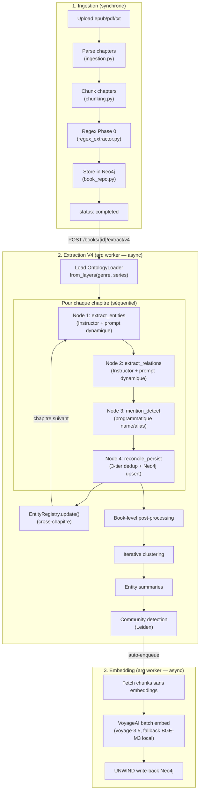
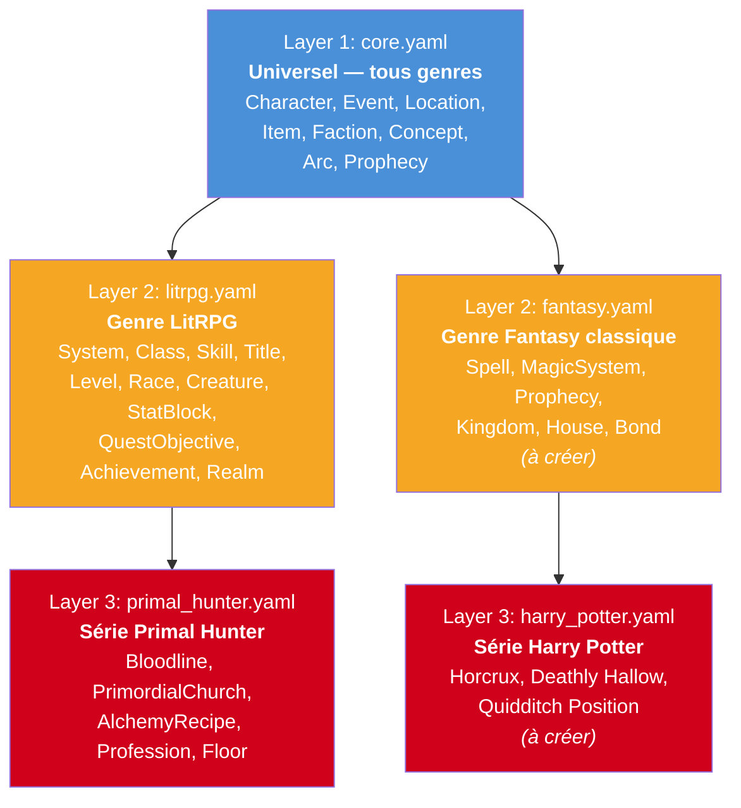
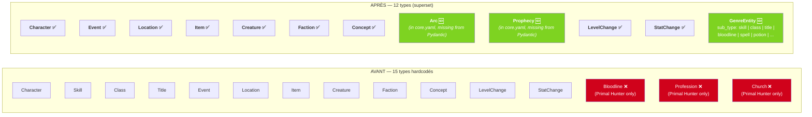
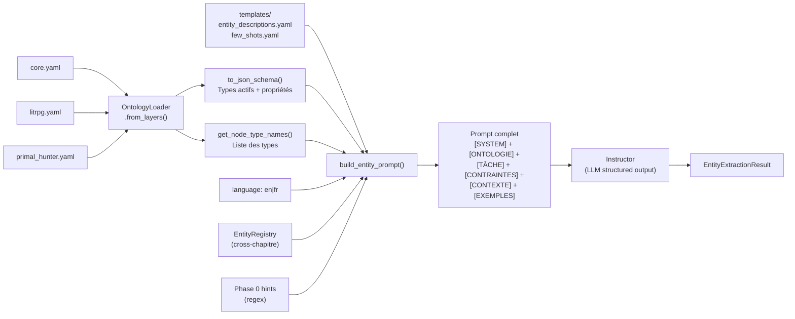
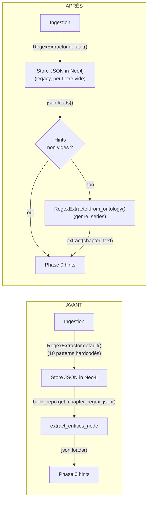
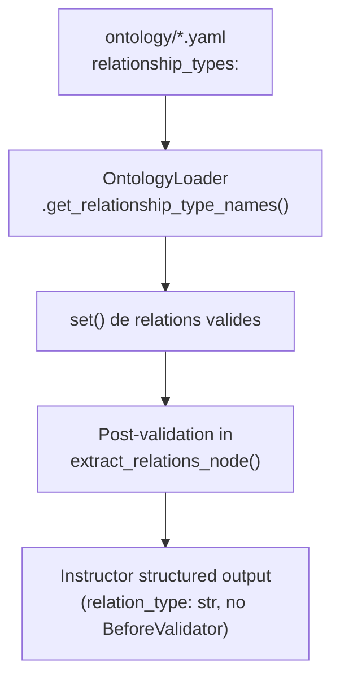
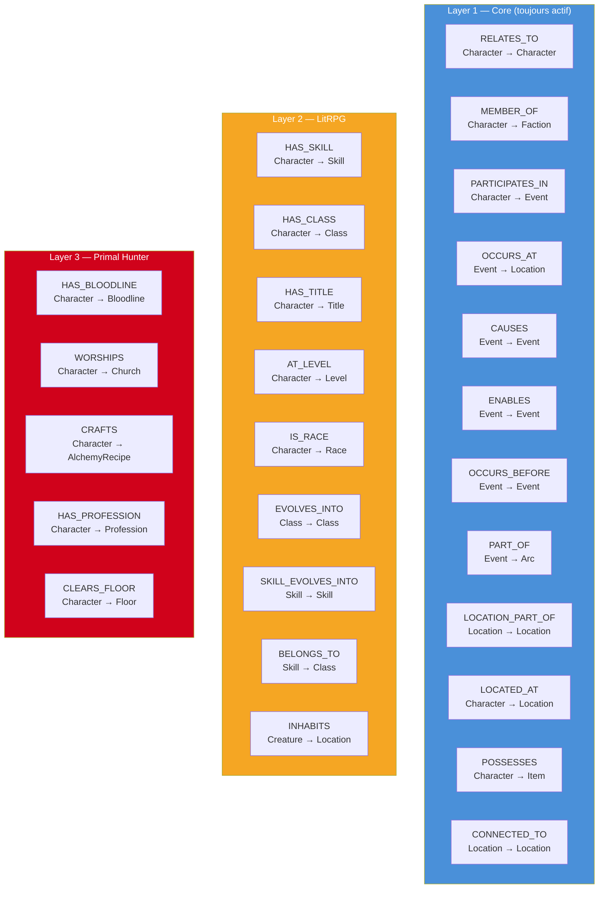
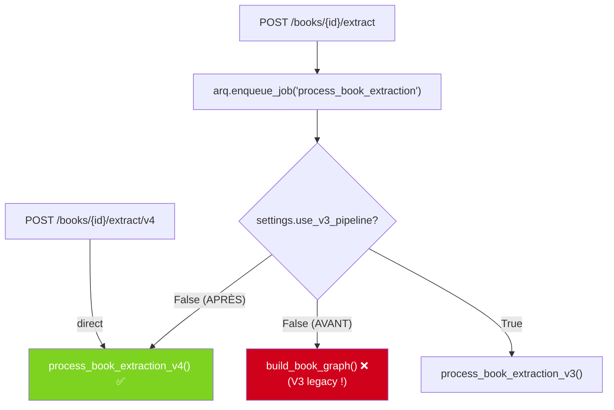
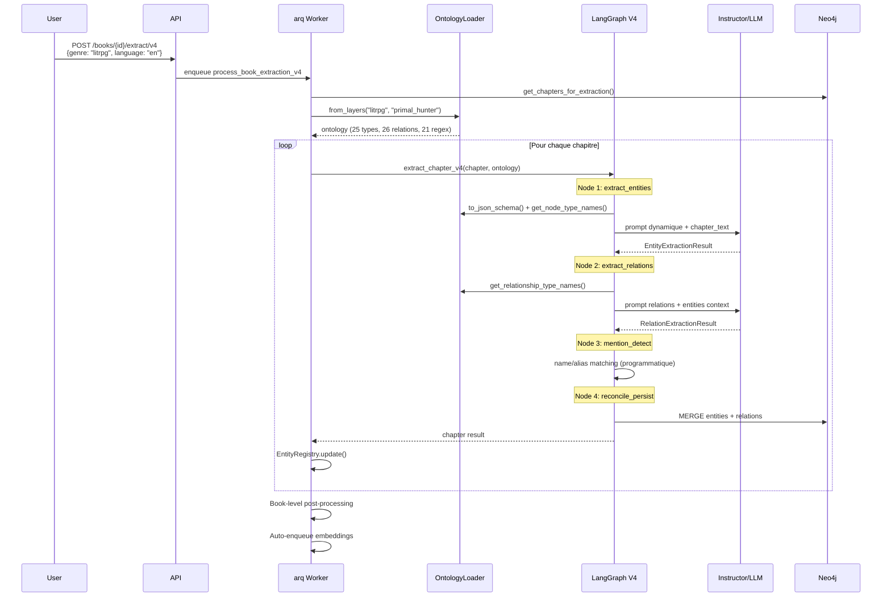

# V4 SOTA Extraction Pipeline — Design Spec

> **Date**: 2026-03-18
> **Status**: Draft
> **Fil rouge**: The Primal Hunter (LitRPG) + Harry Potter (fantasy classique)

---

## Table of Contents

1. [Vue d'ensemble](#1-vue-densemble)
2. [Architecture du pipeline](#2-architecture-du-pipeline)
3. [Ontologie 3 couches](#3-ontologie-3-couches)
4. [Schemas Pydantic](#4-schemas-pydantic)
5. [Prompt dynamique](#5-prompt-dynamique)
6. [Regex Phase 0](#6-regex-phase-0)
7. [Relations dynamiques](#7-relations-dynamiques)
8. [Worker & API](#8-worker--api)
9. [Cas d'usage Primal Hunter](#9-cas-dusage-primal-hunter)
10. [Cas d'usage Harry Potter](#10-cas-dusage-harry-potter)
11. [Fichiers impactés](#11-fichiers-impactés)
12. [Ce qu'on ne touche pas](#12-ce-quon-ne-touche-pas)

---

## 1. Vue d'ensemble

### Problème

Le pipeline V4 actuel a l'architecture SOTA mais le contenu est hardcodé :
- 15 types d'entités en `Literal[...]` dont 3 spécifiques Primal Hunter
- Prompts en français uniquement, LitRPG only
- `OntologyLoader` complet mais jamais appelé par le pipeline
- `ontology_schema={}` passé vide aux prompts
- Default language = `"fr"`, prompt EN = vide (`""`)

### Solution

Câbler l'ontologie YAML existante au pipeline V4 :
- Schemas Pydantic = **superset statique** (core universel + catch-all genre)
- Prompts = **générés dynamiquement** depuis ontologie + templates par langue
- Relations = **chargées depuis YAML** au runtime
- Regex Phase 0 = **câblé à `from_ontology()`**
- Default language = `"en"`, FR reste supporté

### Principe directeur

```
Ajouter un genre = créer un fichier YAML + des templates de prompts
                   Aucun code Python à modifier
```

---

## 2. Architecture du pipeline

### Pipeline complet (ingestion → extraction → embedding)



### LangGraph V4 — 4 nodes linéaires (détail)

```mermaid
stateDiagram-v2
    [*] --> extract_entities
    extract_entities --> extract_relations
    extract_relations --> mention_detect
    mention_detect --> reconcile_persist
    reconcile_persist --> [*]

    state extract_entities {
        [*] --> load_ontology
        load_ontology --> build_prompt_from_yaml
        build_prompt_from_yaml --> call_instructor
        call_instructor --> validate_grounding
        validate_grounding --> [*]
    }

    state extract_relations {
        [*] --> inject_entities_context
        inject_entities_context --> build_relation_prompt
        build_relation_prompt --> call_instructor_rel
        call_instructor_rel --> set_temporal_fields
        set_temporal_fields --> [*]
    }

    state mention_detect {
        [*] --> name_alias_matching
        name_alias_matching --> char_offset_alignment
        char_offset_alignment --> [*]
    }

    state reconcile_persist {
        [*] --> exact_match
        exact_match --> fuzzy_match
        fuzzy_match --> embedding_similarity
        embedding_similarity --> alias_map_update
        alias_map_update --> neo4j_upsert
        neo4j_upsert --> [*]
    }
```



---

## 3. Ontologie 3 couches

### Hiérarchie



### Chargement runtime

```python
# Primal Hunter
ontology = OntologyLoader.from_layers(genre="litrpg", series="primal_hunter")
# → charge: core.yaml + litrpg.yaml + primal_hunter.yaml
# → 25+ node types, 35+ relation types, 21 regex patterns

# Harry Potter (futur)
ontology = OntologyLoader.from_layers(genre="fantasy", series="harry_potter")
# → charge: core.yaml + fantasy.yaml + harry_potter.yaml

# Roman générique sans genre spécifique
ontology = OntologyLoader.from_layers(genre="core", series="")
# → charge: core.yaml uniquement (genre="core" skips Layer 2)
# → 13 node types universels, 12 relation types
# NOTE: genre="" logs a warning (tries to load ".yaml"). Use "core" as sentinel.
```

---

## 4. Schemas Pydantic

### Avant vs Après



### `ExtractedGenreEntity` — le catch-all

```python
class ExtractedGenreEntity(BaseModel):
    """Catch-all for genre/series-specific entity types.

    The sub_type field is driven by the ontology YAML.
    For LitRPG: skill, class, title, system, race, quest, achievement, realm,
                bloodline, profession, church, alchemy_recipe, floor
    For Fantasy: spell, magic_system, kingdom, house, bond
    """
    entity_type: Literal["genre_entity"] = "genre_entity"
    sub_type: str = Field(..., description="Ontology-defined sub-type")
    # NOTE: sub_type uses a BeforeValidator coercer built at node invocation time
    # from ontology.get_node_type_names(). Unknown sub_types are coerced to the
    # closest match (fuzzy) or "concept" as fallback. This is weaker than Literal
    # constraints but necessary for genre flexibility. The prompt few-shots +
    # ontology schema injection are the primary guardrails.
    name: str = Field(..., description="Entity name as in text")
    canonical_name: str = ""
    description: str = ""
    owner: str = ""
    tier: str = ""
    rank: str = ""
    effects: list[str] = Field(default_factory=list)
    properties: dict[str, Any] = Field(
        default_factory=dict,
        description="Flexible key-value for ontology-defined fields"
    )
    extraction_text: str = ""
    char_offset_start: int = -1
    char_offset_end: int = -1
```

### Discriminated Union

```python
EntityUnion = Annotated[
    ExtractedCharacter        # core
    | ExtractedEvent          # core
    | ExtractedLocation       # core
    | ExtractedItem           # core
    | ExtractedCreature       # core
    | ExtractedFaction        # core
    | ExtractedConcept        # core
    | ExtractedArc            # core — NOUVEAU
    | ExtractedProphecy       # core — NOUVEAU
    | ExtractedLevelChange    # progression
    | ExtractedStatChange     # progression
    | ExtractedGenreEntity,   # genre catch-all — NOUVEAU
    Field(discriminator="entity_type"),
]
```

---

## 5. Prompt dynamique

### Flow de construction



### Structure du prompt généré

```
[SYSTEM]
You are an expert in Knowledge Graph extraction for narrative fiction.
Extraction phase: entities
Target ontology:
```json
{  // ← from OntologyLoader.to_json_schema()
  "Character": { "properties": { "name": {...}, "role": {...} } },
  "Event": { ... },
  "GenreEntity": { "sub_types": ["skill", "class", "title", "bloodline", ...] }
}
```

[TASK]
Extract ALL narrative entities from this chapter in a single pass.

=== CORE ENTITY TYPES ===

CHARACTER:                       // ← from templates/entity_descriptions.yaml
- name: primary name as used in text
- canonical_name: full name in lowercase
...

=== GENRE-SPECIFIC ENTITY TYPES (LitRPG) ===

SKILL (genre_entity, sub_type="skill"):
- name: exact skill name as mentioned
- rank: common | uncommon | rare | epic | legendary
...

CLASS (genre_entity, sub_type="class"):
...

=== SERIES-SPECIFIC (The Primal Hunter) ===

BLOODLINE (genre_entity, sub_type="bloodline"):
...

[CONSTRAINTS]
- Extract ONLY entity types listed in the target ontology
- Each entity MUST have extraction_text matching the source EXACTLY
...

[CONTEXT]
Known entity registry:
- jake thayne (character, protagonist, seen ch.1-41)
- arcane powershot (skill, active, owned by jake)
...

Phase 0 hints (regex):
[{"type": "skill_acquired", "name": "Shadow Vault", "rank": "Rare"}]

[EXAMPLES]                        // ← from templates/few_shots.yaml
Example input:
---
Jake opened his eyes. His level had just reached 42...
```

### Templates YAML

**`prompts/templates/entity_descriptions.yaml`** :

```yaml
# Descriptions bilingues par type d'entité, indexées par layer
core:
  character:
    en: |
      CHARACTER:
      - name: primary name as used in text (exact spelling)
      - canonical_name: full name lowercase, no articles (the/a/an)
      - role: protagonist | antagonist | mentor | sidekick | ally | minor | neutral
      - species: race or species if mentioned
      - aliases: list of alternate names or nicknames
      - description: brief description in chapter context
      - extraction_text: exact source passage
    fr: |
      CHARACTER :
      - name : nom principal utilisé dans le texte (orthographe exacte)
      - canonical_name : nom complet en minuscules, sans articles
      - role : protagonist | antagonist | mentor | sidekick | ally | minor | neutral
      - species : race ou espèce si mentionnée
      - aliases : liste de surnoms ou noms alternatifs
      - description : brève description dans le contexte du chapitre
      - extraction_text : passage source exact

  event:
    en: |
      EVENT:
      - name: short name or title for the event
      - event_type: action | state_change | achievement | process | dialogue
      - significance: minor | moderate | major | critical | arc_defining
      - participants: list of character names involved
      - location: where the event occurs
      - extraction_text: exact source passage
    fr: |
      EVENT :
      - name : nom ou titre court de l'événement
      - event_type : action | state_change | achievement | process | dialogue
      - significance : minor | moderate | major | critical | arc_defining
      - participants : liste de noms de personnages impliqués
      - location : lieu où se déroule l'événement
      - extraction_text : passage source exact

  # ... location, item, creature, faction, concept, arc, prophecy

genre:
  skill:
    en: |
      SKILL (use entity_type="genre_entity", sub_type="skill"):
      - name: exact skill name as mentioned
      - skill_type: active | passive | racial | class | profession | unique
      - rank: common | uncommon | rare | epic | legendary | transcendent | divine
      - owner: character who possesses this skill
      - effects: list of mechanical effects
      - extraction_text: exact source passage
    fr: |
      SKILL (utiliser entity_type="genre_entity", sub_type="skill") :
      - name : nom exact de la compétence
      - skill_type : active | passive | racial | class | profession | unique
      - rank : common | uncommon | rare | epic | legendary | transcendent | divine
      - owner : personnage possédant cette compétence
      - effects : liste des effets mécaniques
      - extraction_text : passage source exact

  # ... class, title, system, race, quest, achievement, realm

series:
  bloodline:
    en: |
      BLOODLINE (use entity_type="genre_entity", sub_type="bloodline"):
      - name: bloodline or heritage name
      - owner: character bearing this bloodline
      - effects: inherited abilities
      - origin: source of the bloodline if mentioned
      - extraction_text: exact source passage
    fr: |
      BLOODLINE (utiliser entity_type="genre_entity", sub_type="bloodline") :
      - name : nom du lignage ou héritage
      - owner : personnage porteur de ce lignage
      - effects : capacités héritées
      - origin : source du lignage si mentionnée
      - extraction_text : passage source exact

  # ... profession, church, alchemy_recipe, floor
```

**`prompts/templates/few_shots.yaml`** :

```yaml
litrpg:
  entities:
    en: |
      Example input:
      ---
      Jake opened his eyes. His level had just reached 42. A new skill
      "Thunderstrike" appeared in his list. He was in the Shadow Cavern,
      a B-rank dungeon known for its deadly traps.
      [Level 42 reached!]
      [New Skill: Thunderstrike (Active) — Unleashes a lightning-charged
      attack dealing 300% base damage.]
      ---

      Example output:
      ```json
      [
        {
          "entity_type": "character",
          "name": "Jake",
          "canonical_name": "jake",
          "role": "protagonist",
          "extraction_text": "Jake opened his eyes."
        },
        {
          "entity_type": "genre_entity",
          "sub_type": "skill",
          "name": "Thunderstrike",
          "rank": "unknown",
          "skill_type": "active",
          "owner": "jake",
          "description": "Lightning-charged attack dealing 300% base damage.",
          "extraction_text": "Thunderstrike (Active) — Unleashes a lightning-charged attack dealing 300% base damage."
        },
        {
          "entity_type": "location",
          "name": "Shadow Cavern",
          "canonical_name": "shadow cavern",
          "location_type": "dungeon",
          "description": "B-rank dungeon known for its deadly traps.",
          "extraction_text": "the Shadow Cavern, a B-rank dungeon known for its deadly traps."
        },
        {
          "entity_type": "level_change",
          "character": "jake",
          "new_level": 42,
          "extraction_text": "His level had just reached 42."
        }
      ]
      ```
    fr: |
      Exemple d'entrée :
      ---
      Jake ouvrit les yeux. Son niveau venait de passer à 42...
      ---
      ... (version française)

  relations:
    en: |
      ... (few-shot relations EN)
    fr: |
      ... (few-shot relations FR)

fantasy:
  entities:
    en: |
      Example input:
      ---
      Fitz felt the Skill surge through him as he reached for Nighteyes.
      The bond between them had grown stronger since they left Buckkeep Castle.
      Chade had warned him — the Skill was dangerous without proper training
      from a Skillmaster.
      ---

      Example output:
      ```json
      [
        {
          "entity_type": "character",
          "name": "Fitz",
          "canonical_name": "fitz",
          "role": "protagonist",
          "extraction_text": "Fitz felt the Skill surge through him"
        },
        {
          "entity_type": "character",
          "name": "Nighteyes",
          "canonical_name": "nighteyes",
          "species": "wolf",
          "role": "sidekick",
          "extraction_text": "he reached for Nighteyes"
        },
        {
          "entity_type": "genre_entity",
          "sub_type": "magic_system",
          "name": "The Skill",
          "canonical_name": "the skill",
          "description": "Telepathic magic, dangerous without proper training from a Skillmaster",
          "extraction_text": "the Skill was dangerous without proper training from a Skillmaster"
        },
        {
          "entity_type": "location",
          "name": "Buckkeep Castle",
          "canonical_name": "buckkeep castle",
          "location_type": "building",
          "extraction_text": "they left Buckkeep Castle"
        }
      ]
      ```
```

---

## 6. Regex Phase 0

### Flow actuel vs nouveau



### Comportement par genre

| Genre | Regex hits attendus | Source |
|---|---|---|
| LitRPG (Primal Hunter) | Beaucoup (blue boxes, skill notifications, level ups) | 21 patterns (core + litrpg + primal_hunter) |
| Fantasy classique | Quasi-zéro (pas de blue boxes) | 0 patterns pertinents |
| Core only (roman générique) | Zéro | Aucun pattern |

C'est normal et voulu. Les regex sont un bonus pour les genres qui ont du texte structuré. Pour la fantasy classique, l'extraction repose entièrement sur le LLM.

---

## 7. Relations dynamiques

### Chargement



### Relations par couche



### Mécanisme de validation des relations

`CoercedRelationType` (static `BeforeValidator`) **ne peut pas** être reconstruit dynamiquement
au runtime car les annotations Pydantic sont évaluées au class-definition time.

**Solution** : `ExtractedRelation.relation_type` devient `str` plain. La coercion se fait
en post-validation dans `extract_relations_node()` :

```python
async def extract_relations_node(state):
    ontology = OntologyLoader.from_layers(state["genre"], state["series_name"])
    allowed = set(ontology.get_relationship_type_names())
    coerce = _make_coercer(allowed, default="RELATES_TO")

    result = await _call_instructor_relations(prompt, chapter_text, model_override)

    # Post-coerce relation types
    for rel in result.relations:
        rel.relation_type = coerce(rel.relation_type)
```

### Fix sémantique

| Relation | Avant (V4 hardcodé) | Après (ontologie) |
|---|---|---|
| `PART_OF` | Location → Location (erreur) | Event → Arc (core.yaml) |
| `LOCATION_PART_OF` | Absente | Location → Location (core.yaml) |
| `OCCURS_BEFORE` | Absente | Event → Event (chronologie) |
| `AT_LEVEL` | Absente | Character → Level (progression) |
| `HAS_BLOODLINE` | Absente | Character → Bloodline (PH L3) |

---

## 8. Worker & API

### Fix du dispatcher

**Clarification** : `POST /books/{id}/extract/v4` enqueue déjà directement
`process_book_extraction_v4` — ce chemin fonctionne. Le bug est dans l'ancien
`process_book_extraction` (appelé par `POST /books/{id}/extract` sans `/v4`) :



**Fix** : `process_book_extraction` avec `use_v3_pipeline=False` délègue à `process_book_extraction_v4`.

### Config changes

```python
class Settings(BaseSettings):
    extraction_language: str = "en"      # AVANT: "fr"
    default_genre: str = "litrpg"        # NOUVEAU
    use_v3_pipeline: bool = False        # inchangé
```

### API schema fix

`books.py` uses `ExtractionRequestV3` which defaults `language="fr"`. Fix :

1. Add `ExtractionRequestV4` in `schemas/pipeline.py` with `language: str = "en"`
2. Update `POST /books/{id}/extract/v4` route to use `ExtractionRequestV4`
3. Fix `books.py` fallback : `language = body.language if body else settings.extraction_language`
   (currently hardcoded to `"fr"`)

### OntologyLoader: NO singleton in worker

**Critical** : `get_ontology()` is a module-level singleton pinned to genre at startup.
In the worker, always call `OntologyLoader.from_layers()` directly :

```python
# In process_book_extraction_v4 — create per-job, pass to extract_chapter_v4
ontology = OntologyLoader.from_layers(genre=genre, series=series_name)

# In extract_chapter_v4 — pass ontology through state
initial_state = {
    ...
    "ontology": ontology,  # OntologyLoader instance, NOT the singleton
}

# In extract_entities_node / extract_relations_node — read from state
ontology = state["ontology"]
```

The `get_ontology()` singleton is NOT used in the extraction path. It remains available
for other uses (API queries, graph explorer) but the worker always creates fresh instances.

### Chaîne d'appel complète



---

## 9. Cas d'usage Primal Hunter

### Configuration

```python
# API call
POST /books/{book_id}/extract/v4
{
    "genre": "litrpg",
    "series_name": "primal_hunter",
    "language": "en"
}
```

### Ontologie chargée

```
Layers: core.yaml + litrpg.yaml + primal_hunter.yaml

Entity types (29 in ontology, 12 Pydantic types in extraction schema):
  Core (13):  Series, Book, Chapter, Chunk, Character, Faction, Event, Arc,
              NarrativeFunction, Location, Item, Concept, Prophecy
  LitRPG (11): System, Class, Skill, Title, Level, Race, Creature, StatBlock,
               QuestObjective, Achievement, Realm
  PH (5):     Bloodline, PrimordialChurch, AlchemyRecipe, Profession, Floor
  NOTE: Creature is defined in litrpg.yaml, NOT core.yaml.
        Bibliographic types (Series/Book/Chapter/Chunk) are not extracted by LLM.
        All genre/series types map to ExtractedGenreEntity with sub_type.

Relation types (26):
  Core:    RELATES_TO, MEMBER_OF, PARTICIPATES_IN, OCCURS_AT, CAUSES, ENABLES,
           OCCURS_BEFORE, PART_OF, LOCATION_PART_OF, CONNECTED_TO, LOCATED_AT, POSSESSES
  LitRPG:  HAS_SKILL, HAS_CLASS, HAS_TITLE, AT_LEVEL, IS_RACE, EVOLVES_INTO,
           SKILL_EVOLVES_INTO, BELONGS_TO, INHABITS
  PH:      HAS_BLOODLINE, WORSHIPS, CRAFTS, HAS_PROFESSION, CLEARS_FLOOR

Regex patterns (21): skill_acquired, level_up, class_obtained, ...
```

### Exemple d'extraction

**Input** (chapitre 42 de Primal Hunter) :
```
Jake activated his Bloodline Ability, feeling the power of the Primal Hunter
surge through him. His Arcane Powershot had evolved into Arcane Bombshot after
reaching level 150. The Viper lunged, and Jake dodged—his Perception at 2,847
making it almost too easy.

[Skill Evolved: Arcane Powershot → Arcane Bombshot - Epic]
[+12 Perception]
```

**Phase 0 regex** → 2 hits :
```json
[
  {"type": "skill_evolved", "old_name": "Arcane Powershot", "new_name": "Arcane Bombshot", "rank": "Epic"},
  {"type": "stat_increase", "stat_name": "Perception", "value": 12}
]
```

**Entities extraites** :
```json
[
  {"entity_type": "character", "name": "Jake", "canonical_name": "jake", "role": "protagonist"},
  {"entity_type": "genre_entity", "sub_type": "bloodline", "name": "Primal Hunter",
   "owner": "jake", "description": "Jake's bloodline ability"},
  {"entity_type": "genre_entity", "sub_type": "skill", "name": "Arcane Powershot",
   "rank": "unknown", "owner": "jake"},
  {"entity_type": "genre_entity", "sub_type": "skill", "name": "Arcane Bombshot",
   "rank": "epic", "owner": "jake"},
  {"entity_type": "creature", "name": "The Viper", "species": "viper"},
  {"entity_type": "stat_change", "character": "jake", "stat_name": "Perception", "value": 12},
  {"entity_type": "level_change", "character": "jake", "new_level": 150}
]
```

**Relations extraites** :
```json
[
  {"relation_type": "HAS_BLOODLINE", "source": "jake", "target": "primal hunter"},
  {"relation_type": "HAS_SKILL", "source": "jake", "target": "arcane bombshot"},
  {"relation_type": "SKILL_EVOLVES_INTO", "source": "arcane powershot", "target": "arcane bombshot"}
]
```

---

## 10. Cas d'usage Harry Potter

### Configuration

```python
POST /books/{book_id}/extract/v4
{
    "genre": "fantasy",      # ou "" pour core-only
    "series_name": "",       # pas de Layer 3 pour l'instant
    "language": "en"
}
```

### Ontologie chargée (core-only pour l'instant)

```
Layers: core.yaml (genre="core", no Layer 2/3)

Entity types (13 in ontology, extractable: 8):
  Core: Character, Event, Location, Item, Faction, Concept, Arc, Prophecy
  NOTE: Creature is NOT available in core-only mode (defined in litrpg.yaml).
        To add Creature for fantasy, create fantasy.yaml with Creature.

Relation types (12):
  Core: RELATES_TO, MEMBER_OF, PARTICIPATES_IN, OCCURS_AT, CAUSES,
        ENABLES, OCCURS_BEFORE, PART_OF, LOCATION_PART_OF, CONNECTED_TO,
        LOCATED_AT, POSSESSES

Regex patterns (0) — pas de blue boxes dans Harry Potter
```

### Exemple d'extraction

**Input** (chapitre 1 de HP et la Pierre Philosophale) :
```
Mr. and Mrs. Dursley, of number four, Privet Drive, were proud to say that
they were perfectly normal, thank you very much. They were the last people
you'd expect to be involved in anything strange or mysterious, because they
just didn't hold with such nonsense.
```

**Entities extraites** :
```json
[
  {"entity_type": "character", "name": "Mr. Dursley", "canonical_name": "vernon dursley",
   "role": "minor"},
  {"entity_type": "character", "name": "Mrs. Dursley", "canonical_name": "petunia dursley",
   "role": "minor"},
  {"entity_type": "location", "name": "number four, Privet Drive",
   "canonical_name": "privet drive", "location_type": "building"}
]
```

Pas de `genre_entity` — core suffit pour ce passage. Quand on ajoutera `fantasy.yaml` avec des types Spell, MagicSystem etc., le chapitre avec "Wingardium Leviosa" produira :

```json
{"entity_type": "genre_entity", "sub_type": "spell", "name": "Wingardium Leviosa",
 "description": "Levitation charm", "properties": {"incantation": "Wingardium Leviosa"}}
```

---

## 11. Fichiers impactés

| # | Fichier | Nature | Description |
|---|---|---|---|
| 1 | `backend/app/schemas/extraction_v4.py` | **Rewrite** | +Arc, +Prophecy, +GenreEntity, -Bloodline/-Church/-Profession, `relation_type` → plain `str` |
| 2 | `backend/app/prompts/extraction_unified.py` | **Rewrite** | Prompt builders dynamiques, `ontology` param, plus de constantes hardcodées |
| 3 | `backend/app/prompts/templates/entity_descriptions.yaml` | **New** | Descriptions bilingues par type+layer |
| 4 | `backend/app/prompts/templates/few_shots.yaml` | **New** | Few-shots par genre+langue |
| 5 | `backend/app/services/extraction/entities.py` | **Edit** | Wire OntologyLoader (from state, not singleton), regex fallback |
| 6 | `backend/app/services/extraction/relations.py` | **Edit** | Wire OntologyLoader, post-validation coercion of relation_type |
| 7 | `backend/app/config.py` | **Edit** | `extraction_language="en"`, `default_genre` |
| 8 | `backend/app/workers/tasks.py` | **Edit** | Fix dispatcher V4, pass OntologyLoader instance via state |
| 9 | `backend/app/schemas/pipeline.py` | **Edit** | Add `ExtractionRequestV4` with `language="en"` default |
| 10 | `backend/app/api/routes/books.py` | **Edit** | Use `ExtractionRequestV4`, fix language fallback to `settings.extraction_language` |
| 11 | `backend/app/services/extraction/__init__.py` | **Edit** | `extract_chapter_v4` accepts+passes `ontology` in state |
| 12 | `docs/v4-pipeline-sota.md` | **New** | Cette doc (version finale) |

---

## 12. Ce qu'on ne touche PAS

| Composant | Raison |
|---|---|
| `core/ontology_loader.py` | Déjà complet — `from_layers()`, `to_json_schema()`, `get_regex_patterns_list()`. Minor: add `if genre:` guard in `from_layers()` to avoid warning when `genre=""` (or use `genre="core"` sentinel everywhere) |
| `ontology/*.yaml` | Déjà bien définis (core + litrpg + primal_hunter) |
| `prompts/base.py` | Déjà bilingue (LANG_FR, LANG_EN) |
| `entity_registry.py` | Inchangé — cross-chapitre fonctionne |
| `grounding.py` | Inchangé — validation offsets |
| `book_level.py` | Inchangé — post-processing (clustering, summaries, communities) |
| `repositories/` | Inchangé — MERGE Neo4j fonctionne avec tout label |
| Frontend | Aucun changement requis |
| V3 pipeline | Reste disponible via `use_v3_pipeline=True` |
| Neo4j schema | Pas de migration — MERGE crée les labels dynamiquement |
