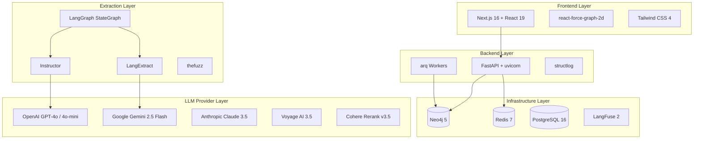

# Technology Stack

Every technology in WorldRAG was chosen with specific trade-offs in mind. This document explains not just what we use, but why we chose it over the alternatives.

## Overview

| Layer | Technology | Version | Role | Alternative Considered |
|-------|-----------|---------|------|----------------------|
| API Framework | FastAPI | >= 0.115 | Async REST API | Django, Flask |
| Graph Database | Neo4j | 5.x | Entity & relationship storage | PostgreSQL + pg_graphql, ArangoDB |
| Extraction (Grounded) | LangExtract | >= 0.1 | Grounded entity extraction with source offsets | Raw LLM prompting, spaCy NER |
| Extraction (Structured) | Instructor | >= 1.7 | Pydantic-validated LLM output | LangChain output parsers |
| Orchestration | LangGraph | >= 0.3 | Parallel extraction with typed state | Raw asyncio.gather, Celery |
| Embeddings | Voyage AI | voyage-3.5 | 1024d document/query embeddings | OpenAI text-embedding-3, Cohere embed |
| Reranking | Cohere | rerank-v3.5 | Re-rank retrieved chunks | Voyage rerank, cross-encoder |
| Task Queue | arq | >= 0.26 | Async background jobs | Celery, Dramatiq, Huey |
| Frontend | Next.js | 16 | React SSR/SSG with App Router | Nuxt, SvelteKit, Remix |
| Monitoring | LangFuse | 2.x | LLM observability (self-hosted) | Weights & Biases, custom logging |
| Resilience | tenacity + custom | >= 9.0 | Retry, circuit breaking, rate limiting | pybreaker, backoff |
| Logging | structlog | >= 24.0 | Structured JSON logging | loguru, standard logging |

## Backend: FastAPI over Django or Flask

**Choice**: FastAPI >= 0.115 with uvicorn

**Why FastAPI**:
- **Native async/await**: First-class support for `async def` route handlers. Every I/O operation in WorldRAG (Neo4j queries, LLM API calls, Redis operations) is async. Django's async support is bolt-on and incomplete; Flask requires Quart for async.
- **Pydantic v2 integration**: Request/response validation using the same Pydantic models we use everywhere else. 33 Pydantic schemas in the project, all automatically validated and documented.
- **Automatic OpenAPI**: Swagger UI generated at `/docs` with zero configuration. Every endpoint is self-documented with request/response types.
- **Dependency injection**: `Depends()` system for injecting Neo4j driver, Redis pool, arq pool, cost tracker -- clean and testable.
- **Performance**: ASGI (uvicorn) benchmarks significantly faster than WSGI (gunicorn) for I/O-bound workloads like ours.

**Why not Django**: Django's ORM is irrelevant (we use Neo4j, not PostgreSQL for primary data). Django REST Framework adds overhead without benefit for a graph-first architecture. Async support is still maturing.

**Why not Flask**: No native async. Would require Quart (Flask-compatible async) plus Flask-RESTful or Marshmallow for schema validation -- essentially rebuilding what FastAPI provides out of the box.

## Graph Database: Neo4j over PostgreSQL or ArangoDB

**Choice**: Neo4j 5.x Community Edition with APOC plugin

**Why a graph database at all**: WorldRAG's core data is a network of interconnected entities -- characters have relationships with other characters, participate in events, possess items, belong to factions. In a relational database, querying "all characters within 3 hops of Jake Thayne" requires recursive CTEs or multiple JOINs. In Neo4j, it's a single Cypher pattern: `MATCH (c:Character {name: 'Jake Thayne'})-[*1..3]-(neighbor) RETURN neighbor`.

**Why Neo4j specifically**:
- **Cypher query language**: Purpose-built for graph patterns. Declarative, readable, and efficient for traversals.
- **MERGE semantics**: `MERGE` creates a node if it doesn't exist, or matches if it does -- perfect for idempotent entity upserts across multiple extraction passes.
- **Vector index**: Built-in 1024-dimension cosine similarity index for embedding-based search, eliminating the need for a separate vector store.
- **Fulltext indexes**: Lucene-backed fulltext search across entity labels for the graph explorer search feature.
- **APOC library**: Extended procedures for complex graph algorithms (path finding, subgraph export, etc.).
- **Temporal properties**: Chapter-based `valid_from_chapter` / `valid_to_chapter` on relationships maps naturally to graph properties.

**Why not PostgreSQL + pg_graphql**: PostgreSQL excels at relational data but graph traversals require recursive CTEs that are harder to write, optimize, and maintain. The pg_graphql extension provides GraphQL but not native graph traversal performance.

**Why not ArangoDB**: Multi-model (document + graph + search) sounds appealing, but the Cypher-like AQL is less mature, the ecosystem is smaller, and vector index support is newer.

## Extraction: LangExtract + Instructor over Raw LLM

**Choice**: LangExtract for grounded extraction, Instructor for structured reconciliation

**Why not raw LLM prompting**: Raw prompt engineering produces unstructured text that requires fragile regex parsing. When the LLM output format changes slightly, the parser breaks.

**Why LangExtract**:
- **Source grounding**: Every extracted entity comes with `char_interval` (start_pos, end_pos) -- exact character offsets into the source text. This is critical for provenance: we can always show the user exactly where an entity was found.
- **Multi-pass extraction**: LangExtract supports configurable extraction passes (`langextract_passes: 2`) that refine results across multiple LLM calls.
- **Native Gemini support**: LangExtract accepts an `api_key` parameter for direct Gemini integration -- no LangChain wrapper needed for extraction passes. All 4 passes forward `settings.gemini_api_key`.
- **Model-agnostic**: Works with any LLM provider (we use Gemini 2.5 Flash for cost optimization).

**Why Instructor**:
- **Pydantic output validation**: Define the expected output as a Pydantic model, and Instructor ensures the LLM returns exactly that schema. If validation fails, it retries with the error message.
- **Type safety**: `CharacterExtractionResult`, `SystemExtractionResult`, etc. are all Pydantic models with field-level validation.
- **Multi-provider**: `providers.py` provides `get_instructor_client(provider)` supporting OpenAI, Anthropic, and Gemini backends. The Gemini backend uses `instructor.from_gemini(google.genai.Client(...))`.
- **Used for reconciliation**: The 3-tier deduplication's LLM-as-Judge step uses Instructor to produce `EntityMergeCandidate` objects with structured confidence scores.

## Orchestration: LangGraph over asyncio.gather or Celery

**Choice**: LangGraph >= 0.3 with StateGraph and Send() API

**Why not raw asyncio.gather**: We initially considered simple `asyncio.gather(pass1(), pass2(), pass3(), pass4())`. It works for parallel execution, but lacks:
- **Typed state management**: LangGraph's `StateGraph` with `TypedDict` state and `operator.add` reducers handles merging results from parallel branches automatically.
- **Conditional routing**: The `Send()` API lets the router dynamically decide which passes to invoke, skipping unnecessary work (e.g., no lore extraction for a dialogue-heavy chapter).
- **Checkpointing**: LangGraph supports `AsyncPostgresSaver` for crash recovery mid-extraction (planned, not yet wired).
- **Visual debugging**: LangGraph execution traces can be visualized for debugging complex extraction failures.

**Why not Celery for orchestration**: Celery is designed for distributed task queues, not for orchestrating a stateful multi-step pipeline within a single process. We do use a task queue (arq) for the outer extraction/embedding jobs, but the inner 4-pass extraction is an in-process LangGraph pipeline.

## Embeddings: Voyage AI over OpenAI or Cohere

**Choice**: Voyage AI voyage-3.5 (1024 dimensions)

**Why Voyage AI**:
- **Retrieval quality**: voyage-3.5 consistently ranks at or near the top of MTEB benchmarks for text retrieval, particularly for code and long-form documents.
- **Asymmetric embeddings**: Separate `input_type="document"` vs `input_type="query"` produces embeddings optimized for the specific role (storage vs retrieval). OpenAI text-embedding-3 does not differentiate.
- **Cost**: $0.06 per million tokens -- roughly half the cost of OpenAI's text-embedding-3-large ($0.13/M) with comparable or better quality.
- **Dimension balance**: 1024 dimensions provides an excellent trade-off between quality and storage/compute cost. OpenAI's 3072 dimensions are often overkill.

**Why not OpenAI embeddings**: More expensive, no asymmetric input types, and WorldRAG already has OpenAI as a dependency for extraction -- using a different provider for embeddings provides vendor diversification.

## Task Queue: arq over Celery or Dramatiq

**Choice**: arq >= 0.26 with Redis backend

**Why arq**:
- **Native async**: arq is built on asyncio from the ground up. Worker functions are `async def`, which means they can directly `await` Neo4j queries, LLM API calls, and other async operations without thread pools.
- **Lightweight**: Just Redis, no separate broker + result backend like Celery. One dependency, one configuration.
- **Job chaining**: `await ctx["redis"].enqueue_job("process_book_embeddings", book_id)` -- simple, explicit, and asyncio-native.
- **Clean lifecycle**: `on_startup` and `on_shutdown` hooks for initializing/tearing down Neo4j connections, Redis clients, and cost trackers in the worker process.
- **Deterministic job IDs**: `_job_id=f"extract:{book_id}"` prevents duplicate jobs and enables simple status polling.

**Why not Celery**: Celery is thread-based (not async-native), requires a separate message broker (RabbitMQ or Redis) plus a result backend, and is significantly heavier. For a system with 2 task types and single-digit concurrency, Celery is overkill.

**Why not Dramatiq**: Closer to arq in philosophy (simple, Redis-based), but not async-native. Worker functions are synchronous, requiring thread pools for I/O-bound work.

## Frontend: Next.js 16 over Nuxt or SvelteKit

**Choice**: Next.js 16 with React 19 and App Router

**Why Next.js**:
- **App Router**: Server Components by default reduces client-side JavaScript. Only interactive components (graph visualization, forms) use `"use client"`.
- **TypeScript**: Strict mode with full type coverage. API client functions return typed interfaces matching Pydantic schemas.
- **Ecosystem**: Tailwind CSS 4 for styling, shadcn/ui compatible component patterns, lucide-react for icons.
- **API proxy**: `next.config.ts` rewrites `/api/*` to the backend, eliminating CORS issues in development.

**Graph visualization**: `react-force-graph-2d` wraps D3 force simulation with React bindings. Nodes are color-coded by entity type, labels are rendered on canvas, and click events trigger entity detail views.

## Monitoring: LangFuse over Weights & Biases

**Choice**: LangFuse 2.x (self-hosted via Docker Compose)

**Why self-hosted LangFuse**:
- **Purpose-built for LLM**: Traces, spans, and generations with token-level cost attribution -- not a general ML experiment tracker adapted for LLMs.
- **Data privacy**: Novel content stays on-premise. No book text leaves the local infrastructure.
- **Per-trace cost attribution**: Every extraction pass records its LLM cost, enabling per-book and per-chapter cost analysis.
- **LangChain integration**: Native integration with LangChain and LangGraph for automatic trace capture.

**Why not Weights & Biases**: General-purpose ML experiment tracking. Powerful but not LLM-specific. Cloud-hosted (data privacy concern for book content). More expensive for LLM-focused observability.

## Resilience: tenacity + Custom CircuitBreaker

**Choice**: Custom `CircuitBreaker` class + tenacity `@retry_llm_call` decorator + `ProviderRateLimiter`

**Why custom circuit breaker**: The existing `pybreaker` library is synchronous. Our circuit breaker uses `asyncio.Lock` for thread-safe state transitions in an async context. It's 50 lines of code with exactly the semantics we need.

**Why tenacity for retries**: Composable decorators with exponential backoff (1-30s) and jitter (5s). Retries only on `TimeoutError` and `ConnectionError` -- never on `ValueError` or schema validation failures.

**Why ProviderRateLimiter**: Combines a token bucket (aiolimiter `AsyncLimiter`) for RPM limits with an `asyncio.Semaphore` for concurrency limits. Each LLM provider has its own singleton instance with appropriate limits.

## Logging: structlog over loguru

**Choice**: structlog >= 24.0

**Why structlog**:
- **Structured key=value pairs**: `logger.info("extraction_complete", book_id="b1", entities=42)` -- not formatted strings that need parsing.
- **ContextVars integration**: `request_id`, `book_id`, `chapter`, and `pipeline_stage` are automatically bound to every log entry via Python's `contextvars`.
- **Dual output**: JSON for production (machine-parseable), colored console for development (human-readable). Configured via `LOG_FORMAT` setting.
- **Processor pipeline**: Chain of processors for enrichment, filtering, and formatting. Clean architecture that separates concerns.

**Why not loguru**: loguru produces beautiful formatted strings, but they're harder to parse in log aggregation systems. structlog's JSON output integrates directly with ELK, Loki, or CloudWatch.

---

## Full Dependency List

### Python (from `pyproject.toml`)

| Category | Package | Version | Purpose |
|----------|---------|---------|---------|
| API | fastapi | >= 0.115 | REST API framework |
| API | uvicorn[standard] | >= 0.34 | ASGI server |
| API | python-multipart | >= 0.0.18 | File upload support |
| API | sse-starlette | >= 2.0 | Server-sent events |
| Graph DB | neo4j | >= 5.27 | Neo4j async driver |
| Graph DB | neo4j-graphrag | >= 1.0 | Neo4j RAG utilities |
| Extraction | langextract | >= 0.1 | Grounded extraction |
| Extraction | instructor | >= 1.7 | Structured LLM output |
| LLM | openai | >= 1.60 | OpenAI async client |
| LLM | anthropic | >= 0.40 | Anthropic async client |
| LLM | google-genai | >= 1.0 | Google Gemini client |
| Orchestration | langgraph | >= 0.3 | StateGraph pipelines |
| Orchestration | langchain-core | >= 0.3 | LangChain base |
| Orchestration | langchain-openai | >= 0.3 | LangChain OpenAI |
| Orchestration | langchain-anthropic | >= 0.3 | LangChain Anthropic |
| Orchestration | langgraph-checkpoint-postgres | >= 2.0 | PostgreSQL checkpointing |
| Embeddings | voyageai | >= 0.3 | Voyage AI embeddings |
| Reranking | cohere | >= 5.0 | Cohere reranker |
| Queue | arq | >= 0.26 | Async task queue |
| Queue | redis | >= 5.0 | Redis async client |
| Monitoring | langfuse | >= 2.27 | LLM observability |
| Monitoring | structlog | >= 24.0 | Structured logging |
| Monitoring | tiktoken | >= 0.8 | Token counting |
| Resilience | tenacity | >= 9.0 | Retry with backoff |
| Resilience | aiolimiter | >= 1.1 | Async rate limiter |
| Parsing | ebooklib | >= 0.18 | EPUB parsing |
| Parsing | pdfplumber | >= 0.11 | PDF parsing |
| Parsing | beautifulsoup4 | >= 4.12 | HTML parsing |
| Utils | pydantic | >= 2.10 | Data validation |
| Utils | pydantic-settings | >= 2.7 | Settings management |
| Utils | thefuzz | >= 0.22 | Fuzzy string matching |
| Utils | asyncpg | >= 0.30 | PostgreSQL async driver |
| Utils | httpx | >= 0.28 | Async HTTP client |
| Utils | pyyaml | >= 6.0 | YAML parsing |

### Frontend (from `package.json`)

| Package | Version | Purpose |
|---------|---------|---------|
| next | 16.1.6 | React framework |
| react | 19.2.3 | UI library |
| react-dom | 19.2.3 | React DOM renderer |
| react-force-graph-2d | ^1.29.1 | D3 force graph |
| clsx | ^2.1.1 | Class name utility |
| tailwind-merge | ^3.5.0 | Tailwind class merging |
| lucide-react | ^0.575.0 | Icon library |
| tailwindcss | ^4 | CSS framework |
| typescript | ^5 | Type system |

---

**Next**: [Data Model](./data-model.md) for the complete Neo4j schema.
