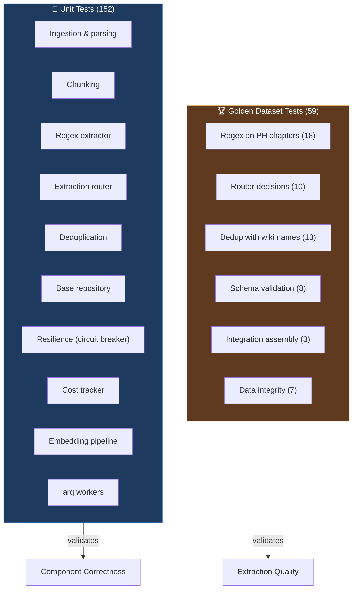

# Testing Strategy

> Test architecture, golden dataset design, fixture patterns, and quality metrics for WorldRAG's 211-test suite.

**Back to**: [Documentation Hub](./README.md)

---

## Table of Contents

- [Philosophy](#philosophy)
- [Test Suite Overview](#test-suite-overview)
- [Golden Dataset](#golden-dataset)
- [Test Categories](#test-categories)
- [Fixture Architecture](#fixture-architecture)
- [Running Tests](#running-tests)
- [Coverage Map](#coverage-map)

---

## Philosophy

WorldRAG's tests follow three principles:

1. **No LLM calls in tests** — all tests are fast, deterministic, and free. LLM interactions are mocked.
2. **Golden dataset as ground truth** — extraction quality is measured against wiki-sourced data, not arbitrary expectations.
3. **Infrastructure isolation** — Neo4j, Redis, and LLM providers are fully mocked. Tests run without any running services.

---

## Test Suite Overview



**Total: 211 tests** — all pass, all fast (< 30 seconds total), zero network calls.

---

## Golden Dataset

### What Is It?

The golden dataset is a curated collection of ground truth data from *The Primal Hunter* wiki, encoded as Python fixtures. It provides the "correct answers" that the extraction pipeline should produce.

### Structure

```
backend/tests/fixtures/
├── golden_primal_hunter.py    # Wiki-sourced entity definitions
└── primal_hunter_chapters.py  # Synthetic chapter text + expectations
```

### Golden Entity Definitions (`golden_primal_hunter.py`)

Contains wiki-sourced data for The Primal Hunter, series:

| Dataset | Count | Fields |
|---------|-------|--------|
| `CHARACTERS` | 10+ | `canonical_name`, `name`, `aliases`, `species`, `role`, `description` |
| `SKILLS` | 15+ | `name`, `owner`, `rank`, `skill_type` |
| `CLASSES` | 8+ | `name`, `owner`, `tier` |
| `TITLES` | 10+ | `name`, `owner`, `effects` |
| `FACTIONS` | 5+ | `name`, `faction_type` |
| `LOCATIONS` | 5+ | `name`, `location_type` |
| `RELATIONSHIPS` | 10+ | `source`, `target`, `rel_type`, `subtype` |

Aggregated sets for quick lookups:
- `CHARACTER_NAMES`, `SKILL_NAMES`, `CLASS_NAMES`, `TITLE_NAMES`, `FACTION_NAMES`
- `MUST_FIND_CHARACTERS` — characters that MUST be extracted (protagonist + major characters)
- `ALL_ENTITY_NAMES` — union of all name sets

### Synthetic Chapter Text (`primal_hunter_chapters.py`)

5 synthetic chapters that mimic real Primal Hunter writing style, each with a `GoldenChapterExpectation`:

| Chapter | Theme | Key Content |
|---------|-------|-------------|
| 1 | Tutorial Start | Skills acquired, level-up, title earned, stat increases |
| 2 | Viper's Blessing | Alchemy skills, primordial blessing, title |
| 3 | Political Arc | Factions, cities, faction tensions |
| 4 | Boss Fight | Evolution, combat skills, level-up, title |
| 5 | B-Grade Evolution | Dense multi-entity: 3 titles, evolution, skills, factions, locations |

Each expectation specifies:
```python
GoldenChapterExpectation(
    chapter_number=1,
    expected_characters=["Jake Thayne", "Caleb Thayne", ...],
    expected_skills=["Basic Archery", "Archer's Eye", ...],
    expected_classes=["Archer", "Warrior (Light)"],
    expected_titles=["Forerunner of the New World"],
    expected_locations=[],
    expected_factions=[],
    min_entity_count=8,
)
```

### Why Synthetic, Not Real Text?

1. **Copyright** — real novel text cannot be committed to a repository
2. **Controlled complexity** — each chapter focuses on specific extraction patterns
3. **Deterministic** — regex and routing tests are reproducible
4. **Wiki-verified** — entity names and relationships match the official wiki

---

## Test Categories

### 1. Regex Extractor on Golden Data (18 tests)

**Class**: `TestRegexOnPrimalHunter`
**File**: `test_golden_extraction.py`

Tests the regex pre-extractor (Pass 0) against the 5 synthetic chapters:

| Test Group | Count | What It Validates |
|-----------|-------|-------------------|
| Chapter 1 skills | 2 | `Basic Archery`, `Archer's Eye` captured |
| Chapter 1 level-up | 1 | `Level: 1 -> 3` captured |
| Chapter 1 title | 1 | `Forerunner of the New World` captured |
| Chapter 1 stats | 1 | `+2 Perception` captured |
| Chapter 2 skills | 1 | `Palate of the Malefic Viper` captured |
| Chapter 2 title | 1 | Primordial blessing title captured |
| Chapter 2 stats | 1 | `+5 Wisdom, +5 Willpower` captured |
| Chapter 4 skill | 1 | `Moment of the Primal Hunter` captured |
| Chapter 4 level-up | 1 | `Level: 74 -> 75` captured |
| Chapter 4 evolution | 1 | `Avaricious Arcane Hunter` captured |
| Chapter 4 title | 1 | `Prodigious Slayer of the Mighty` captured |
| Chapter 5 skill | 1 | `Event Horizon` captured |
| Chapter 5 evolution | 1 | `Boundless Horizon` captured |
| Chapter 5 titles | 1 | 3 titles in dense chapter |
| Chapter 5 level-up | 1 | `Level: 199 -> 200` captured |
| Cross-chapter offsets | 1 | All offsets within text bounds (5 chapters parameterized) |
| Cross-chapter raw text | 1 | `raw_text == chapter_text[start:end]` (5 chapters parameterized) |
| Cross-chapter no dupes | 1 | No generic/specific overlap (5 chapters parameterized) |

### 2. Extraction Router (10 tests)

**Class**: `TestRouterOnPrimalHunter`

Tests the routing decision (which passes to run) on each chapter:

| Test | Assertion |
|------|-----------|
| Ch1 tutorial → all passes | Characters + Systems always present |
| Ch2 Viper → systems | Skills + blessings trigger systems pass |
| Ch3 politics → lore | Factions + cities trigger lore pass |
| Ch4 combat → events | Battle keywords trigger events pass |
| Ch5 dense → 3+ passes | Multi-signal chapter triggers most passes |
| Regex JSON → systems | Pre-extraction matches force systems pass |
| Non-LitRPG → higher threshold | Genre affects keyword thresholds |
| Characters always present | Parameterized across all 5 chapters |

### 3. Deduplication with Wiki Names (13 tests)

**Class**: `TestDedupWithWikiNames`

Tests the 3-tier dedup engine with real Primal Hunter character names:

| Test | Input | Expected |
|------|-------|----------|
| Article stripping | "The Malefic Viper" / "Malefic Viper" | 1 entity |
| Name vs. full name | "Jake Thayne" / "Jake" | 2 entities (different) |
| Case insensitivity | "JAKE THAYNE" / "Jake Thayne" | 1 entity |
| Fuzzy: dissimilar | "Villy" / "Vilastromoz" | No auto-merge |
| Fuzzy: partial | "Miranda Wells" / "Miranda" | Kept separate |
| Fuzzy: last name only | "Caleb Thayne" / "Caleb" | 2 entities |
| Batch: all wiki chars | All 10+ characters | Zero false merges |
| Batch: all wiki skills | All 15+ skills | Zero false merges |
| Alias forms | 3 forms of "Malefic Viper" | 1 entity, 2 aliases |
| Normalize patterns | Various patterns | Correct normalization |
| Article stripping | Titles with "The", "A" | Correct stripping |
| No false positives | All wiki chars through fuzzy | Zero auto-merges |
| Alias owners | Entity forms match | Correct |

### 4. Schema Validation (8 tests)

**Class**: `TestSchemaRepresentsWikiData`

Verifies that Pydantic extraction schemas can encode all wiki entity types:

- All wiki characters → `ExtractedCharacter`
- All wiki skills → `ExtractedSkill`
- All wiki classes → `ExtractedClass`
- All wiki titles → `ExtractedTitle`
- All wiki factions → `ExtractedFaction`
- All wiki locations → `ExtractedLocation`
- All wiki relationships → `ExtractedRelationship`
- Events with wiki data → `ExtractedEvent`

### 5. Integration Assembly (3 tests)

**Class**: `TestChapterExtractionResultAssembly`

End-to-end assembly of `ChapterExtractionResult` from wiki data:

- Chapter 1 result with expected characters and skills
- Chapter 5 (dense) result with 12+ entities across all types
- Entity count consistency across all 5 chapters

### 6. Golden Data Integrity (7 tests)

**Class**: `TestGoldenDataIntegrity`

Sanity checks on the ground truth data itself:

- `MUST_FIND_CHARACTERS` ⊂ `CHARACTER_NAMES`
- All skill owners are known characters
- All class owners are known characters
- All title owners are known characters
- All relationship participants are known characters
- Chapter expected entities exist in wiki data
- No duplicate canonical names
- `ALL_ENTITY_NAMES` = union of all sets

### 7. Unit Tests (152 tests across 10 files)

| File | Tests | Component |
|------|-------|-----------|
| `test_ingestion.py` | ~15 | ePub/PDF/TXT parsing, chapter splitting |
| `test_chunking.py` | ~15 | Token-based chunking, overlap, edge cases |
| `test_regex_extractor.py` | ~25 | Pattern matching, captures, offsets, edge cases |
| `test_router.py` | ~15 | Routing decisions, thresholds, genre boost |
| `test_deduplication.py` | ~20 | Exact, fuzzy, normalize, edge cases |
| `test_base_repository.py` | ~15 | Neo4j session management, execute_read/write |
| `test_resilience.py` | ~15 | Circuit breaker, rate limiter, retries |
| `test_cost_tracker.py` | ~12 | Cost accumulation, ceilings, summary |
| `test_embedding_pipeline.py` | ~10 | Batch embedding, partial failure, write-back |
| `test_workers.py` | ~10 | arq task flow, auto-chaining, error handling |

---

## Fixture Architecture

### Shared Fixtures (`conftest.py`)

| Fixture | Type | Purpose |
|---------|------|---------|
| `mock_neo4j_driver` | AsyncMock | Standalone driver mock |
| `mock_neo4j_session` | AsyncMock | Pre-configured session with run().data()/.consume() |
| `mock_neo4j_driver_with_session` | MagicMock+AsyncMock | Driver → session integration mock |
| `mock_redis` | AsyncMock | Redis client mock |
| `mock_langfuse` | MagicMock | LangFuse trace mock |
| `mock_instructor_client` | AsyncMock | Instructor LLM client mock |
| `make_chapter` | Factory | Creates `ChapterData` with defaults |
| `sample_chapter_text` | str | Realistic LitRPG chapter text |

### Key Pattern: MagicMock for Sync, AsyncMock for Async

```python
# driver.session() is synchronous (returns async context manager)
driver = MagicMock()
cm = MagicMock()
cm.__aenter__ = AsyncMock(return_value=mock_neo4j_session)
cm.__aexit__ = AsyncMock(return_value=False)
driver.session.return_value = cm
```

This pattern correctly handles Neo4j's driver API where `session()` is sync but returns an async context manager.

---

## Running Tests

### Quick Run

```bash
# All tests
python -m uv run pytest backend/tests/ -x -v

# Only golden tests
python -m uv run pytest backend/tests/test_golden_extraction.py -v

# Only unit tests (exclude golden)
python -m uv run pytest backend/tests/ -v --ignore=backend/tests/test_golden_extraction.py

# Specific test class
python -m uv run pytest backend/tests/test_golden_extraction.py::TestRegexOnPrimalHunter -v

# With coverage
python -m uv run pytest backend/tests/ --cov=app --cov-report=term-missing
```

### Linting

```bash
python -m uv run ruff check backend/ --fix
python -m uv run ruff format backend/
python -m uv run pyright backend/
```

### CI Expectations

- **211 tests pass** in < 30 seconds
- **Zero network calls** (no LLM, no Neo4j, no Redis)
- **ruff check** passes with zero warnings
- **ruff format** leaves zero changes
- **pyright** in standard mode with zero errors

---

## Coverage Map

| Layer | Component | Tests | Coverage |
|-------|-----------|-------|----------|
| **Ingestion** | File parsing (epub/pdf/txt) | ✅ | High |
| | Chapter splitting | ✅ | High |
| | Chunking | ✅ | High |
| **Extraction** | Regex extractor | ✅✅ | Very high (unit + golden) |
| | Router | ✅✅ | Very high (unit + golden) |
| | LangGraph state | ✅ | Medium (schema only) |
| | Characters pass | ⚠️ | Low (mock only) |
| | Systems pass | ⚠️ | Low (mock only) |
| | Events pass | ⚠️ | Low (mock only) |
| | Lore pass | ⚠️ | Low (mock only) |
| **Reconciliation** | Deduplication | ✅✅ | Very high (unit + golden) |
| | Reconciler | ⚠️ | Low (mock only) |
| **Persistence** | Base repository | ✅ | High |
| | Entity repository | ⚠️ | Low (via integration) |
| | Book repository | ⚠️ | Low (via integration) |
| **Embedding** | Batch embedding | ✅ | High |
| | Write-back | ✅ | High |
| **Workers** | Extraction task | ✅ | Medium |
| | Embedding task | ✅ | Medium |
| | Auto-chaining | ✅ | Medium |
| **Infrastructure** | Circuit breaker | ✅ | High |
| | Rate limiter | ✅ | High |
| | Cost tracker | ✅ | High |
| | DLQ | ⚠️ | Low |
| **API** | Health endpoints | ⚠️ | Low (manual) |
| | Books endpoints | ⚠️ | Low (manual) |
| | Graph endpoints | ⚠️ | Low (manual) |

**Legend**: ✅✅ = Excellent | ✅ = Good | ⚠️ = Needs improvement

### Known Gaps

1. **API endpoint tests** — no httpx/TestClient tests for FastAPI routes yet
2. **LLM pass unit tests** — extraction passes are tested only via golden data structure, not isolated
3. **Entity repository** — no isolated upsert tests (covered by integration flow)
4. **DLQ** — only basic size/clear tested, not retry or error classification

---

**Next**: [Deployment](./deployment.md) for the complete setup and deployment guide.
